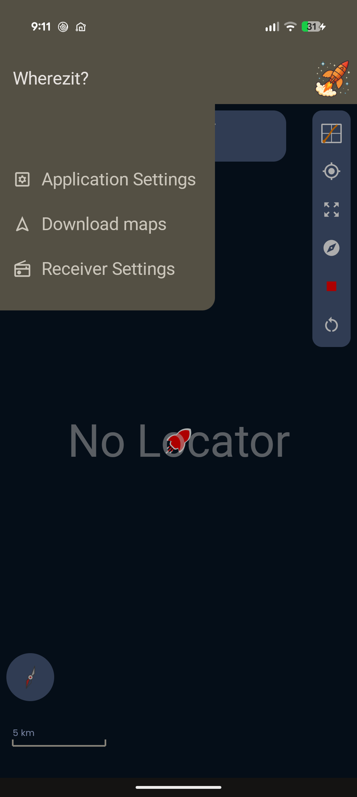
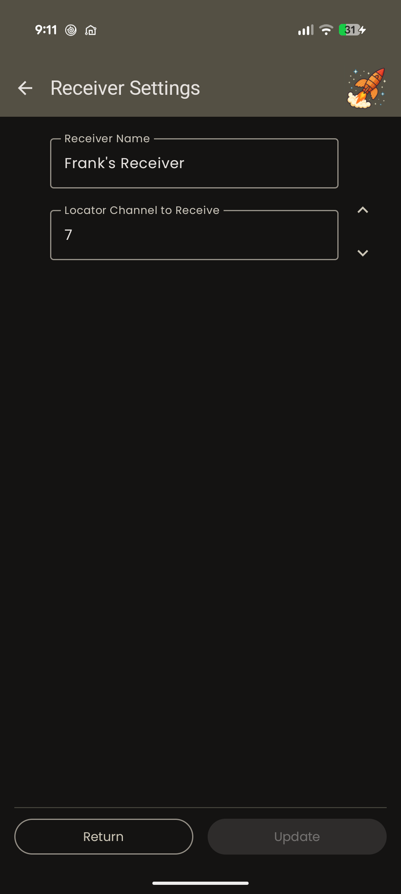
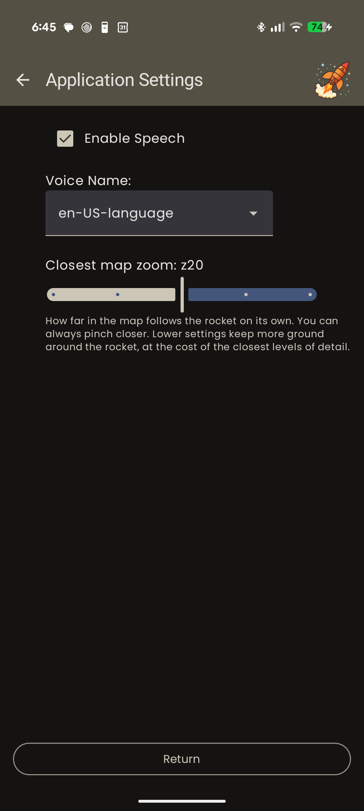
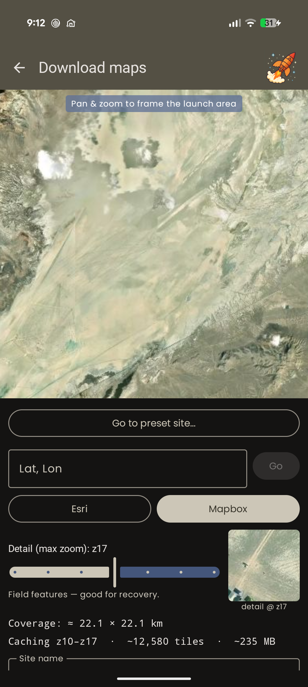
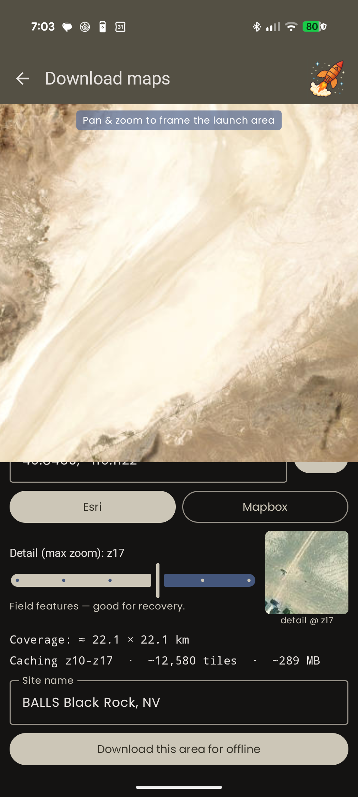
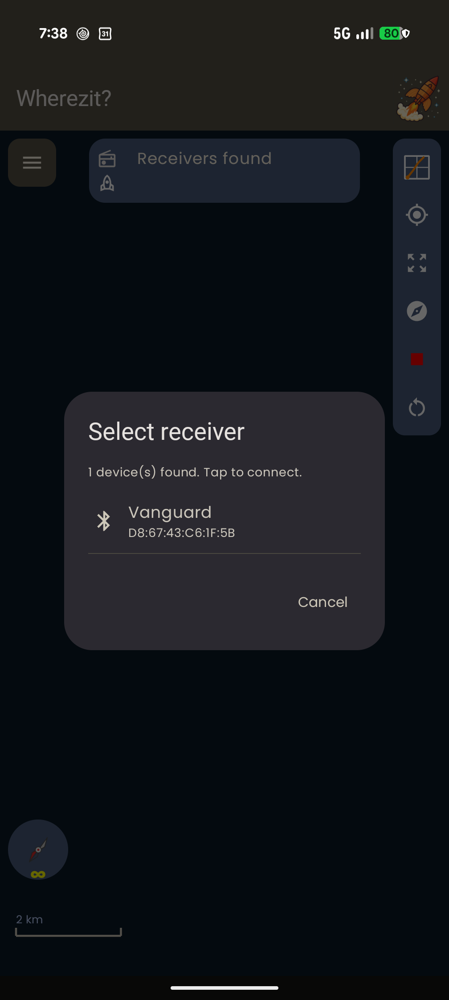
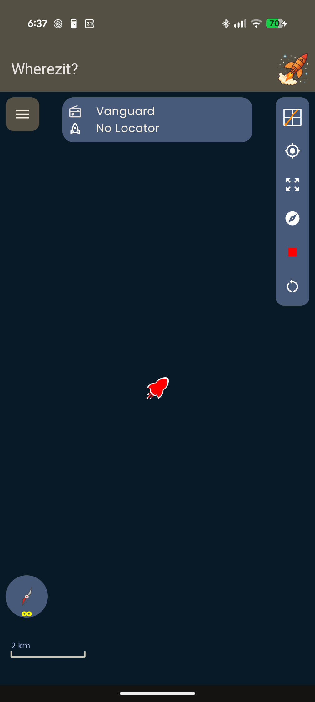

# Steam Pigeon User Manual

**Flight tracking and recovery for mid- and high-power rocketry**

Locator · Receiver · *Wherezit?* app

---

> **Document status:** Draft, 2026-07-29. Written against locator/receiver firmware and *Wherezit?* Android app as of this date. Two features are explicitly incomplete and are marked **WORK IN PROGRESS** where they appear: offline satellite maps (§3.7, §9.2) and flight-path export (§10.3). Air starts are **not** an available feature — see §7.6.
>
> Placeholders marked 📷 and 📱 indicate images still to be captured. Every 📱 placeholder needs a powered-on locator; the screenshots already present were captured with the receiver connected and the locator off.

---

## Table of contents

**Front matter** — [What Steam Pigeon is](#fm1-what-steam-pigeon-is) · [What it's for](#fm2-what-it-is-for-in-priority-order) · [Scope and limits](#fm3-scope-and-limits) · [Conventions](#fm4-conventions-used-in-this-manual) · [**Read this first: the five rules**](#fm5-read-this-first--the-five-rules)

**Part 1** — [Know your hardware](#part-1--know-your-hardware)
**Part 2** — [Settings and what they do](#part-2--settings-and-what-they-do)
**Part 3** — [Before you leave home](#part-3--before-you-leave-home)
**Part 4** — [At the field: rocket build-up](#part-4--at-the-field-rocket-build-up)
**Part 5** — [RSO inspection](#part-5--rso-inspection)
**Part 6** — [Pad preparation](#part-6--pad-preparation)
**Part 7** — [Arming for launch](#part-7--arming-for-launch)
**Part 8** — [During the flight](#part-8--during-the-flight)
**Part 9** — [Recovery](#part-9--recovery)
**Part 10** — [After the flight: your data](#part-10--after-the-flight-your-data)
**Part 11** — [Troubleshooting](#part-11--troubleshooting)

**Appendices** — [A Quick-reference cards](#appendix-a--quick-reference-cards) · [B Sound and light reference](#appendix-b--sound-and-light-reference) · [C Settings reference](#appendix-c--settings-reference) · [D USB-C console reference](#appendix-d--usb-c-console-reference) · [E Glossary](#appendix-e--glossary) · [F Specifications](#appendix-f--specifications) · [G Radio notes](#appendix-g--radio-notes)

---

# Front matter

## FM.1 What Steam Pigeon is

Steam Pigeon is a three-part system:

| Part | Where it is | What it does |
|---|---|---|
| **Locator** | Inside the rocket | Reads its own sensors, detects launch, apogee and descent, fires your recovery charges, records the whole flight, and transmits status by radio. |
| **Receiver** | In your hand | Bridges the locator's long-range radio link to your phone's Bluetooth. |
| ***Wherezit?* app** | Your Android phone | Shows telemetry and position, speaks status aloud, configures the locator and receiver, and downloads recorded flights. |

The data path is:

```
Locator  ⇄  (LoRa radio)  ⇄  Receiver  ⇄  (Bluetooth)  ⇄  Phone
```

The locator and the phone never talk to each other directly. Every message goes through the receiver.

## FM.2 What it is for, in priority order

The system was built to do three things, in this order:

1. **Fire the right recovery charges at the right moments.**
2. **Help you find the rocket after it lands.**
3. **Record enough data to understand the flight.**

Everything else — live telemetry, the map, the spoken callouts, the orientation views — is secondary to those three. When something has to give, the locator protects deployment and recording first. This is worth knowing because it explains behavior you'll see in the field: for example, the locator keeps flying, deploying and recording perfectly well when the radio link to your phone has dropped out entirely.

## FM.3 Scope and limits

- Intended for **mid- and high-power rocketry**.
- Deployment channels are designed for **e-matches with an all-fire current of 1 A or less**, such as MJG Firewire. **Test any other brand of igniter on the bench before you fly it.**
- Usable altitude ceiling of the barometric sensor is roughly **98,000 ft**.
- A recorded flight is capped at **8 minutes**; the locator stores **10 flights** before you need to clear space.
- The app is **Android only**. There is no iOS app.
- The locator has **four** deployment channels.

## FM.4 Conventions used in this manual

| | Meaning |
|---|---|
| ⚠️ **DANGER** | Involves energetics or ignition. Someone can get hurt. |
| ⚡ **CAUTION** | Can damage hardware, lose a flight, or lose recorded data. |
| 📋 **RSO NOTE** | Something a range safety officer will ask about, or that you should be ready to show. |
| 💡 **TIP** | Makes your day easier. |

## FM.5 Read this first — the five rules

If you read nothing else in this manual, read these.

1. **E-matches only until you've confirmed no-fire.** Connect igniters, power the locator on once with no black powder anywhere, confirm nothing fires — *then* power off and install charges. (§4.4)
2. **Deployment outputs are dead while the locator is Disarmed.** They become live only when you arm. Treat them as live anyway.
3. **Arm only when the rocket is on the rail in its final flight orientation, and still.** Arming re-runs the locator's calibration. Arming and then re-orienting the rocket invalidates it. (§7.2)
4. **Launch on the repeating ready-beep, not on the arming chirp.** The ready-beep is the locator telling you the flight record is open. (§7.4)
5. **Download the launch site's map before you leave home.** Recovery happens where there is no cell signal. (§3.7)

---

# Part 1 — Know your hardware

*Read this part once. You shouldn't need it on the pad.*

## 1.1 Locator tour

> 📷 **Photo needed — `images/hw-01-locator-top.jpg`:** locator board, top view, straight down, with callout labels for: the four deployment terminal blocks (numbered 1–4), USB-C connector, battery connector, buzzer, GPS antenna, GPS lock LED, status LED.

> 📷 **Photo needed — `images/hw-02-locator-bottom.jpg`:** locator board, bottom view, with callouts for the magnetic power-switch sensor location and any mounting hole pattern / dimensions.

The locator carries, on one board: a barometric altimeter, an inertial measurement unit (accelerometer and gyroscope), a multi-constellation GPS receiver, a long-range radio, flight memory, a Li-ion battery charger, a buzzer, and four independently switched deployment channels.

## 1.2 The magnetic power switch

The locator has **no mechanical power switch**. It is turned on and off by holding a magnet against the board, and the two magnet poles do different things:

- **One pole turns it on. The other pole turns it off.** Which is which depends on how you present the magnet — flip the magnet over to get the opposite action.
- Power state is latched, so the locator stays on after you remove the magnet.

> 📷 **Photo needed — `images/hw-03-magnet-switch.jpg`:** hand holding the magnet against the correct spot on the locator (ideally installed in an airframe, showing the through-the-wall usage), with the sensor location marked.

💡 **Keep a dedicated magnet with your range box** and know which face is "on". A small labelled magnet ("ON this side") removes all doubt on the pad.

⚡ **Do not store or transport the rocket next to magnets.** Magnetic tool trays, magnetic latches on range-box lids, speaker magnets, and magnetic phone mounts can all switch the locator on (or off) without you noticing. A locator that switched itself on in the car arrives at the field with a flat battery.

📋 **RSO NOTE:** Because there is no visible switch, an RSO cannot tell "on" from "off" by looking. See §5.3 for how to answer this.

## 1.3 Locator sounds — the full vocabulary

The buzzer is the locator's primary way of talking to you, and it's the only channel that works when your phone is in your pocket. There are five patterns. **Learn the difference between the quiet ready-beep and the loud landed beacon** — they are the same three rising notes at very different volumes.

| Pattern | Sounds like | Volume | When | What it means |
|---|---|---|---|---|
| **Power-on** | Five quick rising notes, about half a second total | **Loud** | Once, immediately after you apply the magnet | The locator has booted. It is **Disarmed**; deployment outputs are off. |
| **Arming** | Two quick rising notes, then silence | Quiet | Once, right after you press **Arm** | Your arm command was received. **This is not yet permission to launch.** |
| **Ready** | Three rising notes, repeating about every 2 seconds | Quiet | Continuously, while armed and waiting for launch | Armed, calibrated, flight record open. **This is your permission to launch.** |
| **Disarming** | Two quick rising notes, twice | Quiet | Once, right after you press **Disarm** | Your disarm command was received; deployment outputs are off again. |
| **Landed beacon** | Three rising notes, repeating about every 2 seconds | **Loud** | Continuously, after landing is detected | Flight over, record closed. Walk toward this sound. |

**The locator is deliberately silent during the flight itself** — from launch detection until landing detection there is no sound at all. Silence after a launch is normal and expected.

## 1.4 Locator status lights

| Light | Behavior | Meaning |
|---|---|---|
| GPS lock LED (next to the GPS antenna) | Starts blinking | The GPS has a position fix. Before it blinks, you have no position. |
| Status LED | Brief **blue** flash | The locator just transmitted a radio message (roughly once per second). |
| Status LED | Brief **green** flash | The locator just received a radio message from your receiver. |
| Status LED | **Red**, blinking about once per second, then twice per second | A deployment test is counting down. The faster blink means under 3 seconds to fire. ⚠️ |
| Status LED | Off | Normal idle state between radio events. |

## 1.5 Receiver tour

> 📷 **Photo needed — `images/hw-04-receiver.jpg`:** receiver, top view, with callouts for USB-C connector, status LED, antenna, and the battery/charge indicator.

The receiver is a relay and nothing more. It has no flight role: it forwards messages between the locator's radio and your phone's Bluetooth, and adds its own name, battery level, signal strength and firmware version to what your phone sees.

**Receiver status LED:**

| Colour | Meaning |
|---|---|
| Brief **blue** flash | Transmitted a message to the locator. |
| Brief **green** flash | Received a good message from the locator. This is the flash you want to see roughly once a second when the locator is powered and in range. |
| Brief **red** flash | Received something it couldn't validate — a corrupted or partial message. Occasional red flashes at long range are normal; continuous red means interference or a very marginal link. |

The receiver also has separate indicators for Bluetooth traffic to and from the phone.

💡 Hold the receiver **vertically, away from your body**, and keep it out of your pocket during the flight. Your body is a very effective radio shield at these frequencies.

## 1.6 Batteries and charging

Both the locator and the receiver charge over USB-C at up to 1 A.

**Lithium-ion care:**

- **Store** between **10 °C and 25 °C** (50 °F to 77 °F).
- **Operate** safely up to **60 °C** (140 °F). Above that, risk of thermal runaway increases.
- **Do not charge above 45 °C** (113 °F). A black rocket sitting in the desert sun gets there easily — bring the locator into the shade before you plug it in.

Locator battery voltage appears in the app on the flight map while the locator is powered and in range (§4.6). Check it before every flight; a locator that has been sitting switched on in your range box since last month will not make it through a flight.

## 1.7 Mounting the locator in the rocket

> 📷 **Photo needed — `images/hw-05-locator-installed.jpg`:** locator mounted on a sled inside an airframe, showing wiring dressed to the deployment terminals, battery secured, and the GPS antenna oriented outward/upward.

**Orientation:** any orientation works. The locator detects which of its axes is pointing along the airframe each time you arm it. What matters is that the orientation **doesn't change between arming and launch**.

**Barometer:** the altimeter needs static air. Follow normal altimeter-bay practice for vent holes.

⚡ **Keep the barometer out of direct sunlight.** The sensor compensates for temperature, but sudden temperature jumps of several degrees — the kind you get when sunlight falls directly on the sensor — will show up as altitude steps. This is normally a non-issue, *unless the locator sits in a clear or translucent section of the airframe.* If it does, shade the sensor.

**GPS:** the antenna wants the clearest possible view of the sky.

- Avoid putting metal or carbon fibre between the antenna and the sky. Carbon airframes will substantially degrade or block GPS.
- Position the locator so the antenna faces outward/upward where you can.
- 💡 The reliable trick: **power the locator up out in the open, wait for the GPS lock LED to blink, and only then install it in the rocket.** Getting the first fix is much harder than keeping one.

---

# Part 2 — Settings and what they do

*Read this part once, and come back to it whenever you change your deployment plan.*

## 2.1 The two ways to configure

| | App (*Wherezit?*) | USB-C console |
|---|---|---|
| Deployment channel modes | ✅ | ✅ |
| Deploy delays and altitudes | ✅ | ✅ |
| Launch detect altitude | ✅ | — |
| Deploy signal duration | ✅ | — |
| LoRa channel | ✅ | ✅ |
| Locator name | ✅ | ✅ |
| **Connection password** | — | ✅ **only** |
| Export recorded flights as CSV | — | ✅ |
| Erase flight memory | — | ✅ |
| Deployment test | ✅ (armed only) | ✅ |

Everything in the app lives behind the menu button at the top left of the flight map:



⚡ **The menu changes depending on what's connected.** This is deliberate, not a bug:

| Menu item | Appears when |
|---|---|
| Application Settings | Always |
| Download maps | Always |
| Receiver Settings | The receiver is connected |
| Locator Settings | The locator is powered, in range, and **disarmed** |
| Flight Profiles | The locator is powered, in range, and **disarmed** |
| Deployment Test | The locator is powered, in range, and **armed** |

So if a screen you want isn't in the menu, the reason is almost always the locator's arm state or the fact that it isn't transmitting. The screenshot above was taken with the receiver connected and the locator switched off — which is why only three items appear.

Two rules apply to all configuration:

- **The locator accepts configuration changes only while Disarmed.** Arm first and the settings screen is not even reachable.
- **The connection password can only be set — and only be read — over the USB-C console.** It is never sent over the air. If you forget it, you need a cable. Set it at home.

## 2.2 Deployment channel mapping

Each of the four channels is assigned one **mode**:

| Mode | Fires when |
|---|---|
| **Drogue Primary** | A set delay after apogee is detected. |
| **Drogue Backup** | A longer delay after apogee is detected. |
| **Main Primary** | The rocket descends below the main primary altitude. |
| **Main Backup** | The rocket descends below the main backup altitude. |
| **Unused** | Never. The channel is excluded from the firing schedule entirely. |

**Factory defaults:** Channel 1 = Drogue Primary, Channel 2 = Drogue Backup, Channel 3 = Main Primary, Channel 4 = Main Backup.

⚡ **Set every channel you are not using to `Unused`.** An unused channel left mapped to a real role is a channel that will be commanded to fire — harmless with nothing connected, but it wastes battery, and it makes the recorded flight data harder to read.

**Worked examples**

*Single deploy, motor eject with electronic backup*
| Channel | Mode | Setting |
|---|---|---|
| 1 | Drogue Primary | delay 1.0 s (fires after motor ejection should have) |
| 2 | Unused | — |
| 3 | Unused | — |
| 4 | Unused | — |

*Dual deploy, two charges*
| Channel | Mode | Setting |
|---|---|---|
| 1 | Drogue Primary | delay 0.0 s |
| 2 | Main Primary | 130 m |
| 3 | Unused | — |
| 4 | Unused | — |

*Dual deploy, fully redundant (the default)*
| Channel | Mode | Setting |
|---|---|---|
| 1 | Drogue Primary | delay 0.0 s |
| 2 | Drogue Backup | delay 2.0 s |
| 3 | Main Primary | 130 m |
| 4 | Main Backup | 100 m |

Note how the redundant pairs are separated: the backup drogue fires 2 seconds after the primary, and the backup main fires 30 m lower than the primary. If the primary charge does its job, the backup fires into an already-open bay.

## 2.3 Timing and altitude settings

| Setting | Range | Default | What it does |
|---|---|---|---|
| **Drogue Primary Deploy Delay** | 0.0 s up to just under the backup delay | 0.0 s | Delay from apogee detection to firing the primary drogue charge. |
| **Drogue Backup Deploy Delay** | just above the primary delay, up to 3.0 s | 2.0 s | Same, for the backup charge. Must be longer than the primary. |
| **Main Primary Deploy Altitude** | just above the backup altitude, up to 500 m | 130 m | Altitude above ground at which the primary main charge fires. |
| **Main Backup Deploy Altitude** | 0 m up to just below the primary altitude | 100 m | Same, for the backup charge. Must be lower than the primary. |
| **Launch Detect Altitude** | 10–100 m | 30 m | How far the rocket must climb before the locator will call it a launch. Raise it if you fly from a windy, bumpy pad; lower it for very short flights. |
| **Deploy Signal Duration** | 0.5–10.0 s | 1.0 s | How long each channel stays energized when it fires. 1.0 s is plenty for an e-match. |

The app enforces the primary/backup relationships for you — it won't let you set a backup drogue delay shorter than the primary, or a backup main altitude higher than the primary.

**All altitudes are above ground level (AGL)**, zeroed at the pad when you arm.

## 2.4 Only one charge fires at a time

The locator will never energize two channels simultaneously. If two charges are scheduled close enough together to overlap, the second waits until the first is finished.

What this means for you:

- Battery current draw stays predictable.
- If you set the drogue primary and backup delays very close together, the backup will fire slightly later than the number you set — it waits its turn.
- Give redundant pairs some separation (the default 0.0 s / 2.0 s is a good starting point) so the backup genuinely acts as a backup rather than a simultaneous second charge.

## 2.5 LoRa channels — the two controls that are not the same thing

This is the single most confusing part of the system, so it gets its own box.

> **Locator Settings → *Locator Channel to Receive***
> Moves **your locator** to a new radio channel. Your receiver automatically follows it, so your link is preserved. Use this when someone else at the launch is on your channel.
>
> **Receiver Settings → *Locator Channel to Receive***
> Points **your receiver** at a *different locator* that is already on another channel. Your own locator does not move. Use this when you have two locators and want to switch which one you're watching.

Channels are numbered **0–63**. Default is 0.

The receiver's copy of the control looks like this:



⚠️ **Both screens label this field with the same text — *"Locator Channel to Receive"*.** On the Receiver Settings screen that label is correct. On the **Locator Settings** screen it is misleading: that field sets the channel your locator **transmits on**, not a channel it receives. **Go by which screen you are on, not by the label.**

💡 At a busy launch, pick an uncontested channel *before* you power up on the pad. The app will warn you if it hears another locator on your channel (§2.6).

⚠️ **A different channel does not protect you at arm's length. Keep spare locators well away from the receiver.** A powered locator sitting within a few feet of the receiver will be heard *whatever channel either one is set to* — at that distance it arrives billions of times stronger than the rocket you're tracking, and no radio can filter that out. Two consequences:

- Your app may show packets from the nearby locator. It won't display the wrong rocket's data (§2.6), but you'll get a conflicting-traffic banner.
- **More importantly, every transmission from the close-in locator deafens the receiver to your actual rocket.** During a flight that is real telemetry loss.

**Rule: only the locator you're flying stays near the receiver. Spares go in the car, or stay switched off.** A few tens of feet of separation is enough. See Appendix G for why.

## 2.6 Connection password and locator recognition

Each locator identifies itself with a permanent hardware ID and, optionally, a password.

**What the password does:** the app only *recognizes* — displays, controls, arms — locators it is authorized for. If it hears an unknown locator, it asks you for that locator's password before it will do anything with it.

**Authorized and connected are not the same thing.** The app can be authorized for any number of locators — most people who own two are authorized for both — but it displays and commands exactly **one** at a time. Once it connects to a locator, that connection is held: another locator turning up on the air, even one you're authorized for, does **not** take over the screen. This matters at close range, where you can hear a locator that isn't on your channel at all (§2.5).

**How you'll experience it:**

- **First time the app hears your locator**, it prompts for the password. Enter it once; the app remembers that locator.
- **If another locator is on the air and isn't the one you're watching**, the app warns you: *"Another locator (ID …) is on the air and is not being displayed. Connect to switch to it, or move to an uncontested channel."* Its data is not shown.
- **To deliberately switch to that other locator**, tap **Connect** on the banner. If you're already authorized for it, the app switches immediately; if not, it asks for its password first.
- **The connection releases on its own** if your locator goes quiet for about 15 seconds — long enough to ride out a fade, so a moment's dropout never hands the display to a different rocket.
- **If you set no password**, the locator is open and any *Wherezit?* app will pick it up. Note that "open" means *authorized*, not *connected* — two open locators still can't fight over the display.

> 📱 **Screenshot needed — `images/app-08-password-dialog.png`:** the locator password prompt. Requires a locator with a password set, being heard for the first time.

⚠️ **Set the password over USB-C at home, and write it down somewhere you'll find it.** It cannot be read or changed over the air, only over the cable. Maximum 15 characters; blank clears it.

📋 The password is a convenience gate, not a security system. It keeps your app from acting on someone else's rocket and vice versa. Don't treat it as protection against a determined third party.

## 2.7 Device names

- **Locator Name** and **Receiver Name** are both up to 20 characters. Use something you'll recognize at a launch with six other fliers ("Frank's Receiver", not "Receiver").
- ⚠️ **After you rename the receiver, the old name will keep appearing** — both in *Wherezit?* and in your phone's Bluetooth settings. That's because the name is cached by Bluetooth itself, not by our app. **Fix: go to your phone's Bluetooth settings and "Forget" the receiver, then reconnect.** The new name will appear.

## 2.8 App settings



| Setting | What it does |
|---|---|
| **Enable Speech** | Turns the spoken callouts on and off. Leave it on — it's how you keep your eyes on the rocket. |
| **Voice Name** | Selects which of your phone's installed text-to-speech voices to use. |

💡 Try the voice at home, at volume, outdoors. Some voices are much easier to understand over wind and motor noise than others.

---

# Part 3 — Before you leave home

## 3.1 Bench-prep checklist

- [ ] Locator charged
- [ ] Receiver charged
- [ ] Phone charged
- [ ] Firmware versions checked (§3.3)
- [ ] Deployment channel modes set for **this** flight (§3.4)
- [ ] Delays and altitudes set for **this** flight (§3.4)
- [ ] LoRa channel chosen (§3.4)
- [ ] Bench deployment test passed on every channel you will use (§3.5)
- [ ] Flight memory has room (§3.6)
- [ ] Launch site map downloaded (§3.7 — **work in progress**)
- [ ] App connects to receiver (§3.8)
- [ ] Magnet, cable, spare igniters packed (§3.9)

## 3.2 Charge everything

Charge the locator, the receiver and your phone. Do this the night before, not the morning of.

⚡ The locator's magnetic switch means it can be switched on accidentally in storage (§1.2). Assume the battery is lower than you left it.

## 3.3 Confirm firmware versions

The app shows the **locator firmware version** at the top of the Locator Settings screen, and the **receiver firmware version** on the Receiver Settings screen. Each appears once that device has reported it, so give the screen a moment after opening it. Note both down — if you ever need help diagnosing something, these are the first two numbers anyone will ask for.

## 3.4 Set flight configuration

Open **Locator Settings** from the app menu. (The locator must be powered on, in range, and disarmed for this screen to appear — §2.1.)

> 📱 **Screenshot needed — `images/app-09-locator-settings.png`:** the Locator Settings screen showing firmware version, the four channel mode dropdowns with their timing/altitude fields, locator name, LoRa channel, launch detect altitude and deploy signal duration. Requires a powered-on locator.

Set, in this order:

1. **Each channel's mode** — including `Unused` for channels you aren't wiring (§2.2).
2. **The delay or altitude** for each channel that has a role. The field appears underneath the channel once you pick its mode.
3. **Launch detect altitude** and **deploy signal duration** if you're changing them from the defaults.
4. **LoRa channel** (§2.5).
5. **Locator name**.

Press **Update**. The app tells you whether the locator acknowledged the change (*Updated*, *Not Received*, or *Send Failed*). ⚡ **If you don't see the acknowledgement, the locator did not take the change.** Try again; don't assume.

**Read the settings back** before you close the screen. The values shown come from the locator, not from your phone, so what you see is what will fly.

## 3.5 Bench deployment test

This confirms two things: that each channel actually fires, and that your igniters actually light.

⚠️ **DANGER — read the whole procedure before starting.**
- **E-matches only. No black powder. No pyrotechnic charge of any kind.**
- Point the igniters away from your face, your hands, and anything you care about.
- Wear eye protection.
- E-matches produce a hot spark and a bang. Do this on a bare bench, not on carpet, not near solvents.

**Using the app** (deployment test is only reachable while the locator is **armed**, because that's the only time the outputs are live):

1. Connect an e-match to the channel you want to test.
2. Power the locator on. Confirm the loud rising power-on tone.
3. **Arm** from the app. You'll hear the arming chirp, then the repeating quiet ready-beep.
4. Open the menu → **Deployment Test**.
5. Select the channel. A countdown appears on screen; the locator's status LED blinks red, faster in the last 3 seconds.
6. The channel fires.
7. Repeat for each channel you will use.
8. **Disarm** when you're done.

> 📱 **Screenshot needed — `images/app-10-deployment-test.png`:** the Deployment Test screen with the countdown running. Requires a powered-on, armed locator.

**Using the USB-C console:** connect a cable, open a terminal (§Appendix D), type `test`, and select channel 1–4. The channel fires **10 seconds** after you select it. Same safety rules.

## 3.6 Make room in flight memory

The locator holds **10 flights**. When it's full, you can't record a new one.

1. **Export anything you want to keep** first (§10.4). Once erased, it's gone.
2. Connect USB-C, open the console, type `data`.
3. `c` — **clear empty/unused records**. This reclaims slots that were opened but never flown (a stand-down before launch, for example). Safe; it doesn't touch real flights.
4. `e` — **erase ALL flight memory**. Asks for `Y` to confirm. This deletes every recorded flight.

⚡ **If you update the locator's firmware and the flight-record format changed, you must erase all flight memory.** Old records become unreadable and will confuse the app. **Export first, then erase.** The release notes for a firmware update will tell you if this applies.

## 3.7 Download offline maps for the launch site

> ⚠️ **WORK IN PROGRESS.** This feature is built and it works, but the satellite imagery it downloads comes from map providers whose terms do not currently permit keeping tiles on your device permanently. The provider question is being resolved. Until it is:
> - **Treat downloaded imagery as temporary.** It may expire or stop rendering.
> - **Do not rely on it as your only recovery plan.** Bring a paper map, a compass, and a GPS you trust.
> - The buttons, the layout and the workflow described below are stable and will not change; only the provider list and how long a download lasts are open questions.

Recovery happens where there is no cell signal. This screen pre-loads the satellite imagery for your launch site so the map works anyway.



**To download a site:**

1. Open the menu → **Download maps**.
2. **Frame the area** in one of three ways:
   - Pan and zoom the map directly.
   - **Go to preset site…** — pick from the built-in list of known launch sites.
   - Type a **Lat, Lon** and press **Go**.
3. Choose the **provider** (Esri or Mapbox).
4. Set **Detail (max zoom)** with the slider. The hint under the slider tells you what each level is good for — z17 is described as *"Field features — good for recovery"*, which is the level you want. The thumbnail on the right previews the actual detail you'll get.
5. Check the estimate. The screen shows the ground coverage, the tile count and the download size.
6. Give it a **Site name**.
7. Press **Download this area for offline**.



The example above is a 22 × 22 km area at z10–z17: about 12,580 tiles and 235 MB. That's a realistic figure for one launch site.

💡 **Do this on Wi-Fi, the day before.** 235 MB over a marginal cell connection at the field is not a plan.

**Downloaded regions** are listed at the bottom of the screen with a delete button each. **Clear ambient cache (offline test)** wipes the incidental tiles your phone cached while browsing, so you can honestly test whether your downloaded region really works with no signal.

💡 **Test it properly before you trust it:** clear the ambient cache, put the phone in airplane mode, then open the flight map and pan around your launch site. If you see imagery, you're good.

## 3.8 Verify the app-to-receiver link

1. Power the receiver on.
2. Open *Wherezit?*. The status pill at the top of the map shows **Scanning**, then a **Select receiver** dialog appears listing what it found.



3. Tap your receiver. The pill changes to the receiver's name.



With the receiver connected but the locator off, the map reads **No Locator**. **This is the normal, healthy state before you power up the rocket.** The app is connected to the receiver; there is simply nothing flying yet.

⚡ **Silence is not a dropped connection.** The receiver relays nothing when the locator is quiet — off, on the pad, or out of range. The app knows this, checks the receiver's health in the background, and will not tear down a working link just because the locator has gone quiet. Don't "fix" a link that isn't broken.

## 3.9 Pack list

- Receiver
- **The magnet** (and know which face is "on")
- Phone, charged, plus a power bank
- USB-C cable — the same one that talks to the locator's console
- Spare e-matches
- The printed quick-reference cards from Appendix A

---

# Part 4 — At the field: rocket build-up

## 4.1 Field checklist

- [ ] Locator installed, wiring dressed and secured (§4.2)
- [ ] E-matches connected to the correct channels (§4.3)
- [ ] **No-fire confirmation done, with e-matches only** (§4.4)
- [ ] Locator **powered off**
- [ ] Black powder charges installed
- [ ] GPS lock confirmed (§4.5)
- [ ] Readiness page checked (§4.6)
- [ ] Locator powered **off** for RSO (§5.1)

## 4.2 Install the locator

> 📷 **Photo needed — `images/hw-06-terminals.jpg`:** close-up of the deployment terminal blocks with an e-match lead correctly installed — showing strip length, insertion depth and a properly tightened screw.

- Seat the sled; make sure it can't shift under thrust or ejection pressure.
- Dress the deployment wiring so it can't be pulled out of the terminals.
- Secure the battery. A battery that comes loose under thrust can pull its own connector.
- Check the GPS antenna's view of the sky (§1.7).

## 4.3 Connect e-matches to the assigned channels

Match the wiring to the mapping you configured in §3.4. **Channel 1 in the app is the terminal block labelled 1 on the board.**

💡 Say it out loud as you wire: *"Channel one, drogue primary. Channel three, main primary."* Miswiring drogue and main is a well-travelled route to a very short flight.

## 4.4 First power-on: the no-fire confirmation

This is the most important procedure in this manual.

⚠️ **DANGER**

1. **E-matches connected. No black powder anywhere near the rocket.** Charge wells empty and clean.
2. **Point the charge wells away from yourself and away from anything you value.** Assume something could fire.
3. **Power the locator on** with the magnet. You should hear the loud rising power-on tone. **Nothing should fire.**
   - The locator is designed to boot into a no-fire state, and its deployment outputs are electrically disabled while it is Disarmed. That's the design. Treat the charges as live regardless.
4. **Confirm continuity** on each connected channel in the app (§4.6). This is the point of doing it now: you learn that every igniter is intact and every terminal is tight, while the rocket is still harmless.
5. **Power the locator off.**
6. **Now install the black powder charges.**
7. **Do not power the locator on again until the rocket is on the pad** (Part 6).

⚠️ If **anything** fires during step 3, stop. Do not install charges. Do not fly. The rocket is not safe until you understand why.

## 4.5 Get GPS lock in the open, then install

1. Power the locator up **out in the open**, away from buildings, vehicles and trees.
2. Wait for the **GPS lock LED next to the GPS antenna to start blinking**.
3. Check the satellite count and accuracy in the app (§4.6).
4. **Then** install the locator in the airframe.

Acquiring a first fix takes far more signal than holding one. Doing it in this order routinely turns a locator that "won't get GPS in the rocket" into one that works fine.

## 4.6 Reading the pre-launch readiness page

While the locator is powered on, in range, and **disarmed**, the app's flight map shows a readiness summary. This is your pre-flight instrument panel.

> 📱 **Screenshot needed — `images/app-11-readiness.png`:** the flight map with a live, disarmed locator, showing the readiness panel — satellites, accuracy, altitude, battery, sensor health, per-channel continuity, and the deployment configuration read back from the locator. Requires a powered-on locator.

| Indicator | What good looks like |
|---|---|
| **Satellites** | More is better. Watch it climb after power-on. |
| **Accuracy** (horizontal) | A few metres. If it's tens of metres, the antenna's view of the sky is poor (§1.7). |
| **Altitude (AGL)** | Near zero on the pad. This is the value that gets zeroed when you arm. |
| **Battery** | Shown as a bar gauge. Don't fly a locator showing one bar. |
| **Sensor health** | Barometer, IMU and GPS each report status. All three should be healthy. |
| **Continuity, channels 1–4** | **Present on every channel you have wired, absent on every channel you haven't.** |
| **Deployment configuration** | Modes, delays and altitudes, read back from the locator. Confirm they're what you intended. |

**About continuity:** continuity means *there is an intact circuit through the igniter*. It tells you the igniter is good and the terminals are tight. It does **not** mean the channel is armed or live — you'll see continuity on a wired channel whenever the locator is powered, armed or not.

⚡ **Continuity present on a channel you set to `Unused`** means you've wired a channel you don't intend to fire, or a mode is set wrong. Resolve it before you fly.

⚡ **Continuity absent on a channel you have wired** means a broken igniter, a loose terminal, or a lead that isn't making contact. Fix it before the black powder goes in.

## 4.7 If GPS accuracy is poor

In order of effectiveness:

1. **Get the first fix in the open, before installing** (§4.5).
2. **Reposition the locator** in the airframe so the antenna has a clearer view — away from metal, batteries, and especially carbon fibre.
3. **Wait.** Satellite count climbs over the first minute or two.
4. If your airframe is carbon, accept that GPS may be unreliable inside it and plan recovery around the audible beacon and the radio link (§9.4, §9.5).

---

# Part 5 — RSO inspection

## 5.1 Recommended state for RSO inspection

**Present the rocket with the locator POWERED OFF.**

- Locator **off**.
- Black powder charges **installed** (you did the no-fire confirmation before installing them, §4.4).
- Magnet **in your hand or your pocket**, not in the rocket, not in a magnetic tray next to the rocket.
- Be ready to power the locator on and show the readiness page (§4.6) if the RSO wants to see continuity, satellites, or the deployment configuration.

**Why off:** because the locator has no mechanical switch, "off" is the only state an RSO can accept on your word and then verify by watching you turn it on. Powering up in front of the RSO — with the power-on tone as audible confirmation — is a much better demonstration than arriving already on.

## 5.2 What to tell the RSO, in their language

Have this ready. It answers the questions in the order they get asked:

> *"Recovery charges are fired by an onboard flight computer. It boots into a no-fire state — the deployment outputs are electrically disabled unless it's armed. Arming is done deliberately from my phone once the rocket is on the pad and I'm back at the flight line; there's no way to arm it by bumping something. It can't be disarmed in flight. Before I installed the black powder, I powered it up with just the e-matches connected and confirmed nothing fires and that all channels show continuity. It's off right now — I can power it up and show you the continuity and deployment settings if you'd like."*

Points worth having straight:

- **Boots safe.** Power-on state is Disarmed; outputs off.
- **Arming is remote and deliberate.** From the app, from the flight line, after the rocket is on the pad.
- **One charge at a time.** The computer never energizes two channels simultaneously (§2.4).
- **Disarm is blocked in flight.** Once it's flying, nothing you or your phone does can turn off the recovery system. The app will refuse: *"Can't disarm while the rocket is in flight. Wait until it has landed."*
- **Continuity was verified with e-matches only**, before charges were installed.

## 5.3 The two questions about magnetic switches

**"How do you turn it off?"**
> *"A magnet against this spot on the airframe. One pole switches it on, the other switches it off. It's off now — you'll hear it play a tone when I switch it on."*

**"What stops it turning on by accident?"**
> *"It needs a magnet held against the right spot with the right pole. I keep the magnet separate from the rocket, and I keep the rocket away from magnetic tool trays and range-box latches. And even if it did switch on, it boots disarmed — the deployment outputs stay dead until I arm it from the app."*

## 5.4 Documentation to have on hand

Be ready to show, from the app:

- The **deployment channel modes** — which channel does what.
- The **drogue delays** and the **main altitudes**.
- **Continuity** on every wired channel.

All four live on the readiness page and the Locator Settings screen (§4.6, §3.4).

---

# Part 6 — Pad preparation

## 6.1 Pad checklist

- [ ] Rocket on the rail, rail buttons seated
- [ ] Motor igniter installed per range procedure
- [ ] Locator powered **on** at the pad (§6.2)
- [ ] Power-on tone heard
- [ ] App shows the locator; readiness page good (§6.3)
- [ ] Link confirmed from the flight line (§6.4)
- [ ] Locator left **Disarmed** (§6.5)

## 6.2 Order of operations at the pad

1. Rocket on the rail. Rail buttons seated, rail free.
2. Motor igniter installed and connected per your range's procedure.
3. **Then** power the locator on.

**Power the locator on at the pad, not in the prep area.** Every minute the locator spends armed-and-waiting or powered-and-waiting is battery you don't have during recovery — and a locator carried around powered-up is a locator that could be jostled into something unhelpful.

## 6.3 Power on and confirm

1. Apply the magnet. **Listen for the loud rising power-on tone.** No tone means no power — check the battery.
2. Check your phone: the locator appears, and the map switches from **No Locator** to live data.
3. Walk the readiness page (§4.6): satellites, accuracy, battery, sensor health, **continuity on every wired channel**, deployment configuration.

⚠️ **Do not arm at the pad.** Arm from the flight line (Part 7).

## 6.4 Confirm the link from the flight line

Walk back to where you'll be standing during the launch, and check that telemetry is still arriving. This is the only honest test of your radio link, because it's the geometry you'll actually have.

If the link is marginal:

- **Hold the receiver vertically, clear of your body.** This alone often fixes it.
- **Change the LoRa channel** if you suspect another flier is on yours — remember to use *Locator Settings*, so your receiver follows (§2.5).
- **Move.** Vehicles, trailers and crowds between you and the pad all attenuate the signal.

## 6.5 Leave the rocket Disarmed

Walk away from the pad with the locator **powered on and Disarmed**. Arming is the last thing you do, and you do it from the flight line.

---

# Part 7 — Arming for launch

## 7.1 Why you arm last, and from a distance

Arming does three things at once:

1. **Enables the deployment outputs.** Before this, they are electrically dead. After this, they are live.
2. **Runs the on-pad calibration** — zeroes altitude, measures the gyro's bias, and works out which way the rocket is pointing.
3. **Opens the flight record**, so the flight will be recorded.

Because of (1), you arm from the flight line, not standing over the rocket.

## 7.2 Arming re-calibrates — what that means for you

⚡ **Every time you arm, the locator re-calibrates from scratch.** It assumes the rocket is:

- **In its final flight orientation** — on the rail, pointing where it's going to point.
- **Still** — not being carried, leaned on, or steadied by hand.
- **At the altitude you want called zero** — because arming zeroes AGL right there.

**Arming and then re-orienting or moving the rocket invalidates the calibration.** If you arm and then have to lay the rocket down, walk it to a different pad, or re-angle the rail: **disarm, sort it out, and arm again** once it's back in its final position.

## 7.3 The arm sequence

1. From the flight map, press **Arm**.
2. The app shows **Arming**, then **Armed**, and speaks the change aloud.
3. The locator plays the **quiet two-note arming chirp**.
4. Then the **quiet repeating three-note ready-beep** starts, about every 2 seconds.

## 7.4 The ready-beep is your launch permission

⚠️ **Do not launch on the arming chirp. Launch on the repeating ready-beep.**

The locator deliberately withholds the ready-beep until the flight record is fully open and recording. The gap between the two sounds is the locator finishing its preparation. A rocket launched in that gap flies fine — but may record nothing, and you will have no data and no flight profile.

**If the ready-beep never starts:**

1. Wait a few more seconds. Opening a record takes a moment.
2. If it still hasn't started, **disarm** and investigate. Most likely causes: flight memory is full (§3.6), or the battery is too low.
3. Don't launch on a locator that never gave you the ready-beep.

## 7.5 If you have to stand down

Press **Disarm**. You'll hear the two double-chirps and the app will confirm.

- Deployment outputs go dead again.
- The flight record that was opened is **not wasted** — a disarm-before-launch followed by a later re-arm reuses the same slot.
- Configuration becomes editable again.

**You do not need to power-cycle** to arm again. Just fix whatever needs fixing, put the rocket back in its final orientation, and arm again (§7.2).

⚠️ **You cannot disarm in flight.** Once the rocket has launched, the app refuses: *"Can't disarm while the rocket is in flight. Wait until it has landed."* This is intentional — it's what makes the recovery system trustworthy.

## 7.6 What is not available

**Air starts / staged ignition are not a feature of this system.** There is no supported way to use a Steam Pigeon deployment channel to light a second-stage or airstart motor. Do not attempt to configure one.

---

# Part 8 — During the flight

## 8.1 What to watch, and what to listen to

**Watch the rocket. Let the app talk.** That's the entire design intent behind the spoken callouts: you should never need to look at your phone during a flight.

**The locator is silent from launch to landing.** No buzzer at all. This is normal.

## 8.2 The spoken callouts

With **Enable Speech** on (§2.8), the app announces:

| Callout | When |
|---|---|
| "*Armed*" / "*Disarmed*" | When the arm state changes. |
| "*[number] meters*" | Altitude, every 100 m as the rocket coasts to apogee. |
| "*Apogee, [number] meters*" | Apogee detected. |
| "*Drogue charge*" | The drogue primary charge has been fired. |
| "*Drogue backup charge*" | The drogue backup charge has been fired. |
| "*Main charge*" | The main primary charge has been fired. |
| "*Main backup charge*" | The main backup charge has been fired. |
| "*Drogue deployed*" | The locator has *detected the parachute actually taking hold* — a change in descent rate. |
| "*Main deployed*" | Same, for the main. |
| "*Descent warning, [number] meters per second…*" | Descending faster than **50 m/s** — fast enough that no chute is holding. Repeated at most every 10 s, with the distance and direction from the launch point when the rocket has a GPS fix. |
| "*Landing…*" | Touchdown, with the distance and direction from the launch point. Said once. If the link died on the way down, the app works out when the rocket must have reached the ground from the last altitude and descent rate it heard, and calls the landing then — you get the callout even though nothing was received for the last part of the descent. |
| "*GPS fix lost*" / "*GPS fix restored*" | The locator is still being heard but has stopped (or resumed) reporting a good fix. |
| "*Telemetry lost*" / "*Telemetry restored*" | More than 3 s with no valid message from the locator (see §8.4), and its recovery. |

⚡ **"Charge" and "deployed" are two different things.** "*Main charge*" means the locator energized the channel. "*Main deployed*" means it then detected the rocket slowing down. Hearing the charge but not the deployment is exactly the signature of a charge that fired but didn't open the bay — worth knowing in real time.

📍 **A spoken distance always means a real GPS fix.** Any callout that quotes a distance and direction only does so when the locator reports a good fix and a real launch position was captured. When either is missing the app says "*location unknown*" or simply omits the distance — it will never read out a position it does not have.

🔆 **The screen stays on** for as long as the app is in the foreground, so a flight spent watching the sky doesn't end with a blanked phone. It also means the app will not let the display sleep — back out of it, or lock the phone, when you're done.

## 8.3 The live screens

**Portrait — the flight map.** Your position, the rocket's position, and its track. Distance and bearing to the rocket. The flight state and altitude readouts. The status pill at the top shows the receiver and locator status.

**Landscape — the heads-up view.** Rotate the phone and it switches to a camera view with the rocket's position overlaid — hold it up, look through it, and it points you at the rocket.

> 📱 **Screenshot needed — `images/app-12-heads-up.png`:** the landscape heads-up camera view during or after a flight, showing the overlay. Hold the phone in landscape while connected to capture this.

> 📱 **Screenshot needed — `images/app-13-flight-map-live.png`:** the portrait flight map during a flight, showing the rocket's track, the flight state and the altitude readout. Requires a flight (or a bench replay).

## 8.4 If the telemetry goes quiet

**Nothing about the rocket has changed.** The locator keeps detecting events, firing charges and recording data whether or not your phone is listening. What you've lost is the *view*, not the system.

Normal causes:

- **Range.** Especially near apogee, at altitude, and low on the horizon after landing.
- **Orientation.** The rocket's antenna sweeping away from you.
- **Your body.** Receiver in a pocket, or you standing between it and the rocket.

**What to do: nothing.** Keep the receiver up and vertical, keep watching the sky. Don't start disconnecting and reconnecting — the app maintains its own link health and will recover on its own. The **last known position is retained**, and that's what you'll walk toward.

**The app tells you, once.** After 3 s with no valid message it says "*Telemetry lost*" — with the last known distance and direction if the rocket was in the air — and then stays quiet rather than repeating. When packets start arriving again you get "*Telemetry restored*". A dropout of a few seconds is routine; hearing it is information, not an instruction to do anything.

**Once it has called the landing, it stops narrating the flight.** Losing the link on the way down and getting it back after the rocket is on the ground used to produce a burst of callouts describing things that had already happened — "*main charge*", "*main deployed*" — over a rocket lying in a field. If the app has concluded the rocket is down, the only thing you'll hear when the signal comes back is "*Telemetry restored*". Live status like the GPS fix still gets called out, because that is what you need while walking in.

## 8.5 Landing

When the locator detects landing:

- The **loud repeating landed beacon** starts.
- The flight record closes, keeping a couple of seconds of settled-on-the-ground data at the end.

If the locator somehow never detects a landing, the record closes itself after **8 minutes** regardless, so a flight is never lost to a stuck state.

---

# Part 9 — Recovery

## 9.1 Recovery checklist

- [ ] Note the last known position on the map **before** you start walking
- [ ] Receiver held vertically, out of your pocket
- [ ] Walk the bearing (§9.3)
- [ ] Listen for the beacon (§9.4)
- [ ] ⚠️ Approach assuming unfired charges are live (§9.6)
- [ ] Power the locator **off** before handling the airframe (§9.6)

## 9.2 Using the map with no cell signal

> ⚠️ **WORK IN PROGRESS** — see the warning in §3.7. Offline imagery may expire or fail to render. **Do not make it your only recovery plan.**

If you downloaded the site (§3.7), the flight map renders that imagery with no connectivity, showing your position and the rocket's last known position on the same picture.

⚡ Note the coordinates or the position on the map **before** you walk out of radio range of a landed rocket. If the beacon and the link both go away, a remembered map position is what you have left.

## 9.3 Using the heads-up view for the last stretch

Rotate the phone to landscape. Hold it up and look through the camera view: the overlay marks where the rocket is. Walk the bearing it shows you. This is much more intuitive than reading a map while walking through brush.

## 9.4 Using the audible beacon

The landed beacon is **loud** and repeats about every 2 seconds — the same three rising notes as the ready-beep, but at full volume.

- It's a close-in finder, not a long-range one. Expect to hear it when you're within tens of metres, less in wind or tall vegetation.
- Stop walking to listen. Your own footsteps are louder than you think.
- 💡 In a group, spread out and triangulate. Two people who can both hear it will find it much faster than one.

## 9.5 If the last known position is stale or absent

Position quality degrades exactly when you need it most: the rocket on its side, antenna against the ground, or under trees.

Work with what you have:

1. **Walk the last known position first**, even if it's a few minutes old.
2. **Use the descent track.** The last part of the recorded path shows the drift direction — the rocket kept drifting the same way after your last data point.
3. **Use signal strength as a crude direction finder.** Walk in one direction for 50 m and watch whether the link gets better or worse. Slow, but it works.
4. **Listen** (§9.4).
5. Bring the airframe's paint scheme to mind before you start looking. You'd be surprised.

## 9.6 Recovering the rocket safely

⚠️ **DANGER — unfired charges.**

Any charge that didn't fire is still live, and you don't know which ones fired until you look.

1. **Approach assuming every unfired channel is live.**
2. **Do not put your hands or face over a charge well.**
3. **Power the locator off with the magnet** before you handle the airframe, disconnect anything, or start disassembly.
4. Only then inspect and disconnect the remaining igniters.

The locator records which channels fired and their continuity before and after, so you can reconstruct exactly what happened later (§10.2) — you don't need to work it out standing in a field.

## 9.7 Flying again the same day

**No power cycle needed.**

1. Recover, power off, install fresh charges following the full §4.4 procedure (e-matches first, no-fire confirmation, then black powder).
2. Power on at the pad, and arm as usual.

Arming after a completed flight resets everything and opens a fresh record automatically.

---

# Part 10 — After the flight: your data

## 10.1 Flight Profiles in the app

Open the menu → **Flight Profiles** (locator powered, in range, disarmed).

You get a list of stored flights with the date, time, apogee and time-to-apogee for each. Pick one; the app downloads it over the radio link and draws the flight profile.

> 📱 **Screenshot needed — `images/app-14-flight-profiles-list.png`:** the Flight Profiles list showing stored flights with date, time, apogee and time to apogee. Requires a powered-on locator with recorded flights.

> 📱 **Screenshot needed — `images/app-15-flight-profile-chart.png`:** a downloaded flight profile chart with event markers. Requires a powered-on locator with recorded flights.

💡 The download takes a little while over the radio — it's a lot of data through a long-range, low-bandwidth link. Stay in good range and let it finish.

**The altitude you see plotted is the barometric altitude** — the same measurement the locator actually used to make its deployment decisions. That's deliberate: the chart shows you the world as the flight computer saw it.

## 10.2 Reading the event markers

The profile is marked with the events the locator recorded:

| Event | Meaning |
|---|---|
| Launch detect | The locator decided it was flying. |
| Burnout | Thrust ended. |
| Noseover / apogee | The top of the flight — and the trigger for the drogue timing. |
| Drogue primary / backup | Each drogue charge firing. |
| Main primary / backup | Each main charge firing. |
| Drogue / main velocity threshold | Where the locator detected the parachute actually taking hold. |
| Landing | Touchdown. |

And per channel:

| Field | Meaning |
|---|---|
| **Fired** | The locator energized this channel. |
| **Pre-fire continuity** | The igniter circuit was intact immediately before firing. |
| **Post-fire continuity** | The circuit was *still* intact after firing — which normally means **the igniter did not go off**. |

⚡ **Fired = yes, pre-fire continuity = yes, post-fire continuity = yes** is the signature of a channel that was commanded, had a good igniter, and still didn't light. Investigate the igniter and the charge, not the locator.

## 10.3 Export flight path

> ⚠️ **WORK IN PROGRESS.** Flight-path export is not currently reachable from the app's menu. Use the USB-C CSV export (§10.4) for now.

## 10.4 Full CSV export over USB-C

This gives you everything the locator recorded, at full rate, for analysis in a spreadsheet or a plotting tool.

1. Connect the locator to a computer with USB-C.
2. Open a serial terminal at **921600 baud** (§Appendix D).
3. Type `data` and press Enter. You'll get a numbered list of stored flights with dates, apogees and times to apogee.
4. **Start your terminal's logging-to-file** *before* the next step — the export scrolls past as plain text.
5. Type the number of the flight you want. The CSV streams out, followed by a summary of the flight's events and per-channel deployment statistics.

**Columns:**

| Column | Meaning |
|---|---|
| `time_ms` | Milliseconds since thrust onset. |
| `raw_baro_agl_m` | Barometric altitude above ground — the altitude used for deployment decisions. |
| `fused_agl_m` | Altitude from the combined sensor solution, recorded for analysis. |
| `raw_baro_vel_mps` | Vertical speed derived from the barometer. |
| `fused_vspeed_mps` | Vertical speed from the combined solution. |
| `accel_x_g`, `accel_y_g`, `accel_z_g` | Acceleration in g, in the rocket's own axes. |
| `gyro_x_dps`, `gyro_y_dps`, `gyro_z_dps` | Rotation rate in degrees per second. |
| `lat_deg`, `lon_deg` | GPS position. |
| `flight_state` | Which state the flight state machine was in. |
| `tilt_deg` | Angle off vertical. |
| `q_w`, `q_x`, `q_y`, `q_z` | Orientation, as a quaternion. |
| `oc_*`, `process_*` | Internal timing diagnostics. Ignore unless you're debugging the firmware. |

## 10.5 Flight memory housekeeping

- **10 flights** stored. Export what you want to keep before you clear anything.
- `c` in the data menu reclaims empty slots; `e` erases everything (§3.6).
- ⚡ Export before any firmware update that changes the record format.

## 10.6 What the timestamps mean

- **`time_ms = 0` is thrust onset.** The record starts at launch.
- Time is measured on a **GPS-disciplined clock**, so it is real elapsed time, not an assumed sample rate. Durations you measure from the data are trustworthy.
- Data is recorded at **20 samples per second**.
- A record is capped at **8 minutes** and includes about **2 seconds of settled data after landing**.

---

# Part 11 — Troubleshooting

| Symptom | Look at |
|---|---|
| Locator won't power on / no power-on tone | Battery flat (§1.6). Wrong magnet pole or wrong spot (§1.2). |
| App never finds the receiver | Receiver powered? Bluetooth on? Phone permissions granted? (§3.8) |
| App says "No Locator" but the receiver is connected | Normal when the locator is off (§3.8). Otherwise: locator off, out of range, or on a different channel (§2.5). |
| App asks for a password | First contact with a locator it doesn't know (§2.6). |
| App opened while the locator was already armed | Supported: armed telemetry identifies itself, so the app picks up a locator it already knows and shows live data straight away. If it still reads "No Locator", that locator has never been connected on this phone — **disarm it once** so the app can prompt for its password (§2.6). |
| "Another locator … is not being displayed" | Someone else is on your channel — change **Locator Settings → channel** (§2.5). Or one of your *own* spare locators is powered up near the receiver, in which case the channel is irrelevant: move it away (§2.5). To switch to that locator on purpose, tap **Connect** (§2.6). |
| App shows a locator that isn't on your channel | A powered locator within a few feet of the receiver gets in regardless of channel (§2.5, Appendix G). Move it away. |
| Telemetry patchy on the pad or the flight line | Check for another powered locator near the receiver — it deafens the receiver every time it transmits (§2.5). |
| Receiver's new name won't show up | Bluetooth name cache. "Forget" the receiver in your phone's Bluetooth settings, then reconnect (§2.7). |
| Bluetooth seems to keep dropping | Silence is not a dropped link (§3.8). If it's genuinely reconnecting, check the receiver's battery. |
| Few satellites / poor accuracy | Get the fix in the open before installing (§4.5). Antenna view obstructed (§1.7, §4.7). |
| No continuity on a wired channel | Broken igniter, loose terminal, or a lead not making contact (§4.6). |
| Continuity on a channel set to `Unused` | Mis-wired, or the mode is wrong (§4.6). |
| Deployment Test isn't in the menu | It only appears while the locator is **armed** (§3.5). |
| Locator Settings / Flight Profiles aren't in the menu | They only appear while the locator is powered, in range, and **disarmed** (§2.1). |
| Ready-beep never starts after arming | Flight memory full (§3.6) or battery too low. **Don't launch** (§7.4). |
| Can't disarm | Not while it's flying. This is intentional (§7.5). |
| Telemetry drops out mid-flight | Normal at range and altitude. The rocket is unaffected (§8.4). |
| Altitude looks stepped or jumpy | Sunlight on the barometer, most likely in a clear payload bay (§1.7). |
| A recorded flight looks empty | Launched before the ready-beep started (§7.4). |
| Recorded flights "disappeared" after a firmware update | **Power-cycle the locator** — the data is very likely still there. If it reappears, that was it. |
| A charge didn't fire | Check fired / pre-fire / post-fire continuity in the flight data (§10.2). |
| Map is blank | No imagery downloaded for the area, or no connectivity and no cached region (§3.7). |

---

# Appendix A — Quick-reference cards

*Print these. Laminate them. Keep them in the range box.*

## A1 — Bench prep

```
□ Charge locator, receiver, phone
□ Note firmware versions
□ Set channel modes (Unused for spares!)
□ Set delays / altitudes
□ Set LoRa channel
□ BENCH DEPLOYMENT TEST — e-matches only, no BP
□ Export + clear flight memory if needed
□ Download launch site map (on Wi-Fi)
□ Confirm app connects to receiver
□ Pack: magnet, USB-C cable, spare e-matches
```

## A2 — Field build-up + no-fire confirmation

```
□ Install locator, dress wiring, secure battery
□ Connect e-matches to correct channels

  ⚠  NO BLACK POWDER YET

□ Point charge wells at nothing you value
□ Power ON — expect tone, expect NO fire
□ Confirm continuity on every wired channel
□ Power OFF
□ NOW install black powder
□ Do not power on again until the pad

□ GPS: power up in the open, wait for blink, then install
□ Present to RSO with locator OFF
```

## A3 — Pad + arming

```
AT THE PAD
□ Rocket on rail, buttons seated
□ Motor igniter per range procedure
□ Power locator ON — hear the tone
□ Readiness: satellites / accuracy / battery /
  sensor health / continuity / deploy config
□ Leave DISARMED — walk back

AT THE FLIGHT LINE
□ Confirm telemetry still arriving
□ Rocket in FINAL orientation and STILL
□ Press ARM  → arming chirp
□ WAIT for the repeating READY-BEEP
□ Launch on the READY-BEEP, not the chirp
```

## A4 — Recovery

```
□ Note last known position BEFORE walking
□ Receiver vertical, out of pocket
□ Landscape = heads-up view, walk the bearing
□ Stop and listen for the loud beacon

  ⚠  UNFIRED CHARGES ARE LIVE

□ Approach off-axis from charge wells
□ Power locator OFF before handling
□ Then disconnect remaining igniters
```

---

# Appendix B — Sound and light reference

## Locator sounds

| Pattern | Notes | Volume | Repeats? | Meaning |
|---|---|---|---|---|
| Power-on | 5 rising notes, ~0.1 s each | Loud | No | Booted, Disarmed |
| Arming | 2 rising notes | Quiet | No | Arm command received |
| Ready | 3 rising notes, then ~1.7 s silence | Quiet | Yes, ~every 2 s | **Armed and ready to launch** |
| Disarming | 2 rising notes, twice | Quiet | No | Disarm command received |
| Landed beacon | 3 rising notes, then ~1.7 s silence | **Loud** | Yes, ~every 2 s | Landed — walk toward it |
| *(silence)* | — | — | — | In flight |

**Ready-beep and landed beacon are the same notes.** Volume tells them apart: quiet on the pad, loud on the ground.

## Locator lights

| Light | Behavior | Meaning |
|---|---|---|
| GPS LED | Blinking | GPS fix acquired |
| Status | Blue flash | Radio transmit |
| Status | Green flash | Radio receive |
| Status | Red, ~1 Hz | Deployment test countdown |
| Status | Red, ~2 Hz | Deployment test — under 3 s to fire ⚠️ |
| Status | Off | Idle |

## Receiver lights

| Colour | Meaning |
|---|---|
| Blue flash | Transmitted to locator |
| Green flash | Good message received from locator |
| Red flash | Corrupt/partial message received — occasional at long range is normal |

---

# Appendix C — Settings reference

| Setting | Where | Range | Default | Notes |
|---|---|---|---|---|
| Deployment Channel 1–4 Mode | App, USB-C | Drogue Primary / Drogue Backup / Main Primary / Main Backup / Unused | Ch1 DP, Ch2 DB, Ch3 MP, Ch4 MB | `Unused` excludes the channel from firing |
| Drogue Primary Deploy Delay | App, USB-C | 0.0 s → just under backup delay | 0.0 s | From apogee detection |
| Drogue Backup Deploy Delay | App, USB-C | just over primary delay → 3.0 s | 2.0 s | Must exceed the primary |
| Main Primary Deploy Altitude | App, USB-C | just above backup → 500 m | 130 m | AGL |
| Main Backup Deploy Altitude | App, USB-C | 0 m → just below primary | 100 m | AGL, must be below the primary |
| Launch Detect Altitude | App | 10–100 m | 30 m | Climb required to declare launch |
| Deploy Signal Duration | App | 0.5–10.0 s | 1.0 s | How long a channel stays energized |
| LoRa Channel | App, USB-C | 0–63 | 0 | See §2.5 for which control to use |
| Locator Name | App, USB-C | 20 characters | blank | |
| Receiver Name | App, USB-C | 20 characters | blank | Requires Bluetooth "Forget" to refresh (§2.7) |
| Connection Password | **USB-C only** | 15 characters, blank = open | blank | Cannot be read or set over the air |
| Enable Speech | App | on / off | on | |
| Voice Name | App | your phone's installed voices | system default | |

---

# Appendix D — USB-C console reference

**Connection:** USB-C from the locator (or receiver) to a computer. Serial terminal at **921600 baud**.

**Top-level commands** — type the word and press Enter:

| Command | Opens |
|---|---|
| `config` | Configuration menu |
| `data` | Flight data menu |
| `test` | Deployment test menu |
| `dfu` | Firmware update mode |

## Editing keys (configuration menu)

| Key | Action |
|---|---|
| `[` | Decrease the value |
| `]` | Increase the value |
| Enter | Save |
| Esc | Cancel |

For text fields (name, password), just type; Enter saves, Esc cancels.

## `config` — Rocket Locator Configuration

| Key | Setting |
|---|---|
| `0` | Deployment Channel 1 Mode |
| `1` | Deployment Channel 2 Mode |
| `2` | Deployment Channel 3 Mode |
| `3` | Deployment Channel 4 Mode |
| `4` | Drogue Primary Deploy Delay (s) |
| `5` | Drogue Backup Deploy Delay (s) |
| `6` | Main Primary Deploy Altitude (m) |
| `7` | Main Backup Deploy Altitude (m) |
| `8` | LoRa Channel (0–63) |
| `9` | Device Name |
| `p` | Password — shows `(set)` or `(not set)`; type a new one, blank clears it |

## `data` — Rocket Locator Data Menu

Lists stored flights as `#  Date  Time  Apogee (m)  Time to Apogee (s)`.

| Key | Action |
|---|---|
| *a flight number* | Stream that flight's CSV. **Start terminal logging first.** |
| `c` | Clear empty/unused records |
| `e` | Erase ALL flight memory — asks for `Y` to confirm |
| `t` | Per-cycle timing breakdown (diagnostic) |

## `test` — Rocket Locator Test Menu

| Key | Action |
|---|---|
| `1`–`4` | Test deployment channel 1–4. **Fires 10 seconds after selection.** |

⚠️ E-matches only. No black powder. Point it away from everything.

## `dfu` — Device Firmware Upgrade

Puts the device into firmware-update mode. It will not work again until it is reflashed or reset. Enter to continue, Esc to cancel. **Don't go in here unless you're deliberately updating firmware.**

---

# Appendix E — Glossary

| Term | Meaning |
|---|---|
| **AGL** | Above Ground Level. All the locator's deployment altitudes are AGL, zeroed at the pad when you arm. |
| **Apogee** | The highest point of the flight. |
| **Noseover** | The moment the rocket stops climbing and tips over — how the locator detects apogee. |
| **Drogue** | The small first parachute, deployed at apogee to control the descent. |
| **Main** | The large parachute, deployed low down for a soft landing. |
| **Primary / Backup** | Two charges for the same job. The primary fires first; the backup fires slightly later (drogue) or slightly lower (main) in case the primary didn't work. |
| **Continuity** | An intact electrical circuit through an igniter. Means the igniter is good and the terminals are tight. Does **not** mean the channel is live. |
| **E-match** | Electric match — the igniter that sets off a black powder charge. |
| **Armed / Disarmed** | Whether the deployment outputs are electrically live. Disarmed on power-up. |
| **Ready-beep** | The quiet repeating three-note tone that means armed, calibrated and recording. Your permission to launch. |
| **LoRa** | The long-range radio link between the locator and the receiver. |
| **LoRa channel** | Which frequency the link uses, 0–63. Both ends must match. |
| **RSSI** | Received signal strength — how strong the radio link is. |
| **Telemetry** | Live data sent over the radio during a flight. |
| **Archive / flight record** | The full-rate data recorded onboard. Much more detailed than telemetry, and unaffected by radio dropouts. |
| **RSO / LCO** | Range Safety Officer / Launch Control Officer. |

---

# Appendix F — Specifications

## Locator

| | |
|---|---|
| Processor + radio | STM32WL5 series, integrated sub-GHz LoRa transceiver |
| Barometric altimeter | MS5611-01BA — usable to roughly 98,000 ft; temperature compensated |
| IMU | ISM6HG256X — dual-range accelerometer (low-g and high-g, selected automatically) plus gyroscope |
| GPS | SAM-M10Q (u-blox M10). Concurrent GPS, GLONASS, Galileo and BeiDou |
| Flight memory | 64 Mbit external flash — 10 flights |
| Deployment | 4 independent channels, for e-matches with an all-fire current of 1 A or less |
| Power switch | Magnetic (Hall sensor + latch); no mechanical switch |
| Battery charging | Up to 1 A, over USB-C |
| Audio | Piezo buzzer |
| Data interface | USB-C, 921600 baud |
| Sample rate | 20 samples per second |
| Max recorded flight | 8 minutes |

## Receiver

| | |
|---|---|
| Processor + radio | STM32WL5 series, same LoRa transceiver as the locator |
| Phone link | Bluetooth Low Energy |
| Battery charging | Over USB-C |
| Data interface | USB-C configuration console |

## App

| | |
|---|---|
| Platform | Android |
| Permissions used | Location, Bluetooth (scan + connect), Camera (for the heads-up view) |

## Battery limits

| | |
|---|---|
| Storage temperature | 10 °C to 25 °C (50 °F to 77 °F) |
| Operating temperature | up to 60 °C (140 °F) |
| Charging temperature | **do not charge above 45 °C (113 °F)** |

---

# Appendix G — Radio notes

The locator-to-receiver link operates in the **902–928 MHz** band. Channel 0 is at 902.3 MHz and each channel step is 200 kHz, so channels 0–63 span roughly **902.3 to 914.9 MHz**.

This band is licence-free for low-power devices in the United States and in other ITU Region 2 countries that follow the same allocation. **It is not licence-free everywhere** — in Europe, Japan and many other regions, 902–928 MHz is allocated to other services and operating in it is not permitted.

**If you are flying outside a region where this band is licence-free, check your local regulations before transmitting.**

## Why a nearby locator gets through on the wrong channel

If you've ever had a locator sitting next to the receiver and seen its packets arrive on a channel the receiver wasn't set to, nothing is broken. The numbers make it unavoidable.

The link uses a **125 kHz** wide signal, and channels are spaced **200 kHz** apart. That's less than two channel-widths of separation, which is fine at any normal distance — the receiver's filtering rejects an adjacent channel by a factor of several hundred thousand.

But signal strength falls off with distance, and at short range the numbers get absurd. The locator transmits at **22 dBm** (about a sixth of a watt). At **one metre** the receiver hears it at roughly **−10 dBm**. The receiver's usable sensitivity is about **−123 dBm**. That is a gap of **113 dB — a factor of about 200 billion.**

So the neighbouring locator is arriving some 200 billion times stronger than the faint rocket the receiver is straining to hear, and the channel filter only knocks down a few hundred thousand of that. What's left over is *still* a strong, perfectly decodable signal. On top of that, a signal that loud simply overwhelms the receiver's input stage, which then leaks energy across all channels regardless of filtering.

Two practical points follow:

- **Changing channels doesn't help at close range.** Separation in *distance* is what helps. A few tens of feet is plenty — the same 113 dB advantage collapses fast as the locator moves away.
- **Nothing downstream can tell.** The receiver stamps its own channel onto every packet it relays, so neither it nor the app can report that a packet arrived off-channel. The app identifies the sender by its locator ID instead, which is what keeps the wrong rocket's data off your screen (§2.6).

The practical rule is in §2.5: only the locator you're flying stays near the receiver.

---

*End of manual.*
