# Steam Pigeon User Manual

**Flight tracking and recovery for mid- and high-power rocketry**

Locator · Receiver · *SteamPigeon* app

---

> **Document status:** Draft, 2026-08-21. Written against locator/receiver firmware and *SteamPigeon* Android app as of this date.
>
> **The app is now called SteamPigeon.** It shipped as *Wherezit?*, which is the name you will see under the icon until you update it; nothing else about it changed with the name. Two features are explicitly incomplete and are marked **WORK IN PROGRESS** where they appear: offline satellite maps (§3.7, §9.2) and flight-path export (§10.3). Air starts are **not** an available feature — see §7.6.
>
> Placeholders marked 📷 and 📱 indicate images still to be captured.
>
> **Screenshot status.** Every app screenshot in this manual was captured on 2026-08-13, against a live locator and the current build. The three remaining 📱 placeholders all need an actual flight — the heads-up view, the live flight map, and a profile chart with real samples in it.
>
> Screenshots are shown at reduced size so a phone-shaped image doesn't run to several screens, and a few are cropped to the part being described rather than showing the whole phone. **The files are in `docs/images/`** — open them there when you need to read the small print in a settings screen.

---

## Table of contents

**Before you start** — [What Steam Pigeon is](#01-what-steam-pigeon-is) · [What it's for](#02-what-it-is-for-in-priority-order) · [Scope and limits](#03-scope-and-limits) · [Conventions](#04-conventions-used-in-this-manual) · [**Read this first: the five rules**](#05-read-this-first--the-five-rules)

**Part 1** — [Know your hardware](#part-1--know-your-hardware)
**Part 2** — [Settings and what they do](#part-2--settings-and-what-they-do)
**Part 3** — [Before you leave home](#part-3--before-you-leave-home)
**Part 4** — [At the field: rocket build-up](#part-4--at-the-field-rocket-build-up)
**Part 5** — [RSO inspection](#part-5--rso-inspection)
**Part 6** — [Pad preparation](#part-6--pad-preparation)
**Part 7** — [Arming for launch](#part-7--arming-for-launch)
**Part 8** — [During the flight](#part-8--during-the-flight)
**Part 9** — [Recovery](#part-9--recovery)
**Part 10** — [After the flight: your data](#part-10--after-the-flight-your-data)
**Part 11** — [Troubleshooting](#part-11--troubleshooting)

**Appendices** — [A Quick-reference cards](#appendix-a--quick-reference-cards) · [B Sound and light reference](#appendix-b--sound-and-light-reference) · [C Settings reference](#appendix-c--settings-reference) · [D USB-C console reference](#appendix-d--usb-c-console-reference) · [E Glossary](#appendix-e--glossary) · [F Specifications](#appendix-f--specifications) · [G Radio notes](#appendix-g--radio-notes)

---

# Before you start

## 0.1 What Steam Pigeon is

Steam Pigeon is a three-part system:

| Part | Where it is | What it does |
|---|---|---|
| **Locator** | Inside the rocket | Reads its own sensors, detects launch, apogee and descent, fires your recovery charges, records the whole flight, and transmits status by radio. |
| **Receiver** | In your hand | Bridges the locator's long-range radio link to your phone's Bluetooth. |
| ***SteamPigeon* app** | Your Android phone | Shows telemetry and position, speaks status aloud, configures the locator and receiver, and downloads recorded flights. |

The data path is:

```
Locator  ⇄  (LoRa radio)  ⇄  Receiver  ⇄  (Bluetooth)  ⇄  Phone
```

The locator and the phone never talk to each other directly. Every message goes through the receiver.

## 0.2 What it is for, in priority order

The system was built to do three things, in this order:

1. **Fire the right recovery charges at the right moments.**
2. **Help you find the rocket after it lands.**
3. **Record enough data to understand the flight.**

Everything else — live telemetry, the map, the spoken callouts, the orientation views — is secondary to those three. When something has to give, the locator protects deployment and recording first. This is worth knowing because it explains behavior you'll see in the field: for example, the locator keeps flying, deploying and recording perfectly well when the radio link to your phone has dropped out entirely.

## 0.3 Scope and limits

- Intended for **mid- and high-power rocketry**.
- Deployment channels are designed for **e-matches with an all-fire current of 1 A or less**, such as MJG Firewire. **Test any other brand of igniter on the bench before you fly it.**
- Usable altitude ceiling of the barometric sensor is roughly **98,000 ft**.
- A recorded flight is capped at **8 minutes**; the locator stores **9 flights** before you need to clear space.
- The app is **Android only**. There is no iOS app.
- The locator has **four** deployment channels.

## 0.4 Conventions used in this manual

| | Meaning |
|---|---|
| ⚠️ **DANGER** | Involves energetics or ignition. Someone can get hurt. |
| ⚡ **CAUTION** | Can damage hardware, lose a flight, or lose recorded data. |
| 📋 **RSO NOTE** | Something a range safety officer will ask about, or that you should be ready to show. |
| 💡 **TIP** | Makes your day easier. |

## 0.5 Read this first — the five rules

If you read nothing else in this manual, read these.

1. **E-matches only until you've confirmed no-fire.** Connect igniters, power the locator on once with no black powder anywhere, confirm nothing fires — *then* power off and install charges. (§4.4)
2. **Deployment outputs are dead while the locator is Disarmed.** They become live only when you arm. Treat them as live anyway.
3. **Arm only when the rocket is on the rail in its final flight orientation, and still.** Arming re-runs the locator's calibration. Arming and then re-orienting the rocket invalidates it. (§7.2)
4. **Launch on the repeating ready-beep, not on the arming chirp.** The ready-beep is the locator telling you the flight record is open. And if what you hear instead is a *descending* double-beep, the rocket is standing on the pad **not armed** — nothing will deploy. (§7.4, §6.6)
5. **Download the launch site's map before you leave home.** Recovery happens where there is no cell signal. (§3.7)

---

# Part 1 — Know your hardware

*Read this part once. You shouldn't need it on the pad.*

## 1.1 Locator tour

> 📷 **Photo needed — `images/hw-01-locator-top.jpg`:** locator board, top view, straight down, with callout labels for: the four deployment terminal blocks (numbered 1–4), USB-C connector, battery connector, buzzer, GPS antenna, GPS lock LED, status LED.

> 📷 **Photo needed — `images/hw-02-locator-bottom.jpg`:** locator board, bottom view, with callouts for the magnetic power-switch sensor location and any mounting hole pattern / dimensions.

The locator carries, on one board: a barometric altimeter, an inertial measurement unit (accelerometer and gyroscope), a multi-constellation GPS receiver, a long-range radio, flight memory, a Li-ion battery charger, a buzzer, and four independently switched deployment channels.

## 1.2 The magnetic power switch

The locator has **no mechanical power switch**. It is turned on and off by holding a magnet against the board, and the two magnet poles do different things:

- **One pole turns it on. The other pole turns it off.** Which is which depends on how you present the magnet — flip the magnet over to get the opposite action.
- Power state is latched, so the locator stays on after you remove the magnet.

> 📷 **Photo needed — `images/hw-03-magnet-switch.jpg`:** hand holding the magnet against the correct spot on the locator (ideally installed in an airframe, showing the through-the-wall usage), with the sensor location marked.

💡 **Keep a dedicated magnet with your range box** and know which face is "on". A small labeled magnet ("ON this side") removes all doubt on the pad.

⚡ **Do not store or transport the rocket next to magnets.** Magnetic tool trays, magnetic latches on range-box lids, speaker magnets, and magnetic phone mounts can all switch the locator on (or off) without you noticing. A locator that switched itself on in the car arrives at the field with a flat battery.

📋 **RSO NOTE:** Because there is no visible switch, an RSO cannot tell "on" from "off" by looking. See §5.3 for how to answer this.

## 1.3 Locator sounds — the full vocabulary

The buzzer is the locator's primary way of talking to you, and it's the only channel that works when your phone is in your pocket. There are seven patterns. Two things are worth learning by ear before you ever need them:

- **The quiet ready-beep and the loud landed beacon** are the same three rising notes at very different volumes.
- **Everything that means "good" rises. The one thing that means "wrong" descends.** Ready and Landed both climb; the not-armed alert falls, and doubles. You do not have to be listening for it to notice that it is the odd one out.

| Pattern | Sounds like | Volume | When | What it means |
|---|---|---|---|---|
| **Power-on** | Five quick rising notes, about half a second total | **Loud** | Once, immediately after you apply the magnet | The locator has booted. It is **Disarmed**; deployment outputs are off. |
| **Arming** | Two quick rising notes, then silence | Quiet | Once, right after you press **Arm** | Your arm command was received. **This is not yet permission to launch.** |
| **Ready** | Three rising notes, repeating about every 2 seconds | Quiet | Continuously, while armed and waiting for launch | Armed, calibrated, flight record open. **This is your permission to launch.** |
| **Disarming** | Two quick rising notes, twice | Quiet | Once, right after you press **Disarm** | Your disarm command was received; deployment outputs are off again. |
| **Not armed** | Two *descending* notes, a pause, the same two again — then about 3 seconds of silence | Medium | Repeating, while a prepped rocket stands upright and disarmed | ⚠️ **The rocket is ready to fly and nothing will deploy.** Arm it. (§6.6) |
| **Not armed, urgent** | The same descending double-pair, louder and about every 1.2 seconds | **Loud** | After the alert above has gone unanswered for about a minute | The same message, more insistently. Nothing has changed except how long you have ignored it. |
| **Landed beacon** | Three rising notes, repeating about every 2 seconds | **Loud** | Continuously, after landing is detected | Flight over, record closed. Walk toward this sound. |

**The locator is deliberately silent during the flight itself** — from launch detection until landing detection there is no sound at all. Silence after a launch is normal and expected.

⚡ **Silence on the pad is not.** Before this alert existed, "armed" and "not armed" were told apart by a quiet beep versus nothing at all — and nothing at all is also what a flat battery, a dead buzzer and a locator nobody switched on sound like. That is how a rocket reached the pad disarmed. The alert exists so the failure has a voice of its own; §6.6 covers when it sounds and how to silence it legitimately.

## 1.4 Locator status lights

| Light | Behavior | Meaning |
|---|---|---|
| GPS lock LED (next to the GPS antenna) | Starts blinking | The GPS has a position fix. Before it blinks, you have no position. |
| Status LED | Brief **blue** flash | The locator just transmitted a radio message (roughly once per second). |
| Status LED | Brief **green** flash | The locator just received a radio message from your receiver. |
| Status LED | **Red**, blinking about once per second, then twice per second | A deployment test is counting down. The faster blink means under 3 seconds to fire. ⚠️ |
| Status LED | Off | Normal idle state between radio events. |

## 1.5 Receiver tour

> 📷 **Photo needed — `images/hw-04-receiver.jpg`:** receiver, top view, with callouts for USB-C connector, status LED, antenna, and the battery/charge indicator.

The receiver is a relay and nothing more. It has no flight role: it forwards messages between the locator's radio and your phone's Bluetooth, and adds its own name, battery level, signal strength and firmware version to what your phone sees.

**Receiver status LED:**

| Color | Meaning |
|---|---|
| Brief **blue** flash | Transmitted a message to the locator. |
| Brief **green** flash | Received a good message from the locator. This is the flash you want to see roughly once a second when the locator is powered and in range. |
| Brief **red** flash | Received something it couldn't validate — a corrupted or partial message. Occasional red flashes at long range are normal; continuous red means interference or a very marginal link. |

The receiver also has separate indicators for Bluetooth traffic to and from the phone.

💡 Hold the receiver **vertically, away from your body**, and keep it out of your pocket during the flight. Your body is a very effective radio shield at these frequencies.

## 1.6 Batteries and charging

Both the locator and the receiver charge over USB-C at up to 1 A.

**Lithium-ion care:**

- **Store** between **10 °C and 25 °C** (50 °F to 77 °F).
- **Operate** safely up to **60 °C** (140 °F). Above that, risk of thermal runaway increases.
- **Do not charge above 45 °C** (113 °F). A black rocket sitting in the desert sun gets there easily — bring the locator into the shade before you plug it in.

Locator and receiver battery levels appear in the app on the flight map while the locator is powered, in range, and **not yet flying** (§4.6). Check the locator before every flight; one that has been sitting switched on in your range box since last month will not make it through a flight.

⚡ **The battery gauges disappear at launch, and that is correct.** Battery level is only carried by the pre-launch message, which the locator stops sending the moment it detects launch — everything after that is telemetry, which has no room for it. A gauge left on screen during the flight would be showing you the charge from the pad, frozen, for the rest of the day. They come back when the locator returns to its pre-launch message, which it does after landing and re-arming (§9.7). **Check the battery on the ground; there is no reading in the air.**

## 1.7 Mounting the locator in the rocket

> 📷 **Photo needed — `images/hw-05-locator-installed.jpg`:** locator mounted on a sled inside an airframe, showing wiring dressed to the deployment terminals, battery secured, and the GPS antenna oriented outward/upward.

**Orientation:** any orientation works, and either way up. What matters is that the orientation **doesn't change between arming and launch**.

There is one setting to go with it, and it is worth the two minutes it takes:

> **Locator Settings → *Sensor Axis Along Rocket*** — which of the locator's own three axes (X, Y or Z) runs **along the length of the rocket**. Not which way up the board is bolted: the locator measures that for itself. Just the axis. The default is **X**, which is the standard installation: the board's X axis running along the tube.

⚡ **Check that the default matches your installation.** If you mounted the locator so that Y or Z runs along the tube, the default is *wrong for your rocket*, and a wrong axis is worse than no axis: the locator will believe the rocket is standing up when it is lying on the bench and vice versa, so the not-armed pad alert sounds at the wrong times and the automatic pad calibration re-runs at the wrong moments. **Confirm it with the console's `m` key** (Appendix D) — with the rocket stood on its tail, body accel should read `x = +1.00 g`. That is the only way to see the mounting frame directly, short of flying.

**The third option is Auto, and it is not "it figures it out". It is "it does not know until you arm."** With Auto the locator identifies the airframe axis by looking at which way gravity points at the moment you arm — which is correct only because you happen to arm with the rocket standing on the rail. It cannot tell a rocket standing up from one lying on the prep table, because gravity lies along a cardinal axis in both. Two things you lose if you choose it:

- **The not-armed pad alert** (§1.3, §6.6). Under Auto it never sounds, because the locator has no way to know the rocket is standing up.
- **Calibration without arming** — the locator re-runs its pad calibration on its own once the rocket has stood upright and still for about 10 seconds, so a flight you forget to arm is still recorded through the right frame (§7.1). Auto disables this too.

Auto is there for an installation whose axis genuinely is not known. If you know it — and you do, because you mounted it — state it.

💡 **Set it once per installation and forget it.** It is a fact about how the board is mounted in *this* rocket, not a per-flight setting. Set it in the app (§3.4) or over USB-C (`config`, key `n`).

**Barometer:** the altimeter needs static air. Follow normal altimeter-bay practice for vent holes.

⚡ **Keep the barometer out of direct sunlight.** The sensor compensates for temperature, but sudden temperature jumps of several degrees — the kind you get when sunlight falls directly on the sensor — will show up as altitude steps. This is normally a non-issue, *unless the locator sits in a clear or translucent section of the airframe.* If it does, shade the sensor.

**GPS:** the antenna wants the clearest possible view of the sky.

- Avoid putting metal or carbon fiber between the antenna and the sky. Carbon airframes will substantially degrade or block GPS.
- Position the locator so the antenna faces outward/upward where you can.
- 💡 The reliable trick: **power the locator up out in the open, wait for the GPS lock LED to blink, and only then install it in the rocket.** Getting the first fix is much harder than keeping one.

---

# Part 2 — Settings and what they do

*Read this part once, and come back to it whenever you change your deployment plan.*

## 2.1 The two ways to configure

| | App (*SteamPigeon*) | USB-C console |
|---|---|---|
| Deployment channel modes | ✅ | ✅ |
| Deploy delays and altitudes | ✅ | ✅ |
| Launch detect altitude | — | — |
| Deploy signal duration | — | — |
| Sensor axis along rocket | ✅ | ✅ |
| LoRa channel | ✅ | ✅ |
| Locator name | ✅ | ✅ |
| **Connection password** | — | ✅ **only** |
| Export recorded flights as CSV | — | ✅ |
| Erase flight memory | — | ✅ |
| Deployment test | ✅ **only** (armed) | — |

Everything in the app lives behind the menu button at the top left of the flight map:


Arming swaps the menu over — **Locator Settings** and **Flight Profiles** go away, **Deployment Test** appears:

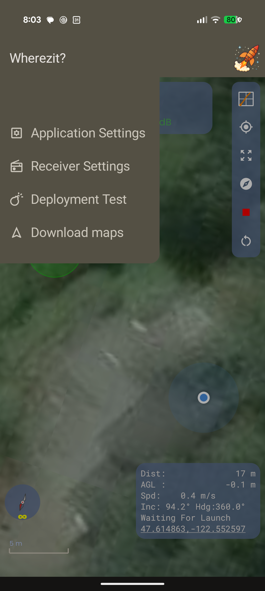

⚡ **The menu changes depending on what's connected.** This is deliberate, not a bug:

Listed in menu order:

| Menu item | Appears when |
|---|---|
| Communication | The receiver is connected |
| Flight Profiles | The locator is powered, in range, and **disarmed** |
| Locator Settings | The locator is powered, in range, and **disarmed** |
| Receiver Settings | The receiver is connected |
| Application Settings | Always |
| Download maps | Always |
| Deployment Test | The locator is powered, in range, and **armed** |

So if a screen you want isn't in the menu, the reason is almost always the locator's arm state or the fact that it isn't transmitting. The screenshot above predates the current menu and shows both an older order and an older set of names; it was taken with a live, disarmed locator, which today gives six items. With the locator switched off you get four: Communication, Receiver Settings, Application Settings and Download maps — in that order, which is the menu's order throughout: the things that depend on a live link first, the ones you set up at home last.

Two rules apply to all configuration:

- **The locator accepts configuration changes only while Disarmed.** Arm first and the settings screen is not even reachable.
- **The connection password can only be set — and only be read — over the USB-C console.** It is never sent over the air. If you forget it, you need a cable. Set it at home.

## 2.2 Deployment channel mapping

Each of the four channels is assigned one **mode**:

| Mode | Fires when |
|---|---|
| **Drogue Primary** | A set delay after apogee is detected. |
| **Drogue Backup** | A longer delay after apogee is detected. |
| **Main Primary** | The rocket descends below the main primary altitude. |
| **Main Backup** | The rocket descends below the main backup altitude. |
| **Unused** | Never. The channel is excluded from the firing schedule entirely. |

**Factory defaults:** Channel 1 = Drogue Primary, Channel 2 = Drogue Backup, Channel 3 = Main Primary, Channel 4 = Main Backup.

⚡ **Set every channel you are not using to `Unused`.** An unused channel left mapped to a real role is a channel that will be commanded to fire — harmless with nothing connected, but it wastes battery, and it makes the recorded flight data harder to read.

**Worked examples**

*Single deploy, motor eject with electronic backup*
| Channel | Mode | Setting |
|---|---|---|
| 1 | Drogue Primary | delay 1.0 s (fires after motor ejection should have) |
| 2 | Unused | — |
| 3 | Unused | — |
| 4 | Unused | — |

*Dual deploy, two charges*
| Channel | Mode | Setting |
|---|---|---|
| 1 | Drogue Primary | delay 0.0 s |
| 2 | Main Primary | 130 m |
| 3 | Unused | — |
| 4 | Unused | — |

*Dual deploy, fully redundant (the default)*
| Channel | Mode | Setting |
|---|---|---|
| 1 | Drogue Primary | delay 0.0 s |
| 2 | Drogue Backup | delay 2.0 s |
| 3 | Main Primary | 130 m |
| 4 | Main Backup | 100 m |

Note how the redundant pairs are separated: the backup drogue fires 2 seconds after the primary, and the backup main fires 30 m lower than the primary. If the primary charge does its job, the backup fires into an already-open bay.

## 2.3 Timing and altitude settings

| Setting | Range | Default | What it does |
|---|---|---|---|
| **Drogue Primary Deploy Delay** | 0.0 s up to just under the backup delay | 0.0 s | Delay from apogee detection to firing the primary drogue charge. |
| **Drogue Backup Deploy Delay** | just above the primary delay, up to 3.0 s | 2.0 s | Same, for the backup charge. Must be longer than the primary. |
| **Main Primary Deploy Altitude** | just above the backup altitude, up to 500 m | 130 m | Altitude above ground at which the primary main charge fires. |
| **Main Backup Deploy Altitude** | 0 m up to just below the primary altitude | 100 m | Same, for the backup charge. Must be lower than the primary. |
| **Launch Detect Altitude** | *fixed* | 30 m | How far the rocket must climb before the locator will call it a launch. **Not adjustable** — see the note below. |
| **Deploy Signal Duration** | *fixed* | 1.0 s | How long each channel stays energized when it fires. 1.0 s is plenty for an e-match. **Not adjustable** — see the note below. |
| **Sensor Axis Along Rocket** | Auto / X / Y / Z | X | Which of the locator's own axes runs along the length of the airframe. A property of how you mounted it, not of the flight. The default assumes the standard installation; if yours runs along Y or Z, change it. Auto disables the not-armed pad alert entirely (§1.7). |

> ⚠️ **Launch detect altitude and deploy signal duration are no longer adjustable, and the app no longer shows them.** They are fixed at 30 m and 1.0 s.
>
> They used to appear in Locator Settings, and editing either **looked like it failed while actually succeeding**: the locator accepted and saved the new value, the app reported *"Update not acknowledged"*, and the display reverted to the old number on the next broadcast. Neither field travels in the locator's status broadcast, so the app has no way to read back what the locator holds — and it confirms a settings change by comparing everything it sent against what comes back.
>
> Worse, because the app had to send *something* for both, every settings change — **including a plain LoRa channel change** — quietly wrote its guess over whatever the locator held. The app now leaves both alone, and the locator keeps its own.
>
> Making either adjustable again means carrying it in the broadcast, which is a change to all three pieces of firmware. Until then the defaults are the values, and they are the right ones for ordinary flying.

The app enforces the primary/backup relationships for you — it won't let you set a backup drogue delay shorter than the primary, or a backup main altitude higher than the primary.

**All altitudes are above ground level (AGL)**, zeroed at the pad when you arm.

## 2.4 Only one charge fires at a time

The locator will never energize two channels simultaneously. If two charges are scheduled close enough together to overlap, the second waits until the first is finished.

What this means for you:

- Battery current draw stays predictable.
- If you set the drogue primary and backup delays very close together, the backup will fire slightly later than the number you set — it waits its turn.
- Give redundant pairs some separation (the default 0.0 s / 2.0 s is a good starting point) so the backup genuinely acts as a backup rather than a simultaneous second charge.

## 2.5 LoRa channels — the Communication screen

Everything to do with which channel you are on lives on one screen: **Communication**, at the top of the app menu. It holds up to four things, in the order you normally reach for them — find a locator you've lost, find a clean channel to move to, point the receiver by hand, move the locator by hand.

Two of those come and go with what the app can hear. **Find a clean channel** is offered only while a locator's messages are arriving: it is for a link that is working badly, and with nothing coming through the question is not which channel is quiet but where the rocket is. Once you have started a scan it stays put — with its results — until you leave the screen, even though the scan itself is what silences the locator. **Locator channel** likewise needs a connected locator, since there has to be one to move.

Channels are numbered **0–63**. Default is 0.

> **Communication → *Receiver channel***
> Points **your receiver** at a locator that is already on another channel. Your own locator does not move. Use this when you have two locators and want to switch which one you're watching — and it's what **Find a locator** fills in for you.
>
> **Communication → *Locator channel***
> Moves **your locator** to a new channel. Your receiver automatically follows it, so your link is preserved. Use this when the channel is chosen for you — someone else at the launch is on yours, or the club assigns one. Shown only while a locator is connected; there has to be one to move.

<!-- Screenshot needed: the Communication screen. app-05-receiver-settings.png predates the move and shows the channel field in its old home. -->

If a scan has already found somebody on the channel you type, the app says so underneath — *"Prometheus is on channel 12"* — so you are not moving a rocket onto an occupied channel blind. It only speaks up when you have actually changed the number, and it never counts the locator you are connected to: that one is on your channel because it is yours. Two more things it will not do: it says *"An unrecognized locator"* rather than inventing a name when the frame it heard carried no ID, and it stays quiet about a hit the search itself flagged *likely false hit* — a locator sitting next to the receiver is heard on channels it is nowhere near (§2.5), and warning you off a channel that is actually free would be worse than saying nothing.

💡 **Can't see *Find a clean channel*?** It is hidden while nothing is being heard. Power the locator up, wait for its name to appear on the status panel, and it will be there. **Find a locator** is the one that works when the link is down.

💡 **These two used to sit on separate screens and carried the same label, which was a reliable way to move the wrong device.** They are now side by side and named for what they move. If you have used an older build, the muscle memory to unlearn is *Locator Settings → channel*: that field is gone, and the locator's channel is set here.

💡 At a busy launch, pick an uncontested channel *before* you power up on the pad. The app will warn you if it hears another locator on your channel (§2.6).

⚠️ **A different channel does not protect you at arm's length. Keep spare locators well away from the receiver.** A powered locator sitting within a few feet of the receiver will be heard *whatever channel either one is set to* — at that distance it arrives billions of times stronger than the rocket you're tracking, and no radio can filter that out. Two consequences:

- Your app may show packets from the nearby locator. It won't display the wrong rocket's data (§2.6), but you'll get a conflicting-traffic banner.
- **More importantly, every transmission from the close-in locator deafens the receiver to your actual rocket.** During a flight that is real telemetry loss.

**Rule: only the locator you're flying stays near the receiver. Spares go in the car, or stay switched off.** A few tens of feet of separation is enough. See Appendix G for why.

### Finding a clean channel

**Communication → *Find a clean channel*** asks the receiver to listen to all 64 channels in turn and rank them from quietest to busiest. It takes about a second. Tap the button next to a suggestion to go there — **Move here** with a locator connected, which moves the rocket and lets the receiver follow, or **Point receiver** without one. Either takes effect on the tap; there is no second step.

A few things to know about the result:

- **It ranks, it doesn't measure.** You get an ordering, not signal levels. The hardware's readings near the noise floor aren't accurate enough to quote as numbers, but they're perfectly good for comparing one channel against another in the same scan.
- **It tells you who is on a busy channel, when it can.** A channel with a locator on it is never offered, and if the app has met that locator before it is named: *"Channel 12 has Redline on it — not offered."* Unnamed means the app has not seen that locator before — someone else's rocket, or one of yours it has never been introduced to. The name comes straight off the air and is not password-checked, so treat it as a helpful label rather than proof.
- **It scans where the receiver is standing.** A channel that's quiet at the flight line may be busier a mile up, where the rocket can hear far more of the world. Use it to pick a good starting channel, not as a forecast.
- **If it says every channel is loud, believe it.** That almost always means a transmitter is within a few feet — usually a spare locator someone left switched on. Changing channel won't help; moving the transmitter will.
- **It won't run while the locator is armed.** Scanning stops the receiver hearing your rocket for about a second, and you can't change channel while armed anyway. Disarm first.
- **If the move doesn't confirm, the app checks before it does anything.** See *When a channel move isn't confirmed*, next.

💡 The natural time to do this is during bench prep or when you arrive at the field — before you power up on the pad.

### When a channel move isn't confirmed

Moving a locator is the one setting the app cannot confirm by asking. There is no *"got it"*
reply from the rocket — the app knows the move worked because your locator's next status
broadcast arrives on the new channel. On a noisy channel, which is usually *why* you are
moving, those broadcasts are the very thing going missing. So a move that actually worked can
sit unconfirmed for a few seconds.

**If nothing arrives, the app goes and looks rather than guessing.** You will see it start a
short search on its own — the new channel, then the old one, about three seconds. **That is
not a fault and you did not press anything.** It is the app finding out which channel your
rocket is really on before it does anything about it. Then one of three things:

- **Heard on the new channel** — the move worked and the confirmation was just late. The app
  says so, and nothing else happens.
- **Heard on the old channel** — your rocket never got the message. The app brings the
  receiver back to the old channel and tries the move once more.
- **Heard on neither** — the app reports *"not acknowledged"* and leaves the receiver on the
  new channel.

⚠️ **If it says not acknowledged, don't assume your rocket stayed put.** It may well have
moved and simply be too quiet to hear — switched off, out of range, or a weak link at that
moment. The app remembers the channel it was trying to reach, so **Find a locator** looks
there first, and dismissing the message does not throw that away.

💡 **Why the receiver is left on the new channel instead of being put back.** Because putting
it back is the one action that can strand your rocket. If the move *did* work, dragging the
receiver to the old channel points it away from where the rocket now is — and the rocket keeps
its new channel even through a power cycle. Leaving the receiver where it is costs you nothing
that a search will not fix.

### Finding a locator when you've lost its channel

This is the other half of the problem, and it looks nothing like interference. You power a locator up, the app sits on **No Locator**, and nothing is wrong with the channel you're listening to — you're simply listening to the wrong one. It's the normal hazard of one receiver and several rockets: each one remembers its own channel, and you don't.

**Communication → *Find a locator*** asks the receiver to listen for a rocket on the channels it's most likely to be on. The app already knows most of them, because it remembers the channel it last heard each of your locators on. It tries that first, then your other locators' channels, then a channel a move was staged to but never confirmed, then channel 0 (where a locator that lost its settings ends up), then the channel you're on now. That's usually four to six channels and a few seconds.

- **Pick which rocket you're looking for, if you know.** *Looking for* lets you choose one of your known locators; the search then stops the moment it hears from that one, usually on the first channel it tries. Leave it on **Any locator** and it reports everything it finds — which is what you want for a borrowed locator the app has never met, or when you want to see both of your rockets at once.
- **Each channel takes about a second and a half.** That's not slack: a locator only transmits for about a seventh of each second, so anything quicker would walk past a channel while the rocket happened to be silent. It's the same reason the clean-channel scan listens properly to its final candidates.
- **Found it? Tap *Connect*.** That moves the **receiver** to the rocket's channel — not the rocket. It's already there, which is what the search just established, and moving it is the one thing guaranteed to lose it again. It takes effect immediately: the row changes to *Connected* once the receiver confirms the new channel. (The clean-channel scan's button still reads *Point receiver*, deliberately — that one sends you to a channel chosen for being **empty**, where "Connect" would promise something that is not there.) While a change is on its way the Connect buttons grey out, so a second tap cannot go missing. If it's a locator the app doesn't know, you'll be asked for its password once broadcasts start arriving, exactly as if you'd tuned there by hand.

  💡 **Picking a channel from a scan acts; typing one by hand needs Update.** Choosing a result is the decision — the search has already established where the rocket is — so there is nothing left to confirm. The *Receiver channel* field lower down is different: every keystroke is a valid channel number, so it waits for **Update**.
- **You can search all 64 channels.** Offered after any short search that runs to the end — whether it found something or not, because finding *some* rocket is no evidence about the one you're looking for — and never started for you: it takes up to about 90 seconds — less when it finds locators along the way, since it moves on as soon as a channel answers — and the receiver hears nothing at all while it runs.
- **It won't run while the locator is armed or flying.** Both scan buttons grey out and say so. A full sweep would leave you deaf for over a minute, which is intolerable over a live flight — and pressing **Arm** during a running scan stops the scan so the command gets through, rather than queueing behind it.

  ⚠️ **This does not time out, and that is deliberate.** If your rocket arms and then goes out of range, the receiver stays locked on it and both scans stay unavailable until you disarm it or power-cycle the receiver. That is not a lockout from a tool that would have helped: a rocket that armed on your channel is *still on your channel*, so it is a range problem and not a channel one. Sweeping 64 other channels cannot find it, and the ninety seconds spent trying are ninety seconds you are not listening for it to come back. Use direction and distance and walk toward it (§4).
- **Names and channels here aren't password-checked.** They're read straight off the air. Normal recognition happens the usual way (§2.6) once the receiver is pointed at the channel.

💡 If you fly several rockets, the app's memory of their channels is what makes this quick — and it builds that memory just by hearing from each of them. A locator you have never connected to has nothing stored, so it will be found on the full sweep rather than the short list.

**You get a free check on your own channel without scanning.** Whenever the receiver is connected and the locator is off, the app has the receiver read your current channel directly and will post an interference note if it finds something transmitting there. So the ordinary sight of **No Locator** with nothing under it is a positive result: your channel was measured and it was clear. A note appearing *before* you have powered the rocket up is the cheapest warning you will ever get — deal with it then, not on the pad.

## 2.6 Connection password and locator recognition

Each locator identifies itself with a permanent hardware ID and, optionally, a password.

**What the password does:** the app only *recognizes* — displays, controls, arms — locators it is authorized for. If it hears an unknown locator, it asks you for that locator's password before it will do anything with it.

**Commands only reach the locator you're connected to.** Arm, disarm, configuration changes and deployment tests are addressed to that specific locator by its hardware ID. Another locator on the same channel — yours or anyone else's — ignores them completely. You can share a channel with other fliers without your commands touching their rockets, or theirs touching yours.

**Authorized and connected are not the same thing.** The app can be authorized for any number of locators — most people who own two are authorized for both — but it displays and commands exactly **one** at a time. Once it connects to a locator, that connection is held: another locator turning up on the air, even one you're authorized for, does **not** take over the screen. This matters at close range, where you can hear a locator that isn't on your channel at all (§2.5).

**How you'll experience it:**

- **First time the app hears your locator**, it prompts for the password. Enter it once; the app remembers that locator. The dialog has an eye icon to show what you have typed, and the Enter key submits it the same as **Connect** does. Get it wrong and the dialog keeps both the focus and the keyboard, so the retry is a straight retype.
- **If another locator is on the air and isn't the one you're watching**, the app warns you: *"Another locator (ID …) is on the air and is not being displayed. Connect to switch to it, or move to an uncontested channel."* Its data is not shown.
- **To deliberately switch to that other locator**, tap **Connect** on the banner. If you're already authorized for it, the app switches immediately; if not, it asks for its password first.
- **The connection releases on its own** if your locator goes quiet for about 15 seconds — long enough to ride out a fade, so a moment's dropout never hands the display to a different rocket.
- **If you set no password**, the locator is open and any *SteamPigeon* app will pick it up. Note that "open" means *authorized*, not *connected* — two open locators still can't fight over the display.

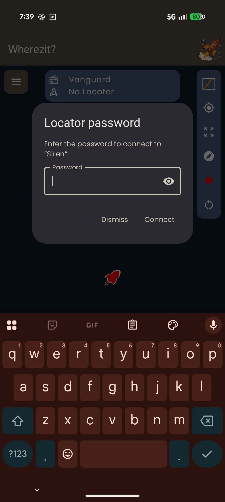

The prompt names the locator it is asking about — *Enter the password to connect to "…"* — so you can tell your own rocket from someone else's before you type anything. **Dismiss** walks away from that locator for this session; **Connect** submits, and so does the Enter key.

⚡ **Until you answer it, the status pill reads No Locator.** An unauthorized locator is transmitting perfectly well and the app is hearing it — it simply will not display or command a locator it cannot vouch for. So "No Locator" plus a password prompt is not a link problem, and reconnecting will not help.

⚠️ **Set the password over USB-C at home, and write it down somewhere you'll find it.** It cannot be read or changed over the air, only over the cable. Maximum 15 characters; blank clears it.

⚠️ **A firmware update can clear the password.** When it does, the locator comes back *open* — the app will pick it up with no prompt, which looks like everything is fine rather than like something was lost. After updating a locator, check §2.6 in the `config` menu and re-enter the password if it reads `(not set)`. This is why the note above says write it down.

📋 The password is a convenience gate, not a security system. It keeps your app from acting on someone else's rocket and vice versa. Don't treat it as protection against a determined third party.

## 2.7 Device names

- **Locator Name** and **Receiver Name** are both up to 20 characters. Use something you'll recognize at a launch with six other fliers ("Frank's Receiver", not "Receiver").
- ⚠️ **After you rename the receiver, the old name will keep appearing** — both in *SteamPigeon* and in your phone's Bluetooth settings. That's because the name is cached by Bluetooth itself, not by our app. **Fix: go to your phone's Bluetooth settings and "Forget" the receiver, then reconnect.** The new name will appear.

## 2.8 App settings


| Setting | What it does |
|---|---|
| **Enable Speech** | Turns the spoken callouts on and off. Leave it on — it's how you keep your eyes on the rocket. |
| **Voice Name** | Selects which of your phone's installed text-to-speech voices to use. |
| **Closest map zoom** | How far in the flight map follows the rocket by itself (z18–z22, default z20). See below. |

💡 Try the voice at home, at volume, outdoors. Some voices are much easier to understand over wind and motor noise than others.

**About closest map zoom.** The map frames your position and the rocket's together, zooming to fit both. This setting is the deepest it will go on its own.

- It bounds **automatic** zoom only. You can always pinch in closer by hand; the map returns to its own framing a few seconds after you let go, as it always has.
- Lower shows more ground around the rocket; higher shows finer detail, as far as the imagery goes. z20 is a starting point, not a recommendation.
- **It is not what stops the map jittering at close range.** It used to be described that way here, and that was wrong: the jitter happens at and below this limit, where there is nothing for a limit to bind. The app now ignores framing changes small enough to be the two receivers disagreeing, which handles it directly and needs no setting — see §9.4.
- If the map still pumps at close range, come down a level. If it settles too far out to be useful, go up.

---

# Part 3 — Before you leave home

## 3.1 Bench-prep checklist

- [ ] Locator charged
- [ ] Receiver charged
- [ ] Phone charged
- [ ] Versions checked and noted — locator, receiver **and app** (§3.3)
- [ ] Deployment channel modes set for **this** flight (§3.4)
- [ ] Delays and altitudes set for **this** flight (§3.4)
- [ ] **Sensor axis along rocket** matches this installation — the default X is right only if X runs along the tube (§1.7, §3.4)
- [ ] LoRa channel chosen (§3.4)
- [ ] Bench deployment test passed on every channel you will use (§3.5)
- [ ] Flight memory has room (§3.6)
- [ ] Launch site map downloaded (§3.7 — **work in progress**)
- [ ] Offline maps app installed, site region downloaded in it (§3.7)
- [ ] App connects to receiver (§3.8)
- [ ] Chosen channel reads clear — receiver connected, locator still off, no interference note (§2.5)
- [ ] Locator heard on that channel once powered up — if not, **Communication → Find a locator** rather than assuming range (§2.5)
- [ ] Phone compass calibrated — figure-eight, away from metal (§9.3)
- [ ] Magnet, cable, spare igniters packed (§3.9)

## 3.2 Charge everything

Charge the locator, the receiver and your phone. Do this the night before, not the morning of.

⚡ The locator's magnetic switch means it can be switched on accidentally in storage (§1.2). Assume the battery is lower than you left it.

## 3.3 Confirm versions

Three pieces of software have to agree with each other, and each one tells you what it is:

- **Locator firmware** — top of the Locator Settings screen.
- **Receiver firmware** — Receiver Settings.
- **The app itself** — top of Application Settings.

The firmware versions appear once that device has reported them, so give the screen a moment after opening it. Note all three down — if you ever need help diagnosing something, these are the first numbers anyone will ask for.

All three are written the same way on purpose, so they can be compared at a glance. A version looks like `2026.08.14-c5e7297`: the date it was built, and the exact source it was built from.

**A version ending in `-dirty` and a time, like `2026.08.14-c5e7297-dirty.231500`, is a development build** — someone's work in progress rather than a released one. That is normal on a board you or a developer has just flashed, and the time is there so two development builds made the same day can be told apart. A version with *no* such suffix is the useful kind: it names an exact, recorded state of the source. If you did not expect a development build, it is worth asking which one you have before flying it.

### Is this device up to date?

The middle part of the version is the answer. It identifies the source the build came from, so anyone with the project can look it up and say what that build is missing.

⚠️ **Mismatched app and receiver versions are the one pairing that can stop things working outright.** The two talk to each other over Bluetooth in a fixed format, and that format changes occasionally. When it does, an old receiver and a new app cannot complete a channel scan or a locator search — the app waits about eight seconds, then reports that no answer came and suggests updating the receiver’s firmware. **That message is literal: it means what it says** — but only if the app made you wait for it. In builds before 2026-09-01 the same message could appear the *instant* you pressed the button, with a perfectly matched and perfectly healthy receiver, because the press had collided with the app’s own background polling and nothing was ever sent. If it arrives with no pause at all, the receiver is not what is wrong — update the app, and see Part 11. The locator is not affected by that pairing; it talks over the radio in its own format.

💡 **A device that has been flashed but not since updated will happily report a months-old version, and nothing else will tell you.** If you own more than one receiver, they drift apart quickly — check the version on the one you are actually flying with, not the one you tested with last.

## 3.4 Set flight configuration

Open **Locator Settings** from the app menu. (The locator must be powered on, in range, and disarmed for this screen to appear — §2.1.)

The screen scrolls; it is shown here in two halves.

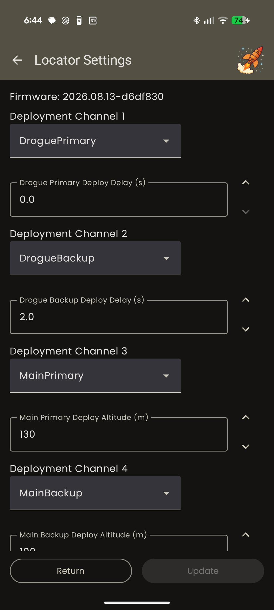

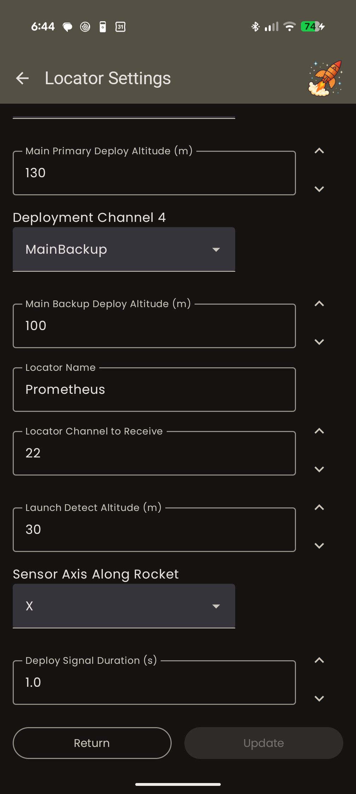

> 📷 **This screenshot predates the change in §2.4** and still shows Launch Detect Altitude and Deploy Signal Duration. The current screen has neither.

Set, in this order:

1. **Each channel's mode** — including `Unused` for channels you aren't wiring (§2.2).
2. **The delay or altitude** for each channel that has a role. The field appears underneath the channel once you pick its mode.
3. **Sensor Axis Along Rocket** — the axis running along the airframe (§1.7). Only needs changing when you move the locator into a different rocket, but it is the one setting whose default is an assumption about *your* hardware rather than a preference, so check it.
4. **LoRa channel** (§2.5).
5. **Locator name**.

⚠️ **Launch detect altitude and deploy signal duration used to be steps 3 and 5 here, and are gone** — they are fixed at 30 m and 1.0 s and the screen no longer offers them. See the note in §2.4 for why, and why their absence is an improvement on what was there before.

💡 **Enter finishes a field.** Every box that raises a keyboard now closes it on Enter, and does so by committing the value — the same thing that happens when you tap away from the field, including clamping a number back into its allowed range. The three numeric locator fields used to have no way to do this at all: the numeric keypad carries no Done key, and Enter inserted a line break.

Press **Update**. The app tells you whether the locator acknowledged the change (*Updated*, *Not Received*, or *Send Failed*). ⚡ **If you don't see the acknowledgment, the locator did not take the change.** Try again; don't assume.

**Read the settings back** before you close the screen. The values shown come from the locator, not from your phone, so what you see is what will fly.

## 3.5 Bench deployment test

This confirms two things: that each channel actually fires, and that your igniters actually light.

⚠️ **DANGER — read the whole procedure before starting.**
- **E-matches only. No black powder. No pyrotechnic charge of any kind.**
- Point the igniters away from your face, your hands, and anything you care about.
- Wear eye protection.
- E-matches produce a hot spark and a bang. Do this on a bare bench, not on carpet, not near solvents.

**The app is the only way to run one.** There is no USB-C console deployment test — it was removed deliberately. A console test can only be started with a cable in your hand, which puts you within arm's reach of the e-match you are about to light; the app starts one from wherever you are standing. Everything else the console does is safe to do at the bench, so this is the one capability that belongs on the radio and nowhere else.

**Using the app** (deployment test is only reachable while the locator is **armed**, because that's the only time the outputs are live):

1. Connect an e-match to the channel you want to test.
2. Power the locator on. Confirm the loud rising power-on tone.
3. **Arm** from the app. You'll hear the arming chirp, then the repeating quiet ready-beep.
4. Open the menu → **Deployment Test**. (While armed, **Locator Settings** and **Flight Profiles** disappear from the menu and this takes their place — §2.1.)
5. **Pick the channel from the dropdown.** Nothing happens yet; the button below is disabled and reads *Select Deployment Channel* until you do.

   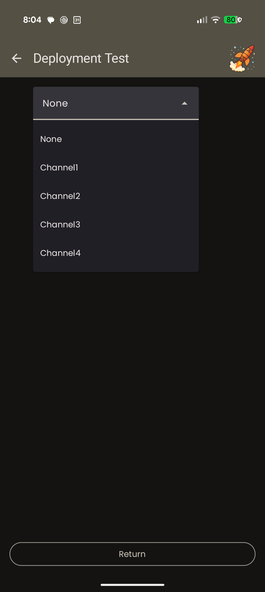

6. **Press the button** — now reading *Deployment Channel n Test* — to start the countdown. The button becomes the countdown and greys out, the red **STOP TEST** button below it comes alive, and the locator's status LED blinks red, faster in the last 3 seconds.

   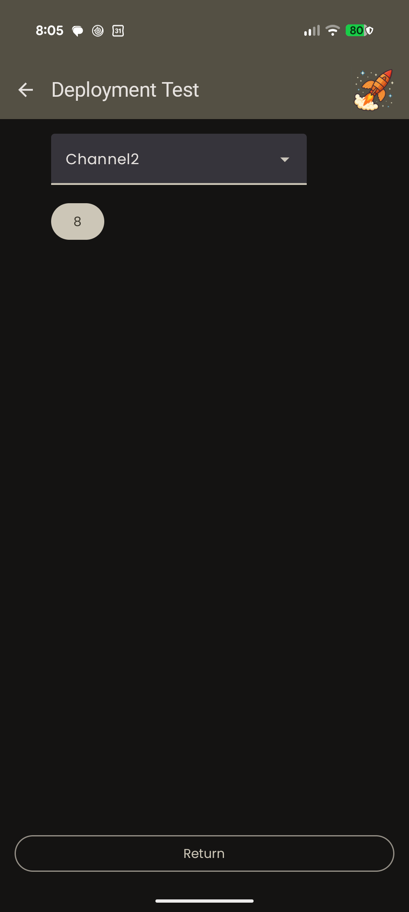

   > 📷 **Screenshot needs retaking** — `images/app-10-deployment-test.png` and `app-10b-deployment-test-select.png` predate the separate **STOP TEST** button and show the countdown button as the only control.

7. The channel fires.
8. Repeat for each channel you will use.
9. **Disarm** when you're done.

### Stopping a test you've started

⚠️ **Read this before you start one, not after.**

- **STOP TEST is the cancel**, sitting under the countdown in red. It is on screen from the moment you open the page — greyed out until there is a test to stop — so you can see where it is *before* you start one. It is a full-width target, not the shrunken digit the countdown becomes.
- **The button that started the test cannot restart it.** It greys out for the duration, so stabbing near zero can no longer set off a fresh countdown. (Older firmware and app versions used one button for both, and this was a real way to fire the charge you were trying to stop.)
- **Leaving the screen sends the cancel too.** Return and the back arrow both send it as the screen closes.
- ⚡ **The cancel is a radio message, and radio messages get lost.** ⚠️ **It is a request, not a switch.** STOP TEST reads **STOPPING…** while a cancel is outstanding, and the count above it keeps ticking until the locator actually honors it. **Until the countdown clears, treat the charge as live.** If it keeps ticking, press again — pressing repeatedly is the right answer, not a mistake.
- ⚡ **Watch it stop.** This is the reason to prefer STOP TEST over Return: leaving the screen sends the same cancel but takes away the one display that would tell you whether it landed. If you need to be sure, stay and watch. (If you have already left, come back — the screen picks the countdown back up if it is still running.)

**There is no USB-C console equivalent**, by design — see above. Earlier firmware had a `test` command; it is gone, and `?` on the console no longer lists it.

## 3.6 Make room in flight memory

The locator holds **9 flights**. When it's full, you can't record a new one.

1. **Export anything you want to keep** first (§10.4). Once erased, it's gone.
2. Connect USB-C, open the console, type `data`.
3. `c` — **clear empty/unused records**. This reclaims slots that were opened but never flown (a stand-down before launch, for example). Safe; it doesn't touch real flights.
4. `e` — **erase ALL flight memory**. Asks for `Y` to confirm. This deletes every recorded flight.

⚡ **If you update the locator's firmware and the flight-record format changed, you must erase all flight memory.** Old records become unreadable and will confuse the app. **Export first, then erase.** The release notes for a firmware update will tell you if this applies.

> **This applies to the current update.** The record format changed and the locator now stores **9 flights instead of 10** — see §10.4. Export anything you want to keep, then erase.

> ⚠️ **Update the phone app at the same time.** The list of stored flights is sent over the radio in a message whose size depends on how many flights the locator holds. A locator on the new firmware talking to an older app will show an **empty flight list** — not an error, just nothing. Updating both together avoids it.

## 3.7 Download offline maps for the launch site

> ⚠️ **WORK IN PROGRESS.** This feature is built and it works, but the satellite imagery it downloads comes from map providers whose terms do not currently permit keeping tiles on your device permanently. The provider question is being resolved. Until it is:
> - **Treat downloaded imagery as temporary.** It may expire or stop rendering.
> - **Do not rely on it as your only recovery plan.** Bring a paper map, a compass, and a GPS you trust.
> - The workflow described below is stable. The provider list, how long a download lasts, and the details of individual controls are still open.

Recovery happens where there is no cell signal. This screen pre-loads the satellite imagery for your launch site so the map works anyway.


**To download a site:**

1. Open the menu → **Download maps**. It opens centred on **where you are**, zoomed out far enough to see a state or two — so a site a few hours' drive away is a pan rather than a search. If the phone has no position fix yet it opens on the whole world instead; frame down from there.
2. **Frame the area** in one of three ways:
   - Pan and zoom the map directly.
   - **Go to preset site…** — pick from the built-in list of known launch sites, each with the area it will frame. It also fills in the **Site name** for you.
   - Type a **Lat, Lon** and press **Go** — or the **Go** key on the keyboard, which does the same thing and puts the keyboard away.

   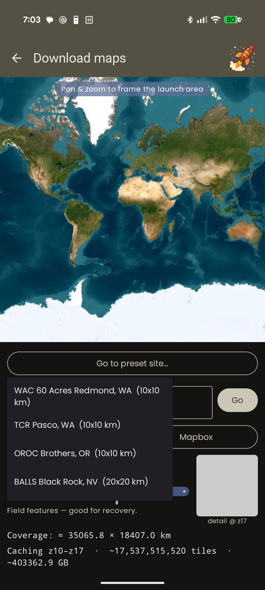

   **The Lat, Lon box also reads back where the map is pointed.** Pan or pinch and the numbers follow the center of the map to four decimal places (about 11 m) — that is the app reporting the position, not something you typed being rewritten. The box holds your own text only while you are typing in it, and returns to reporting the center as soon as you leave it. It is the quickest way to write down the coordinates of a site you framed by eye.
3. Choose the **provider** (Esri or Mapbox).
4. Set **Detail (max zoom)** with the slider. The hint under the slider tells you what each level is good for — z17 is described as *"Field features — good for recovery"*, which is the level you want. The thumbnail on the right previews the actual detail you'll get.
5. Check the estimate. The screen shows the ground coverage, the tile count and the download size.
6. Give it a **Site name**.
7. Press **Download this area for offline**. If the area is too large the button instead reads **"Over 1 GB — tighten the area or lower the zoom"** and cannot be pressed; shrink the area or drop the max zoom until it changes back. Lowering the max zoom by one step is the biggest single lever — each level costs about four times the one above it.


The example above is the **BALLS Black Rock, NV** preset: 22.1 × 22.1 km at z10–z17, about **61,600 tiles and 790 MB**. That's a realistic figure for one launch site — and a large one. Dropping the max zoom one step, to z16, cuts it to roughly a quarter.

💡 **Do this on Wi-Fi, the day before.** 289 MB over a marginal cell connection at the field is not a plan.

**Leaving the screen does not stop the download.** It keeps running in the background and stops only if the app itself closes — so you can go back to the flight map, or start it and put the phone down. While it runs, **Cancel** stops it deliberately; whatever had already downloaded is kept, not discarded.

When it finishes you get a line saying so — *✓ "your site name" downloaded — renders offline on the map* — with a **Dismiss** next to it. That message is the confirmation to look for, not the region simply appearing in the list below (see the warning further down).

💡 **The size shown before you download is an estimate, and it is now roughly right.** It used to run about 2.7× light — a region shown as 290 MB really cost 790 MB — because it counted one zoom level fewer than the map actually fetches. **If these numbers look much larger than you remember, that is the fix, not a new limit:** the downloads were always this big, the screen was under-reporting them. It follows that the 1 GB ceiling now stops you sooner than it used to, and for the first time it means what it says.

**Offline regions** are listed at the bottom of the screen, below the download button, each with a status line and a delete button. ⚡ **The whole section is absent until you have at least one region** — an empty screen there means nothing has been downloaded, not that the list failed to load.

| Status shown | What it means |
|---|---|
| `complete · 3 MB` | Fully downloaded. This region will render with no signal. |
| `incomplete — 62% of tiles · 140 MB` | Interrupted. Press **Resume** to finish it — tiles already downloaded are not fetched again. |
| `status unknown` | The app could not read the region's status. Treat it as incomplete. |

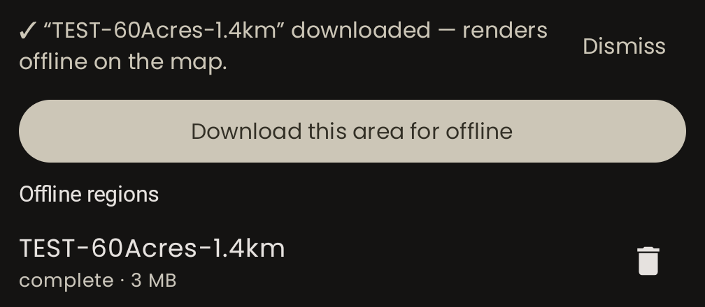

Each entry has the site name, its status line, and a **trash icon** to delete it.

⚠️ **A region appearing in the list is not proof that it downloaded.** The entry is created when the download *starts*, so a region cut short by a dropped connection, a cancel, or the app closing still sits in the list. Check that it says **complete** before you count on it at the field.

💡 **Test it properly before you trust it:** put the phone in **airplane mode _and_ turn Wi-Fi off** — airplane mode alone leaves Wi-Fi up on most phones, which quietly invalidates the test — then open the flight map and pan around your launch site. What you should see is a **hard-edged rectangle** of imagery with nothing outside it. If imagery continues past the edges, you are looking at tiles your phone cached while browsing, not at your downloaded region.

💡 **While you're at it, install an offline maps app** — Organic Maps or OsmAnd, both free — and download the region around your site in that app too. It is what receives the rocket's coordinates when you tap them during recovery (§9.2), and without offline data it opens to a blank screen where you need it. This is separate from the imagery above and takes a few minutes on the same Wi-Fi.

## 3.8 Verify the app-to-receiver link

1. Power the receiver on.
2. Open *SteamPigeon*. The status pill at the top of the map shows **Scanning**, then a **Select receiver** dialog appears listing what it found.


3. Tap your receiver. The pill changes to the receiver's name.


With the receiver connected but the locator off, the status panel reads **No Locator** where the locator's name would be — on the rocket-icon row, whose satellite count and battery are blank for the same reason. **This is the normal, healthy state before you power up the rocket.** The app is connected to the receiver; there is simply nothing flying yet.

While the locator is off the app keeps measuring the channel through the receiver, so it can still warn you that something else is transmitting where your rocket is about to. **Nothing under the No Locator line means the channel is clear** — which is the reading you want before you power up.

⚡ **A clear channel is not the same as the right channel.** If you have powered the rocket up and it still says **No Locator**, this reading stays reassuringly clean, because the receiver is measuring a channel nobody is talking on. That is the moment to use **Find a locator** (§2.5) — the status panel offers it as a **Find my locator** button while the receiver is up and no locator is being heard — rather than to wait it out.

⚡ **Silence is not a dropped connection.** The receiver relays nothing when the locator is quiet — off, on the pad, or out of range. The app knows this, checks the receiver's health in the background, and will not tear down a working link just because the locator has gone quiet. Don't "fix" a link that isn't broken.

💡 **A locator that is already armed when you open the app still gets named.** An armed locator broadcasts flight telemetry and nothing else — no name, from either the locator or the receiver — so the panel used to come up blank while the app was plainly receiving, plotting and able to arm that rocket. The app now remembers the name of every locator it accepts a broadcast from and shows the remembered one when no live name is arriving. The catch: it can only show a name it has heard before, so a locator this phone has **never** seen disarmed still comes up blank. Power the rocket up within range once, before you arm it, and the name is learned.

## 3.9 Pack list

- Receiver
- **The magnet** (and know which face is "on")
- Phone, charged, plus a power bank
- USB-C cable — the same one that talks to the locator's console
- Spare e-matches
- The printed quick-reference cards from Appendix A

---

# Part 4 — At the field: rocket build-up

## 4.1 Field checklist

- [ ] Locator installed, wiring dressed and secured (§4.2)
- [ ] E-matches connected to the correct channels (§4.3)
- [ ] **No-fire confirmation done, with e-matches only** (§4.4)
- [ ] Locator **powered off**
- [ ] Black powder charges installed
- [ ] GPS lock confirmed (§4.5)
- [ ] Readiness page checked (§4.6)
- [ ] Locator powered **off** for RSO (§5.1)

## 4.2 Install the locator

> 📷 **Photo needed — `images/hw-06-terminals.jpg`:** close-up of the deployment terminal blocks with an e-match lead correctly installed — showing strip length, insertion depth and a properly tightened screw.

- Seat the sled; make sure it can't shift under thrust or ejection pressure.
- Dress the deployment wiring so it can't be pulled out of the terminals.
- Secure the battery. A battery that comes loose under thrust can pull its own connector.
- Check the GPS antenna's view of the sky (§1.7).

## 4.3 Connect e-matches to the assigned channels

Match the wiring to the mapping you configured in §3.4. **Channel 1 in the app is the terminal block labeled 1 on the board.**

💡 Say it out loud as you wire: *"Channel one, drogue primary. Channel three, main primary."* Miswiring drogue and main is a well-traveled route to a very short flight.

💡 **If you assemble the rocket standing up, the locator will start its not-armed alert at you** — wired e-matches plus upright plus disarmed is exactly the condition it watches for, and it cannot tell your assembly stand from a launch rail (§6.6). Either lay the rocket down while you work, or use the app's bounded **Snooze** to buy quiet in five-minute steps. Don't tape over the buzzer; that removes the warning for the flight as well as for the prep.

## 4.4 First power-on: the no-fire confirmation

This is the most important procedure in this manual.

⚠️ **DANGER**

1. **E-matches connected. No black powder anywhere near the rocket.** Charge wells empty and clean.
2. **Point the charge wells away from yourself and away from anything you value.** Assume something could fire.
3. **Power the locator on** with the magnet. You should hear the loud rising power-on tone. **Nothing should fire.**
   - The locator is designed to boot into a no-fire state, and its deployment outputs are electrically disabled while it is Disarmed. That's the design. Treat the charges as live regardless.
4. **Confirm continuity** on each connected channel in the app (§4.6). This is the point of doing it now: you learn that every igniter is intact and every terminal is tight, while the rocket is still harmless.
5. **Power the locator off.**
6. **Now install the black powder charges.**
7. **Do not power the locator on again until the rocket is on the pad** (Part 6).

⚠️ If **anything** fires during step 3, stop. Do not install charges. Do not fly. The rocket is not safe until you understand why.

## 4.5 Get GPS lock in the open, then install

1. Power the locator up **out in the open**, away from buildings, vehicles and trees.
2. Wait for the **GPS lock LED next to the GPS antenna to start blinking**.
3. Check the satellite count in the app, and the size of the accuracy ring around the rocket marker (§4.6).
4. **Then** install the locator in the airframe.

Acquiring a first fix takes far more signal than holding one. Doing it in this order routinely turns a locator that "won't get GPS in the rocket" into one that works fine.

## 4.6 Reading the pre-launch readiness page

While the locator is powered on, in range, and **disarmed**, the app's flight map shows a readiness summary. This is your pre-flight instrument panel.

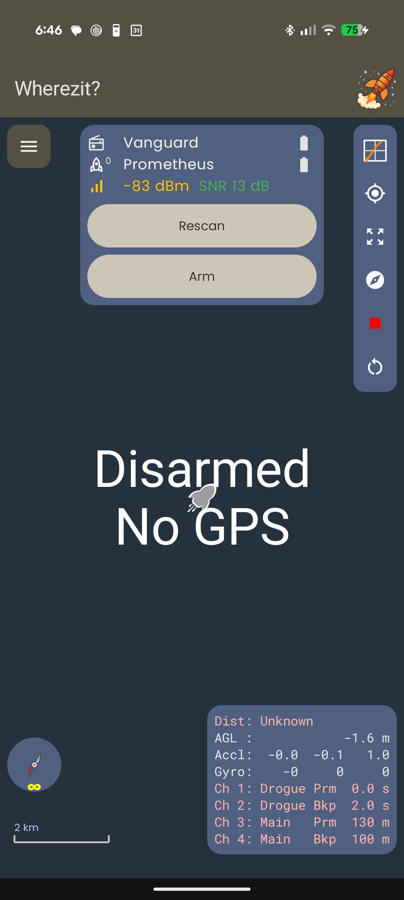

It comes in two pieces.

**The status panel at the top**, tapped to expand it, carries the two device names, a battery gauge for each, the locator's satellite count beside the rocket icon, the signal readout (§8.4), and the **Arm** button.

| Indicator | What good looks like |
|---|---|
| **Receiver / locator names** | Both present. **No Locator** means the locator is off, out of range, or on another channel — **Communication → Find a locator** settles the last of those in a few seconds (§2.5, §3.8). **While a scan is running the same line reads *Searching…* or *Scanning…* instead**: the receiver is listening elsewhere on your instruction, so the locator being quiet is expected rather than a fault. A locator that was already **armed** when you opened the app is named too, from the name the app remembers for it — see §3.8. |
| **Satellites** | The small number beside the rocket icon. More is better; watch it climb after power-on. |
| **Battery, ×2** | Bar gauges — receiver on top, locator below. Don't fly a locator showing one bar. **This is your only chance to read it**; the gauges go away at launch (§1.6). An *empty* gauge on a battery you know is charged is a different problem — see Part 11. |
| **dBm / SNR** | How loud and how clean the link is (§8.4). |

**The statistics panel at the bottom right** is where the flight-critical readings are. ⚡ **It has no separate "health" or "continuity" indicators — the readings themselves change color.** A line in the normal text color is a healthy one; **a line in red is the failure**, and which line is red tells you which sensor or channel.

| Line | What good looks like | Red means |
|---|---|---|
| **Dist** | A distance, or *Unknown* before the locator has a fix | The GPS is unhealthy or the fix is stale |
| **AGL** | Near zero on the pad | The barometer is unhealthy |
| **Accl** | Roughly 1.0 g on one axis and ~0 on the others, matching how the rocket is lying | The IMU is unhealthy |
| **Gyro** | Near zero on all three while the rocket is still | The IMU is unhealthy |
| **Ch 1–4** | The mode and setting for each channel, read back **from the locator** — confirm they are what you intended | ⚠️ **No continuity on that channel** |
| **Coordinates** | The rocket's latitude and longitude, underlined when tappable (§9.2) | — |

💡 **The statistics panel can be dragged** anywhere on the map, and it stays where you put it.

**On accuracy:** there is no numeric accuracy readout. The locator's reported horizontal accuracy is drawn as the **ring around the rocket marker** — a wide ring is a poor fix. If the ring is large, the antenna's view of the sky is poor (§1.7).

**About continuity:** continuity means *there is an intact circuit through the igniter*. It tells you the igniter is good and the terminals are tight. It does **not** mean the channel is armed or live — you'll see continuity on a wired channel whenever the locator is powered, armed or not.

⚡ **On a bench locator with nothing wired, all four channel lines are red.** That is correct and expected. The reading you are checking for at the field is the opposite: **normal color on every channel you have wired, red on every channel you haven't.**

⚡ **Continuity present on a channel you set to `Unused`** means you've wired a channel you don't intend to fire, or a mode is set wrong. Resolve it before you fly.

⚡ **Continuity absent on a channel you have wired** means a broken igniter, a loose terminal, or a lead that isn't making contact. Fix it before the black powder goes in.

**The panel switches layout when the rocket flies, not when you arm it.** Arming alone already swaps it: an armed locator waiting on the pad shows `Spd`, `Inc`/`Hdg` and *Waiting For Launch* in place of `Accl`, `Gyro` and the channel list — so **the continuity check above is something you do before you arm, not after.** A rocket that launches *disarmed* gets the flight layout too (§7.1), which is the part that changed: it used to key off the arm state alone, leaving a disarmed flight showing frozen pad readings all the way up.

## 4.7 If GPS accuracy is poor

In order of effectiveness:

1. **Get the first fix in the open, before installing** (§4.5).
2. **Reposition the locator** in the airframe so the antenna has a clearer view — away from metal, batteries, and especially carbon fiber.
3. **Wait.** Satellite count climbs over the first minute or two.
4. If your airframe is carbon, accept that GPS may be unreliable inside it and plan recovery around the audible beacon and the radio link (§9.4, §9.5).

---

# Part 5 — RSO inspection

## 5.1 Recommended state for RSO inspection

**Present the rocket with the locator POWERED OFF.**

- Locator **off**.
- Black powder charges **installed** (you did the no-fire confirmation before installing them, §4.4).
- Magnet **in your hand or your pocket**, not in the rocket, not in a magnetic tray next to the rocket.
- Be ready to power the locator on and show the readiness page (§4.6) if the RSO wants to see continuity, satellites, or the deployment configuration.

**Why off:** because the locator has no mechanical switch, "off" is the only state an RSO can accept on your word and then verify by watching you turn it on. Powering up in front of the RSO — with the power-on tone as audible confirmation — is a much better demonstration than arriving already on.

## 5.2 What to tell the RSO, in their language

Have this ready. It answers the questions in the order they get asked:

> *"Recovery charges are fired by an onboard flight computer. It boots into a no-fire state — the deployment outputs are electrically disabled unless it's armed. Arming is done deliberately from my phone once the rocket is on the pad and I'm back at the flight line; there's no way to arm it by bumping something. It can't be disarmed in flight. Before I installed the black powder, I powered it up with just the e-matches connected and confirmed nothing fires and that all channels show continuity. It's off right now — I can power it up and show you the continuity and deployment settings if you'd like."*

Points worth having straight:

- **Boots safe.** Power-on state is Disarmed; outputs off.
- **Arming is remote and deliberate.** From the app, from the flight line, after the rocket is on the pad.
- **It tells you if you forgot.** A prepped rocket standing on the rail unarmed sounds an alarm of its own until it is armed (§6.6). Some RSOs will want to know what the beeping is before they hear it on the pad.
- **One charge at a time.** The computer never energizes two channels simultaneously (§2.4).
- **Disarm is blocked in flight.** Once it's flying, nothing you or your phone does can turn off the recovery system. The app will refuse: *"Can't disarm while the rocket is in flight. Wait until it has landed."*
- **Continuity was verified with e-matches only**, before charges were installed.

## 5.3 The two questions about magnetic switches

**"How do you turn it off?"**
> *"A magnet against this spot on the airframe. One pole switches it on, the other switches it off. It's off now — you'll hear it play a tone when I switch it on."*

**"What stops it turning on by accident?"**
> *"It needs a magnet held against the right spot with the right pole. I keep the magnet separate from the rocket, and I keep the rocket away from magnetic tool trays and range-box latches. And even if it did switch on, it boots disarmed — the deployment outputs stay dead until I arm it from the app."*

## 5.4 Documentation to have on hand

Be ready to show, from the app:

- The **deployment channel modes** — which channel does what.
- The **drogue delays** and the **main altitudes**.
- **Continuity** on every wired channel.

All four live on the readiness page and the Locator Settings screen (§4.6, §3.4).

---

# Part 6 — Pad preparation

## 6.1 Pad checklist

- [ ] Rocket on the rail, rail buttons seated
- [ ] Motor igniter installed per range procedure
- [ ] Locator powered **on** at the pad (§6.2)
- [ ] Power-on tone heard
- [ ] App shows the locator; readiness page good (§6.3)
- [ ] Link confirmed from the flight line (§6.4)
- [ ] Locator left **Disarmed** (§6.5)
- [ ] Not-armed alert heard as you walk away — and *not* snoozed (§6.6)

## 6.2 Order of operations at the pad

1. Rocket on the rail. Rail buttons seated, rail free.
2. Motor igniter installed and connected per your range's procedure.
3. **Then** power the locator on.

**Power the locator on at the pad, not in the prep area.** Every minute the locator spends armed-and-waiting or powered-and-waiting is battery you don't have during recovery — and a locator carried around powered-up is a locator that could be jostled into something unhelpful.

## 6.3 Power on and confirm

1. Apply the magnet. **Listen for the loud rising power-on tone.** No tone means no power — check the battery.
2. Check your phone: the locator appears, and the status panel switches from **No Locator** to the locator's name, with its satellite count and battery alongside.
3. Walk the readiness page (§4.6): satellites, battery, the size of the accuracy ring, and the statistics panel — **no red lines except the channels you deliberately left unwired**, and the deployment configuration reading back what you intended. Do this **before** you arm; arming swaps the panel to the flight layout and the channel list goes with it.

⚠️ **Do not arm at the pad.** Arm from the flight line (Part 7).

## 6.4 Confirm the link from the flight line

Walk back to where you'll be standing during the launch, and check that telemetry is still arriving. This is the only honest test of your radio link, because it's the geometry you'll actually have.

If the link is marginal:

- **Hold the receiver vertically, clear of your body.** This alone often fixes it.
- **Change the LoRa channel** if you suspect another flier is on yours — use *Communication → Locator channel*, so your receiver follows (§2.5).
- **Move.** Vehicles, trailers and crowds between you and the pad all attenuate the signal.

## 6.5 Leave the rocket Disarmed

Walk away from the pad with the locator **powered on and Disarmed**. Arming is the last thing you do, and you do it from the flight line.

**Expect the rocket to start complaining about it.** About ten seconds after you leave it standing there, the not-armed alert begins — see §6.6. That is the system working, and you should hear it as you walk back.

## 6.6 The not-armed alert

A rocket on the rail with charges wired and the flight computer disarmed is the one pre-flight fault that used to make no sound whatsoever. The locator now says so out loud, the app says so in your ear, and your phone buzzes in your pocket.

### When it sounds

All four of these have to be true at once:

| Condition | Why it's in the test |
|---|---|
| The locator is **Disarmed** | It is the fault being reported. |
| It is standing **within about 35° of vertical** | A rocket on a rail. The allowance is deliberately wider than any rail angle you'd be permitted to fly, so a legally canted rocket still counts as standing. |
| **At least one channel shows continuity** | This is what makes it a *prepped* rocket rather than a locator on a bench or in a drawer. |
| It hasn't launched | Obviously. |

It fires about **10 seconds** after the rocket has been standing, and escalates to the loud pattern after about **60 seconds** of being ignored. Lay the rocket down and it goes quiet about **a second** later.

⚠️ **It depends entirely on *Sensor Axis Along Rocket* (§1.7) being right for your build.** The locator has no way of knowing which end is up except by that setting. It defaults to **X**, so the alert works out of the box on a standard installation — but if your locator is mounted with Y or Z running along the tube and the setting still says X, the alert reads an upright rocket as lying down and **stays silent when it matters most**. Set to **Auto**, it cannot sound at all. **A silent locator is not the same as a safe one:** if you have never checked this setting, check it before you trust the alert, and confirm it with the console's `m` key.

💡 **Wind does not silence it.** A rocket bobbing on a rod in 20 mph is still a rocket standing on a rod. Brief flicks past the tilt limit cost nothing; only sustained non-vertical clears it.

### What the app does

- **Voice:** "*Warning. Rocket is on the pad and not armed.*", repeated about every 30 seconds while the condition holds.
- **Banner:** **ROCKET ON PAD — NOT ARMED** across the middle of the map, in red, pulsing. Its second line — *tap top panel to snooze* — is there because the snooze is behind a tap you would have no reason to try mid-alarm.
- **Vibration:** two short pulses, a gap, repeating — the same rhythm as the buzzer. This one is **not** turned off by the **Enable Speech** setting, deliberately: someone who has muted the voice is relying on it more, not less. It is also the channel that survives a phone in a pocket on a loud flight line.

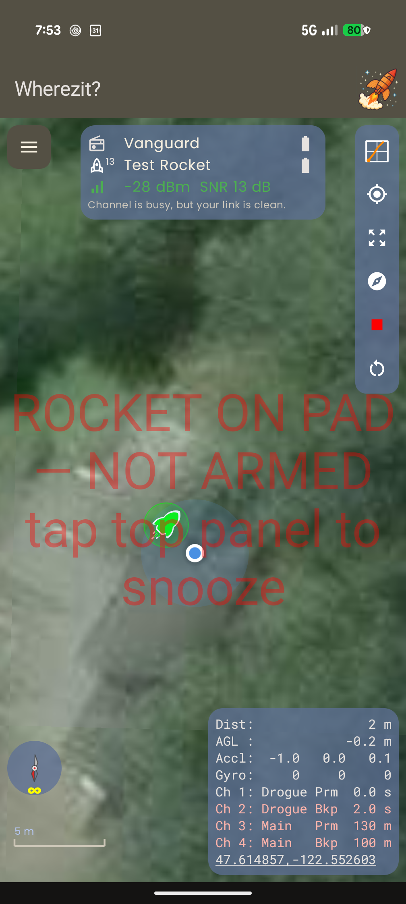

💡 **Notice `Ch 1` in the statistics panel is the only channel in normal color** — that is the wired e-match showing continuity, and it is exactly the condition that makes this a *prepped* rocket rather than a locator someone left standing on a bench (§4.6). With all four channels red the alert would never sound.

### The snooze — for assembly, not for the pad

Assembling a rocket vertically with charges already wired is physically identical to standing on the pad: same tilt, same continuity, same everything the locator can measure. No sensor can tell them apart. An alert that nags through twenty minutes of prep gets the buzzer taped over, which removes the warning entirely — so instead you get an explicit, bounded way to quiet it.

Tap the status panel at the top of the map to expand it; a **Snooze 5 min** button appears between **Rescan** and **Arm**, **only while the alert is actually sounding**. Each tap adds five minutes to whatever is left.

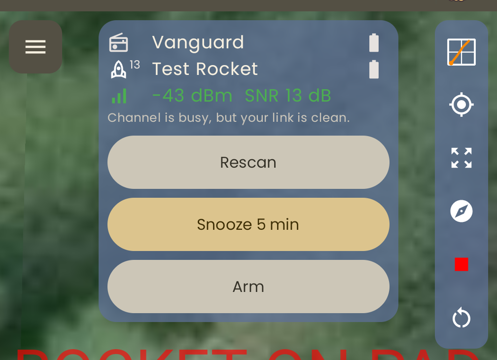

⚡ **The panel collapses on its own after a few seconds, so expand and press in one go.** Reaching for the snooze and finding the panel already shut is the ordinary experience, not a fault — tap the panel again.

Three things keep this a snooze rather than an off switch, and each of them matters:

- **It is capped at 15 minutes total.** The button greys out at the ceiling rather than disappearing, so "no more" is something you can see. The locator enforces the cap itself — no version of the app can talk it into more.
- **Powering the locator off clears it.** The snooze lives in RAM only. A power cycle always fails toward the alert.
- **The clock underneath keeps running.** Only the *sound* stops. When the snooze expires the alert resumes immediately if the rocket is still standing there — you do not get a fresh ten seconds of grace.

While snoozed, the banner reads **NOT ARMED — alert snoozed *n* min** in yellow, and the button itself changes to **Snoozed *n* min — add 5**, so what you have accumulated is readable without doing arithmetic.

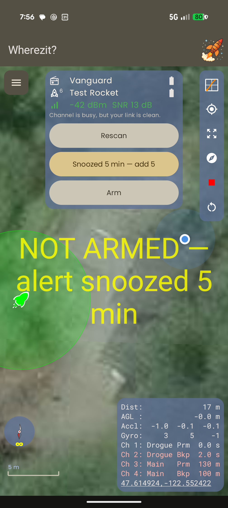

⚡ **That yellow banner is still telling you the rocket is not armed.** A silenced locator that looked identical to a healthy one is the exact failure this whole feature exists to prevent, which is why the snoozed state gets its own color and its own words rather than simply going quiet.

📋 **RSO NOTE:** if an RSO asks what the beeping is, the honest answer is the best one: *"That's the flight computer telling me it isn't armed yet. I arm from the flight line."*

---

# Part 7 — Arming for launch

## 7.1 Why you arm last, and from a distance

Arming does three things at once:

1. **Enables the deployment outputs.** Before this, they are electrically dead. After this, they are live.
2. **Re-runs the on-pad calibration** — zeroes altitude, measures the gyro's bias, and commits which way the rocket is pointing.
3. **Starts a fresh flight record.**

Because of (1), you arm from the flight line, not standing over the rocket.

### What arming does *not* control any more

⚡ **Arming gates the deployment channels, and only the deployment channels.** This changed, and it changed for a good reason: a forgotten arm used to cost the flight its recovery charges *and* its black box *and* its landed beacon, when only the first of those is what arming is for.

A locator that is powered on but disarmed still:

- **runs the flight state machine** and detects launch, apogee, descent and landing;
- **records the whole flight** at full rate, into a record it opens at power-on rather than at arm;
- **sounds the loud landed beacon** when it comes down;
- **transmits live telemetry** once it leaves the pad, marked as disarmed.

**None of that is a substitute for arming.** A disarmed flight fires nothing — no drogue, no main, no backup. It is a ballistic flight that you will be able to analyze afterwards and find, which is strictly better than one you can do neither with, and strictly worse than one that deploys.

⚠️ **Two disarmed flights in a row is the one case that does not work.** After a disarmed flight the locator sits in its Landed state, beacon sounding, and nothing puts it back. Arming or a power cycle resets it. So if you fly disarmed by accident, **power-cycle or arm before the next flight** or the second one will not be recorded.

### Calibration no longer waits for you either

If you have set *Sensor Axis Along Rocket* (§1.7), the locator also re-runs its mounting calibration on its own once the rocket has stood upright and still for about 10 seconds — so even an unarmed flight is recorded through the correct body frame. It re-arms that trigger whenever the rocket is moved or tilted away. On **Auto**, this never happens and calibration is arm-only, exactly as it used to be.

## 7.2 Arming re-calibrates — what that means for you

⚡ **Every time you arm, the locator re-calibrates from scratch.** It assumes the rocket is:

- **In its final flight orientation** — on the rail, pointing where it's going to point.
- **Still** — not being carried, leaned on, or steadied by hand.
- **At the altitude you want called zero** — because arming zeroes AGL right there.

**Arming and then re-orienting or moving the rocket invalidates the calibration.** If you arm and then have to lay the rocket down, walk it to a different pad, or re-angle the rail: **disarm, sort it out, and arm again** once it's back in its final position.

## 7.3 The arm sequence

1. From the flight map, press **Arm**.
2. The app shows **Arming**, then **Armed**, and speaks the change aloud.
3. The not-armed alert, if it was sounding, **stops immediately** (§6.6) — as do the banner and the vibration.
4. The locator plays the **quiet two-note arming chirp**.
5. Then the **quiet repeating three-note ready-beep** starts, about every 2 seconds.

## 7.4 The ready-beep is your launch permission

⚠️ **Do not launch on the arming chirp. Launch on the repeating ready-beep.**

The locator deliberately withholds the ready-beep until the flight record is fully open and recording. The gap between the two sounds is the locator finishing its preparation — mostly erasing the flash slot the new flight will be written into. A rocket launched in that gap flies fine and deploys fine, but may record nothing, and you will have no data and no flight profile.

The gap is usually brief on a locator that hasn't flown yet, because the record it opened at power-on gets reused as-is. It is longest when you **re-arm after a completed flight**, where a fresh slot really does have to be erased — which is exactly the case where you are in a hurry to get back on the pad. Wait for the beep anyway.

**If the ready-beep never starts:**

1. Wait a few more seconds. Opening a record takes a moment.
2. If it still hasn't started, **disarm** and investigate. Most likely causes: flight memory is full (§3.6), or the battery is too low.
3. Don't launch on a locator that never gave you the ready-beep.

## 7.5 If you have to stand down

Press **Disarm**. You'll hear the two double-chirps and the app will confirm.

- Deployment outputs go dead again.
- The flight record that was opened is **not wasted** — a disarm-before-launch followed by a later re-arm reuses the same slot.
- Configuration becomes editable again.

**You do not need to power-cycle** to arm again. Just fix whatever needs fixing, put the rocket back in its final orientation, and arm again (§7.2).

⚠️ **You cannot disarm in flight.** Once the rocket has launched, the app refuses: *"Can't disarm while the rocket is in flight. Wait until it has landed."* This is intentional — it's what makes the recovery system trustworthy.

## 7.6 What is not available

**Air starts / staged ignition are not a feature of this system.** There is no supported way to use a Steam Pigeon deployment channel to light a second-stage or airstart motor. Do not attempt to configure one.

---

# Part 8 — During the flight

## 8.1 What to watch, and what to listen to

**Watch the rocket. Let the app talk.** That's the entire design intent behind the spoken callouts: you should never need to look at your phone during a flight.

**The locator is silent from launch to landing.** No buzzer at all. This is normal.

## 8.2 The spoken callouts

With **Enable Speech** on (§2.8), the app announces:

| Callout | When |
|---|---|
| "*Armed*" / "*Disarmed*" | When the arm state changes. |
| "*Warning. Rocket is on the pad and not armed.*" | A prepped rocket is standing upright and disarmed. Repeats about every 30 s until you arm it, lay it down, or snooze it (§6.6). Accompanied by a phone vibration, which **Enable Speech** does not switch off. |
| "*[number] meters*" | Altitude, every 100 m as the rocket coasts to apogee. |
| "*Apogee, [number] meters*" | Apogee detected. |
| "*Drogue charge*" | The drogue primary charge has been fired. |
| "*Drogue backup charge*" | The drogue backup charge has been fired. |
| "*Main charge*" | The main primary charge has been fired. |
| "*Main backup charge*" | The main backup charge has been fired. |
| "*Drogue deployed*" | The locator has *detected the parachute actually taking hold* — a change in descent rate. |
| "*Main deployed*" | Same, for the main. |
| "*Descent warning, [number] meters per second…*" | Descending faster than **50 m/s** — fast enough that no chute is holding. Repeated at most every 10 s, with the distance and direction from the launch point when the rocket has a GPS fix. |
| "*Landing…*" | Touchdown, with the distance and direction from the launch point. Said once. If the link died on the way down, the app works out when the rocket must have reached the ground from the last altitude and descent rate it heard, and calls the landing then — you get the callout even though nothing was received for the last part of the descent. |
| "*GPS fix lost*" / "*GPS fix restored*" | The locator is still being heard but has stopped (or resumed) reporting a good fix. |
| "*Telemetry lost*" / "*Telemetry restored*" | More than 3 s with no valid message from the locator (see §8.4), and its recovery. |

⚡ **"Charge" and "deployed" are two different things.** "*Main charge*" means the locator energized the channel. "*Main deployed*" means it then detected the rocket slowing down. Hearing the charge but not the deployment is exactly the signature of a charge that fired but didn't open the bay — worth knowing in real time.

📍 **A spoken distance always means a real GPS fix.** Any callout that quotes a distance and direction only does so when the locator reports a good fix and a real launch position was captured. When either is missing the app says "*location unknown*" or simply omits the distance — it will never read out a position it does not have.

🔆 **The screen stays on** for as long as the app is in the foreground, so a flight spent watching the sky doesn't end with a blanked phone. It also means the app will not let the display sleep — back out of it, or lock the phone, when you're done.

📝 **Every callout above is written down with the time it was spoken**, in the app flight log (§10.7), alongside the signal readings from the same moment. Nothing needs switching on. If speech is off, nothing is spoken and nothing is logged — the log records what you actually heard.

## 8.3 The live screens

**Portrait — the flight map.** Your position, the rocket's position, and its track. Distance and bearing to the rocket. The flight state and altitude readouts. The status pill at the top shows the receiver and locator status.

**The rocket marker's color is a statement about the position, not about the rocket.** It has three states, and it is worth knowing which question each one answers:

| Marker | Meaning |
|---|---|
| **Green** | Live. Packets are arriving and the locator reports a healthy GPS fix. The position is current. |
| **Grey** | The link is fine, but the locator says its **fix** is not — stale or unhealthy. The marker stays where the last good fix put it, and the accuracy ring greys with it rather than claiming a precision the position no longer has. |
| **Red** | Nothing has been heard for over 2 seconds. The position is as old as the dropout. This is checked first, and for a good reason: with no recent packet the locator's *reported* fix health is itself stale and cannot vouch for anything. |

The distinction that matters is **grey versus green**: a frozen fix with a perfect radio link used to draw exactly like a healthy one — a green marker sitting still, which reads as a stationary rocket rather than as a stalled position. Grey says "this is the last place it told me, and it hasn't told me since."

⚡ **Grey never means the position is gone.** The marker, the track and the last coordinates all stay on screen. Withholding the last known position at the moment it is the only thing left to walk toward would be the wrong trade — see §9.5 for the separate case where the app refuses to quote a *distance*.

**The banner across the middle of the map** carries the rocket's pre-flight state in a few words: **Disarmed** and **No GPS** in white when they are simply true and unremarkable, **ROCKET ON PAD — NOT ARMED** in pulsing red when the pad alert is sounding, and **NOT ARMED — alert snoozed *n* min** in yellow while you have silenced it (§6.6). Only the alert states pulse; a rocket sitting disarmed in the prep area is an ordinary state and does not need an animation.

The **track stops being drawn at the landing** — once the locator reports it is down, the last point on the path is where it says it is lying, and the path does not grow while it sits there. **Dist** reads *Unknown* if the app cannot vouch for the position (§9.5).

**The map does not re-frame for every reading.** Both receivers keep reporting slightly different positions even when nothing is moving, and a map that followed all of it would creep and re-zoom across the screen all flight. So it holds where it is, at the zoom it is at, until the picture has genuinely changed. Expect the markers to drift a little within a still frame rather than the frame sliding under them — that is the map working, not lagging. See §9.4, where you will notice it most.

**Landscape — the heads-up view.** Rotate the phone and it switches to a camera view with the rocket's position overlaid — hold it up, look through it, and it points you at the rocket.

> 📱 **Screenshot needed — `images/app-12-heads-up.png`:** the landscape heads-up camera view during or after a flight, showing the overlay. Hold the phone in landscape while connected to capture this.

> 📱 **Screenshot needed — `images/app-13-flight-map-live.png`:** the portrait flight map during a flight, showing the rocket's track, the flight state and the altitude readout. Requires a flight (or a bench replay).

## 8.4 If the telemetry goes quiet

**Nothing about the rocket has changed.** The locator keeps detecting events, firing charges and recording data whether or not your phone is listening. What you've lost is the *view*, not the system.

Normal causes:

- **Range.** Especially near apogee, at altitude, and low on the horizon after landing.
- **Orientation.** The rocket's antenna sweeping away from you.
- **Your body.** Receiver in a pocket, or you standing between it and the rocket.

💡 **The signal readout tells you which of these you're looking at.** It shows two numbers, and they mean different things:

- **dBm** — how *loud* the rocket is. Mostly a function of distance, orientation and obstructions. Green near, red far.
- **SNR** — how *clean* it is: how much margin is left before packets start dropping. It falls naturally as the rocket gets further away, and going amber or orange near apogee is **normal, not a fault**. Red means you're close to losing packets — which at apogee is simply what maximum range looks like.

Under those numbers the app will say *"Interference detected. Try another channel."* when the signal is arriving **strong but noisy** — the fingerprint of another transmitter, since a strong signal has no business being noisy. A weak, noisy signal is just distance, and the app stays quiet about it, because that is what every healthy flight looks like at apogee.

**So no interference note during a dropout means range, not congestion — and the answer to range is to wait.** That now rests on a measurement rather than on silence: once nothing has been heard for about five seconds the app starts asking the receiver to read the channel directly, several times a second-and-a-half, and it keeps doing so for as long as the rocket stays quiet. An empty space under the signal reading means the channel was checked and found clear. See §2.5 for what to do about a note that does appear.

⚡ **A note that will not clear is not telling you about the channel.** Up to release 2026-08-11 the interference note could latch on and stay on — through a locator switched off, and even through a *receiver* switched off, when there was no radio left in the system to have an opinion. If you are running an older build, an interference warning that survives powering the locator down is that bug and not a busy channel.

**What to do: nothing.** Keep the receiver up and vertical, keep watching the sky. Don't start disconnecting and reconnecting — the app maintains its own link health and will recover on its own. The **last known position is retained**, and that's what you'll walk toward.

**The app tells you, once.** After 3 s with no valid message it says "*Telemetry lost*" — with the last known distance and direction if the rocket was in the air — and then stays quiet rather than repeating. When packets start arriving again you get "*Telemetry restored*". A dropout of a few seconds is routine; hearing it is information, not an instruction to do anything.

**Once it has called the landing, it stops narrating the flight.** Losing the link on the way down and getting it back after the rocket is on the ground used to produce a burst of callouts describing things that had already happened — "*main charge*", "*main deployed*" — over a rocket lying in a field. If the app has concluded the rocket is down, the only thing you'll hear when the signal comes back is "*Telemetry restored*". Live status like the GPS fix still gets called out, because that is what you need while walking in.

## 8.5 Landing

When the locator detects landing:

- The **loud repeating landed beacon** starts.
- The flight record closes, keeping a couple of seconds of settled-on-the-ground data at the end.

If the locator somehow never detects a landing, the record closes itself after **8 minutes** regardless, so a flight is never lost to a stuck state.

---

# Part 9 — Recovery

## 9.1 Recovery checklist

- [ ] Note the last known position on the map **before** you start walking
- [ ] Receiver held vertically, out of your pocket
- [ ] Step away from vehicles and metal before trusting the compass (§9.3)
- [ ] Walk the bearing (§9.3)
- [ ] Listen for the beacon (§9.4)
- [ ] ⚠️ Approach assuming unfired charges are live (§9.6)
- [ ] Power the locator **off** before handling the airframe (§9.6)

## 9.2 Using the map with no cell signal

> ⚠️ **WORK IN PROGRESS** — see the warning in §3.7. Offline imagery may expire or fail to render. **Do not make it your only recovery plan.**

If you downloaded the site (§3.7), the flight map renders that imagery with no connectivity, showing your position and the rocket's last known position on the same picture.

⚡ Note the coordinates or the position on the map **before** you walk out of radio range of a landed rocket. If the beacon and the link both go away, a remembered map position is what you have left.

**Tap the coordinates to open them in your maps app.** The latitude/longitude at the bottom of the stats panel is a button whenever the app is confident of the position — it is underlined when you can press it. Pressing hands the position over as a dropped pin named after your locator; your phone asks which app to use if you have more than one.

> ⚠️ **This is only as good as the maps app you brought.** The hand-off itself works with no signal, but most mapping apps have nothing to draw without one — Google Maps will open to a blank screen at a launch site. An app with the region **downloaded for offline use** (Organic Maps and OsmAnd both do this, and are free) will show the pin on real terrain and navigate you to it. Install it and download the area **before you leave home**, alongside §3.7. This is not something to sort out standing in a field.

If the coordinates are **not** underlined, the app is not willing to vouch for that position and will not send it anywhere — see §9.5.

## 9.3 Using the heads-up view for the last stretch

Rotate the phone to landscape. Hold it up and look through the camera view: the overlay marks where the rocket is. Walk the bearing it shows you. This is much more intuitive than reading a map while walking through brush.

### The direction depends on your phone's compass

The map rotation and the heads-up overlay both come from the magnetic compass inside your phone, and it is the least reliable part of this system. It does not fail cleanly — it goes quietly wrong by 10, 20, 30 degrees, and it looks exactly as confident as when it is right. Thirty degrees out over 200 m puts you 100 m from the rocket.

**Iron and magnets near the phone are what do it.** A truck bed or tailgate, a steel launch rail, a magnetic phone mount or a case with magnets in it, the car you are standing beside. The phone does not need to touch any of it.

⚡ **An ∞ symbol across the bottom of the compass rose — the dial at the bottom-left of the map, above the scale bar — means the heading is being disturbed. It is a picture of what to do about it: sweep the phone through a figure-eight in the air.** A couple of loops, turning your wrist as you go, so the phone points in a lot of different directions. Step away from vehicles and metal first, or you will be recalibrating against the thing causing the problem. The symbol clears within a few seconds of the compass recovering, and you can watch the map swing onto the correct heading as it does.

**The color tells you how bad it is:**

| Symbol | Meaning | What the app does |
|---|---|---|
| **Yellow ∞** | The heading is disturbed and probably wrong | Still shows you a bearing — treat it with suspicion |
| **Red ∞** | The heading cannot be trusted at all | Stops aiming the heads-up marker (see below) |

⚡ **On red, do not walk the bearing until you have cleared it.** A red ∞ and the heads-up marker disappearing are the same event, not two separate faults.

💡 **The figure-eight is the only repair there is.** There is no calibration button — on Android the compass calibrates itself from movement, and the gesture is simply how you give it enough movement to work with. It is worth doing once when you arrive at the site, before you need it.

> ⚠️ **No ∞ is not the same as a good compass.** The app can spot a field that is obviously being swamped — a magnet, a vehicle, a laptop — but a compass that has simply drifted out of calibration reads as perfectly normal from the inside, and on some phones the operating system never reports its calibration state at all. **Do the figure-eight on arrival regardless of whether the symbol has appeared.** It costs five seconds and it is the only thing that rules this out.

**If the overlay marker disappears** while the crosshair and the scales stay on screen, the app has decided it cannot aim it. Two possible causes, and the map tells you which: **a red ∞** means the compass, and **no ∞** means the position is one it will not vouch for (§9.5). Fall back to the map, the distance readout and the beacon. The marker comes back on its own.

> ⚠️ **The compass affects the picture, not the position.** The rocket's coordinates come from its own GPS and are unaffected by any of this. If in doubt, tap the coordinates to hand them to a maps app (§9.2), or read the bearing off the map against a landmark — a compass problem cannot move the rocket marker on the map, only rotate the map underneath it.

## 9.4 Using the audible beacon

The landed beacon is **loud** and repeats about every 2 seconds — the same three rising notes as the ready-beep, but at full volume.

- It's a close-in finder, not a long-range one. Expect to hear it when you're within tens of meters, less in wind or tall vegetation.
- Stop walking to listen. Your own footsteps are louder than you think.
- 💡 In a group, spread out and triangulate. Two people who can both hear it will find it much faster than one.

💡 **The map holds still as you close in — both its position and its zoom.** Walking the last stretch you will see the rocket marker and your own dot wander around inside a frame that stays put, rather than the frame sliding and re-zooming under them.

That is deliberate, and it is worth knowing what it is hiding. Two receivers each a few meters out is enough to make the *reported* gap between the markers swing wildly at close range — measured on a locator lying motionless on the ground, the distance readout moved between 6 m and 11 m. Left alone the map chases every one of those swings, which reads as the rocket jittering about while you are trying to walk to it. So the app ignores changes small enough to be the two receivers disagreeing with each other rather than anything actually moving.

If it looks like the map has stopped following you, take a few more paces — it re-frames once you have genuinely gone somewhere.

⚡ **The distance readout still swings, even though the map no longer does.** Holding the picture steady does not make the underlying numbers more certain. Within the last few meters, treat **Dist** as "very close" rather than as a measurement, and switch to the beacon and the heads-up view (§9.3) to close the gap.

## 9.5 If the last known position is stale or absent

Position quality degrades exactly when you need it most: the rocket on its side, antenna against the ground, or under trees.

**"Unknown" instead of a distance means the app has caught the position lying.** It shows a *stale* distance quite happily — a rocket that has lost its fix on the ground keeps reporting the last position it did measure, and that number is still worth walking toward. What it will not show you is a position that cannot be true: a reading that jumped further than the rocket could have moved, or a distance far beyond radio range. When it says Unknown, the heads-up overlay drops its marker too, and the coordinates stop being tappable. The rocket's marker stays on the map throughout — the app withholds numbers it cannot stand behind, it never takes away the last position it had.

💡 **It does not work the other way round.** The overlay marker can also disappear while the distance is perfectly good, because aiming it needs the phone's compass as well as the rocket's position — see §9.3. If the marker is gone but **Dist** still reads a number, the position is fine and it is the compass that is in trouble.

Work with what you have:

1. **Walk the last known position first**, even if it's a few minutes old.
2. **Use the descent track.** The last part of the recorded path shows the drift direction — the rocket kept drifting the same way after your last data point.
3. **Use signal strength as a crude direction finder.** Walk in one direction for 50 m and watch whether the link gets better or worse. Slow, but it works.
4. **Listen** (§9.4).
5. Bring the airframe's paint scheme to mind before you start looking. You'd be surprised.

## 9.6 Recovering the rocket safely

⚠️ **DANGER — unfired charges.**

Any charge that didn't fire is still live, and you don't know which ones fired until you look.

1. **Approach assuming every unfired channel is live.**
2. **Do not put your hands or face over a charge well.**
3. **Power the locator off with the magnet** before you handle the airframe, disconnect anything, or start disassembly.
4. Only then inspect and disconnect the remaining igniters.

The locator records which channels fired and their continuity before and after, so you can reconstruct exactly what happened later (§10.2) — you don't need to work it out standing in a field.

## 9.7 Flying again the same day

**No power cycle needed.**

1. Recover, power off, install fresh charges following the full §4.4 procedure (e-matches first, no-fire confirmation, then black powder).
2. Power on at the pad, and arm as usual.

Arming after a completed flight resets everything and opens a fresh record automatically.

⚠️ **If the flight you just recovered was flown *disarmed* (§7.1), arming or power-cycling before the next one is not optional.** Nothing else clears the Landed state, and until it clears the beacon keeps sounding and a second flight will not be recorded.

---

# Part 10 — After the flight: your data

## 10.1 Flight Profiles in the app

Open the menu → **Flight Profiles** (locator powered, in range, disarmed).

You get a list of stored flights, each showing its **record number, date, time and apogee**. Pick one; the app downloads it over the radio link and draws the flight profile. (Time-to-apogee is not on this list — it is on the console's `data` listing, §10.4.)

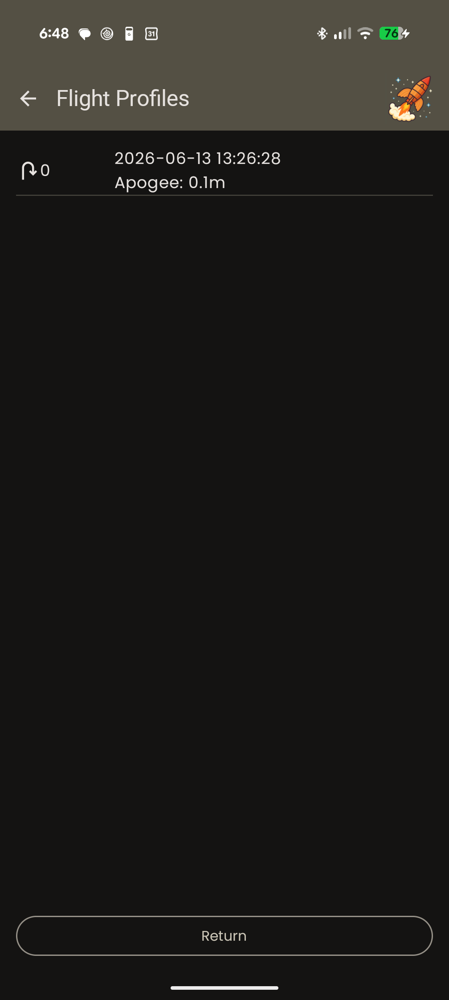

⚡ **"No flight data for this record"** means the slot has a header but no samples — a record opened and never flown, which is exactly what a stand-down or a bench power-cycle leaves behind. It is not a download failure. `c` at the console's `data` menu reclaims these (§3.6).

> 📱 **Screenshot needed — `images/app-15-flight-profile-chart.png`:** a downloaded flight profile chart with event markers. Requires a locator holding a record with actual flight samples in it; the bench locator used for the other captures had only an unflown record.

💡 The download takes a little while over the radio — it's a lot of data through a long-range, low-bandwidth link. Stay in good range and let it finish.

**The altitude you see plotted is the barometric altitude** — the same measurement the locator actually used to make its deployment decisions. That's deliberate: the chart shows you the world as the flight computer saw it.

## 10.2 Reading the event markers

The profile is marked with the events the locator recorded:

| Marker | Meaning |
|---|---|
| **Launch** | The locator decided it was flying. |
| **Burnout** | Thrust ended. |
| **Apogee** | The highest point the barometer recorded. |
| **Noseover** | The moment the locator *decided* the rocket had stopped climbing — and the trigger for the drogue timing. |
| **Drogue Primary** / **Drogue Backup** | Each drogue charge firing. |
| **Drogue Deploy** | Where the locator detected the drogue actually taking hold — a change in descent rate. |
| **Main Primary** / **Main Backup** | Each main charge firing. |
| **Main Deploy** | Same, for the main. |
| **Landing** | Touchdown. |

💡 **Apogee and Noseover are two markers, not one.** Apogee is where the rocket actually was highest; Noseover is where the locator concluded it. The gap between them is the detection delay the drogue timing is measured from — if you are tuning delays, that gap is the number you want.

And per channel:

| Field | Meaning |
|---|---|
| **Fired** | The locator energized this channel. |
| **Pre-fire continuity** | The igniter circuit was intact immediately before firing. |
| **Post-fire continuity** | The circuit was *still* intact after firing — which normally means **the igniter did not go off**. |

⚡ **Fired = yes, pre-fire continuity = yes, post-fire continuity = yes** is the signature of a channel that was commanded, had a good igniter, and still didn't light. Investigate the igniter and the charge, not the locator.

## 10.3 Export flight path

> ⚠️ **WORK IN PROGRESS.** Flight-path export is not currently reachable from the app's menu. Use the USB-C CSV export (§10.4) for the locator's own record, or the app flight log (§10.7) for what the phone received and announced — the two hold different things.

## 10.4 Full CSV export over USB-C

This gives you everything the locator recorded, at full rate, for analysis in a spreadsheet or a plotting tool.

1. Connect the locator to a computer with USB-C.
2. Open a serial terminal at the locator's console baud rate — **921600 unless you changed it** (§Appendix D).
3. Type `data` and press Enter. You'll get a numbered list of stored flights with dates, apogees and times to apogee.
4. **Start your terminal's logging-to-file** *before* the next step — the export scrolls past as plain text.
5. Type the number of the flight you want. The CSV streams out, followed by a summary of the flight's events and per-channel deployment statistics.

**Columns:**

| Column | Meaning |
|---|---|
| `time_ms` | Milliseconds since thrust onset. |
| `raw_baro_agl_m` | Barometric altitude above ground — the altitude used for deployment decisions. |
| `fused_agl_m` | Altitude from the combined sensor solution, recorded for analysis. |
| `raw_baro_vel_mps` | Vertical speed derived from the barometer. |
| `fused_vspeed_mps` | Vertical speed from the combined solution. |
| `accel_x_g`, `accel_y_g`, `accel_z_g` | Acceleration in g, in the rocket's own axes. |
| `gyro_x_dps`, `gyro_y_dps`, `gyro_z_dps` | Rotation rate in degrees per second. |
| `lat_deg`, `lon_deg` | GPS position. |
| `flight_state` | Which state the flight state machine was in. |
| `armed` | Whether the locator was armed for this sample — 1 or 0. Because a disarmed locator now records a full flight (§7.1), this is the column that tells you whether the charges were ever going to fire. |
| `ekf_health` | **0 means the combined solution was working on that sample.** Anything else means `fused_agl_m` and `fused_vspeed_mps` on that row cannot be trusted — see the note below. |
| `gps_vel_n_mps`, `gps_vel_e_mps`, `gps_vel_d_mps` | GPS velocity north / east / down. **Blank** when that fix carried no velocity — blank is not zero. |
| `gps_h_acc_m` | How accurate the GPS thought its own position was, in metres. |
| `tilt_deg` | Angle off vertical. |
| `q_w`, `q_x`, `q_y`, `q_z` | Orientation, as a quaternion. |
| `fix_type`, `num_sv` | GPS fix quality and satellite count at that sample — what the position readings in the same row are worth. |
| `accel_alt_x_g`, `accel_alt_y_g`, `accel_alt_z_g` | The *other* accelerometer. The locator carries a sensitive one and a high-range one and uses whichever suits the moment; this is the one it wasn't using, so the two can be compared. **Blank** if that sensor had nothing valid to report. |
| `accel_source` | Which accelerometer the `accel_*_g` columns came from: 0 = low-g, 1 = high-g. |
| `pps_status` | Whether the GPS one-pulse-per-second timing reference was healthy: 1 = locked, 2 = a pulse was missed, 4 = a bad interval was rejected. These add together. 1 on its own is the good case. |

They are exported in that order.

> **Reading `ekf_health`.** The combined ("fused") solution can fail in flight, and when it does it fails quietly: the altitude stops changing and the vertical speed reads exactly `0.0`. That looks identical to a rocket sitting still on the pad, which is why six flights were analysed before anyone noticed. `ekf_health` is the column that tells them apart — sort or filter on it before you trust anything in `fused_agl_m` or `fused_vspeed_mps`. The value is a set of flags: 1 = the velocity estimate had to be reset, 2 = a sensor correction was rejected, 4 = a barometer update was rejected, and they add together. **`raw_baro_agl_m` is unaffected** — deployment decisions never used the fused columns.

> ⚡ **The timing columns are gone**, and the column order changed. `oc_start_us`, `oc_end_us`, `process_start_us` and `process_dur_us` were replaced by the GPS velocity and accuracy columns above. If you have a spreadsheet that reads columns by position rather than by name, it will need updating. Per-cycle timing is still available live from the data menu's `t` breakdown.

> ⚡ **This firmware update erases your stored flights, and the locator now holds 9 instead of 10.** The record format changed enough that older records cannot be read back at all — the data menu will not list them. **Export everything you want to keep before you flash.** The flight is 8 minutes either way; only the number of stored flights changed, to make room for the extra data in each one.

## 10.5 Flight memory housekeeping

- **9 flights** stored (was 10 before the record format changed). Export what you want to keep before you clear anything.
- `c` in the data menu reclaims empty slots; `e` erases everything (§3.6).
- ⚡ Export before any firmware update that changes the record format.

## 10.6 What the timestamps mean

**In the locator's record** (§10.1, §10.4):

- **`time_ms = 0` is thrust onset.** The record starts at launch.
- Time is measured on a **GPS-disciplined clock**, so it is real elapsed time, not an assumed sample rate. Durations you measure from the data are trustworthy.
- Data is recorded at **20 samples per second**.
- A record is capped at **8 minutes** and includes about **2 seconds of settled data after landing**.

**In the app flight log** (§10.7), which is a different clock and a weaker one:

- Rows are stamped **when the message reached the phone**, using the phone's own clock — not the locator's. Bluetooth delivery adds a little jitter on top.
- `elapsed_s` counts from launch detection, so the pre-launch rows are negative.
- Good enough for *"the app said `telemetry lost` nine seconds before it said `landing`"*, which is what it is for. **Not** a substitute for `time_ms` when you want real flight timing — use the locator's record for that.

## 10.7 App flight logs

This is the other half of your data, and it answers different questions from the locator's record.

The locator archives what the **rocket** did. The app flight log records what the **phone** saw: the same one-per-second messages, plus the signal strength, signal-to-noise ratio and channel noise the receiver measured for each one, plus what the app decided and announced about them. **None of that is stored anywhere else** — the RSSI and SNR are measured on your side of the radio, so the locator never knows them, and the spoken callouts left no trace at all once the words had gone past.

Open the menu → **App Flight Logs**. It is available whether or not anything is connected — the logs are files on the phone, which is the state you are in when you sit down to read them.

**Recording is automatic.** There is nothing to switch on and nothing to remember at the pad:

- A log starts when the app sees a rocket leave the pad, and includes the **two seconds before** launch detection — so the last on-pad signal readings are in the file.
- Nothing is written unless a launch happens. A session spent connecting, arming, changing channels and disarming again leaves **no file at all**, so the list never fills with sessions that never flew.
- A log ends when the locator is **disarmed**, when you change the receiver's channel or connect to a **different locator**, when the app is closed, or when the **next launch** starts a new one.

⚡ **Landing does not end the log**, on purpose. The walk-in to find the rocket is when signal strength matters most and is exactly when you cannot watch it, so the log keeps running through recovery. **Disarming the locator is what closes it** — which is the last thing you do to the rocket anyway.

⚡ **A flight the app was not already receiving is not logged.** The app has to have been hearing the locator before the launch to recognize one; starting the app with the rocket already in the air gives you telemetry on screen but no log for that flight.

**Each log is named for the locator, the date and the time** — `Kestrel_2026-08-31_141955.csv` — so the list identifies the airframe and the flight months later.

**What you can do with one:**

| Action | What happens |
|---|---|
| **View** | Reads the log on the phone, as the raw CSV. Long logs are truncated on screen; the file itself is complete, and the screen says so when it is showing only part of one. |
| **Share** | Hands the whole file to Android's share sheet — Bluetooth to a paired laptop, Quick Share, Drive, or mail. Nothing needs installing on the computer. Choosing *Save a copy* instead writes it into Downloads, where a USB-C cable finds it. |
| **Delete** | Removes it from the phone. Anything you already shared or saved elsewhere is untouched. |

A log still being written says so on its row, and can be shared while it is open — you just get the rows recorded so far.

💡 **Logs are not pruned automatically.** Nothing deletes a flight you have not looked at, which also means they accumulate until you delete them. Each one is small — a few tens of kB for a typical flight and recovery.

**The columns** are one wide schema shared by every row. Telemetry rows fill the flight columns and leave `event` and `detail` blank; app events do the reverse. **A blank is not a zero** — it means the message on that row does not carry that field, and 0 m AGL is a real reading.

| Column | Meaning |
|---|---|
| `timestamp`, `elapsed_s` | When, on the phone's clock, and seconds from launch detection (negative before it) — see §10.6. |
| `source` | `prelaunch`, `telemetry`, `receiver_info`, or `app` for something the app did. |
| `event`, `detail` | Blank on telemetry rows. Otherwise the app event and its text — including the exact words of every spoken callout. |
| `rssi_dbm`, `snr_db`, `noise_floor_dbm`, `bad_frames` | **The receiver's measurement of that message.** The reason this log exists. |
| `link_quality` | The app's interference verdict for that moment (§2.5). |
| `flight_state`, `lat`, `lon`, `agl_m`, velocity, attitude, `satellites`, `hacc_m` | What the message carried. |
| `armed`, deployment masks, `drogue_detected`, `main_detected`, `pad_alert` | Arm state, which channels were armed and which had fired, and whether deployment was physically detected. |
| battery, `receiver_channel`, `locator_id` | Locator and receiver battery, the channel it arrived on, and which locator sent it. |

💡 **`receiver_info` rows are the useful ones during a dropout.** They arrive when nothing else does — the receiver measuring the channel with the locator silent. A gap in the telemetry with these still ticking through it tells you whether the channel was quiet or whether something else was on it, which is the difference between a range problem and an interference one (§2.5).

---

# Part 11 — Troubleshooting

| Symptom | Look at |
|---|---|
| Locator won't power on / no power-on tone | Battery flat (§1.6). Wrong magnet pole or wrong spot (§1.2). |
| "I couldn't follow the signal readings / callouts during the flight" | You aren't meant to — they're recorded for you. Menu → **App Flight Logs** (§10.7). |
| App Flight Logs is empty after a flight | A log is only created for a launch the app was already receiving telemetry for, and only a launch creates one (§10.7). A session that never flew leaves nothing by design. |
| App never finds the receiver | Receiver powered? Bluetooth on? Phone permissions granted? (§3.8) |
| Status panel says "Searching…" or "Scanning…" | A scan is running and the receiver is parked on other channels, so your locator cannot be heard until it finishes. Arm and Disarm still work throughout — pressing either stops the scan so the command gets through (§2.5). |
| Status panel says "No Locator" but the receiver is connected | Normal when the locator is off (§3.8). Otherwise: locator off, out of range, or on a different channel — **Find a locator** answers the channel question directly (§2.5). If an interference note appears under it, the channel is occupied and that may be why you are hearing nothing. |
| App asks for a password | First contact with a locator it doesn't know (§2.6). Also happens to a locator it *used* to know, if you have since set or changed that locator's password — the app's stored key no longer verifies, so it treats it as a stranger and asks again. This works even for the locator you are **currently connected to**: the app lets that connection go and asks, rather than holding a connection whose credentials have stopped verifying. |
| App opened while the locator was already armed | Supported: armed telemetry identifies itself, so the app picks up a locator it already knows and shows live data straight away. If it still reads "No Locator", that locator has never been connected on this phone — **disarm it once** so the app can prompt for its password (§2.6). |
| "Another locator … is not being displayed" | Someone else is on your channel — change **Communication → Locator channel** (§2.5). Or one of your *own* spare locators is powered up near the receiver, in which case the channel is irrelevant: move it away (§2.5). To switch to that locator on purpose, tap **Connect** (§2.6). |
| App shows a locator that isn't on your channel | A powered locator within a few feet of the receiver gets in regardless of channel (§2.5, Appendix G). Move it away. |
| Telemetry patchy on the pad or the flight line | Check for another powered locator near the receiver — it deafens the receiver every time it transmits (§2.5). |
| "Interference detected. Try another channel." under the signal reading | Something other than your rocket is transmitting in your channel. Move to another channel (§2.5), or find and move the nearby transmitter. Appears when an arriving signal is strong *and* noisy (§8.4), and also with the locator off, when the receiver reads the channel directly and finds it occupied. |
| That note stays on after you switch the locator or receiver off | A bug in builds before 2026-08-11, not a busy channel: the verdict was being recomputed from the last packet heard before the silence, and could never clear. Update the app **and reflash the receiver** — the two must match (§8.4). |
| "Channel is busy, but your link is clean" | Informational. Other traffic is present but isn't hurting you. No action needed. Shown only while the locator is being heard — it is a statement about a link, so it is not offered when there isn't one. |
| Channel scan says every channel is loud | A transmitter is very close to the receiver — usually a spare locator left switched on. Move it; don't change channel (§2.5). |
| Channel scan refuses to run | The locator is armed, or a flight data transfer is in progress. Disarm or wait (§2.5). |
| Locator is powered on but the app stays on **No Locator** | Before suspecting range or interference, check you're on its channel: **Communication → Find a locator** (§2.5), or the **Find my locator** button on the status panel. With several rockets and one receiver this is the usual cause, and the channel you're listening to will measure perfectly clean while it happens. |
| Locator search finds nothing on the short list | Its channel isn't one the app has heard it on. Use **Search all 64 channels** (up to ~90 s). Still nothing: check the locator is powered and in range (§2.5). |
| Locator search or channel scan says *"No response from the receiver"* **the instant you press it** | Not the receiver, and not its firmware — on builds before 2026-09-01 the press collided with the app’s own background polling of the receiver and the request was never sent. That polling only runs while no locator is being heard, which is exactly when you reach for a search, so it landed where it was most confusing. Pressing again usually worked. Update the app. A **genuine** no-answer makes you wait about eight seconds first, and that one does mean the receiver (§3.3). |
| Locator search refuses to run | A locator is armed or in flight, or the receiver is busy with a scan or a flight data transfer. A full sweep costs a minute of deafness, so it isn't allowed over a live flight (§2.5). |
| Receiver's new name won't show up | Bluetooth name cache. "Forget" the receiver in your phone's Bluetooth settings, then reconnect (§2.7). |
| Bluetooth seems to keep dropping | Silence is not a dropped link (§3.8). If it's genuinely reconnecting, check the receiver's battery. |
| Few satellites / wide accuracy ring | Get the fix in the open before installing (§4.5). Antenna view obstructed (§1.7, §4.7). There is no numeric accuracy readout — the ring around the marker is it (§4.6). |
| A reading on the statistics panel has turned red | That is how sensor health and continuity are reported — the line itself changes color. Which line is red names the fault (§4.6). |
| No continuity on a wired channel | Broken igniter, loose terminal, or a lead not making contact (§4.6). |
| Continuity on a channel set to `Unused` | Mis-wired, or the mode is wrong (§4.6). |
| Deployment Test isn't in the menu | It only appears while the locator is **armed** (§3.5). |
| Can't stop a deployment test countdown | Press the red **STOP TEST** button below the countdown; leaving the screen sends the same cancel. It is a radio message and can be lost: while one is outstanding the button reads **STOPPING…** and the count keeps ticking until the locator honors it. Press again, and treat the charge as live until the countdown clears (§3.5). |
| STOP TEST is greyed out | No test is running as far as the app knows. If the locator's LED is still blinking red, the app has lost the link — the countdown is not reaching it, and the cancel would not reach the locator either. |
| A deployment test counted down but the channel never fired | First check you are measuring the channel you tested — the terminal blocks are numbered 1–4 and it is an easy one to get wrong. Then connect USB-C, press `p` for the pin trace (Appendix D), and run the test again. `cmd DARM=1 D`*n*`=1` with your meter reading nothing puts the fault in the hardware; anything else puts it in the locator's firmware and is worth reporting. The channel is live for **1 second**, so a meter may miss it where a scope will not. |
| Locator Settings / Flight Profiles aren't in the menu | They only appear while the locator is powered, in range, and **disarmed** (§2.1). |
| Ready-beep never starts after arming | Flight memory full (§3.6) or battery too low. Longest when re-arming after a completed flight. **Don't launch** (§7.4). |
| Locator is playing a repeating *descending* double-beep | It is not armed and it thinks it's on the pad (§6.6). Arm it, lay the rocket down, or snooze the alert. Do not tape over the buzzer. |
| That alert won't sound even though the rocket is standing there disarmed | Most likely *Sensor Axis Along Rocket* names the wrong axis for this build — the default X is right only if X runs along the tube, and a wrong axis makes an upright rocket read as lying down (§1.7). Check it with the console's `m` key. **Auto** disables the alert entirely. Otherwise: no channel shows continuity, or the rocket is more than ~35° off vertical (§6.6). |
| Snooze button isn't there | It only appears while the alert is actually sounding, and only in the expanded top status panel — which closes itself after a few seconds, so expand and press in one motion. Greyed out means you're at the 15-minute ceiling (§6.6). |
| Alert came back before the snooze looked expired | Powering the locator off clears the snooze — it deliberately fails toward the alert (§6.6). |
| A flight recorded but nothing deployed | Check the `armed` column in the CSV (§10.4) or the arm state on the profile. A disarmed locator records and beacons in full and fires nothing (§7.1). |
| Landed beacon won't stop, and a second flight didn't record | The previous flight was flown disarmed. Arm or power-cycle to clear the Landed state (§7.1, §9.7). |
| Rocket marker is grey | The link is fine; the locator's GPS fix isn't. The marker is showing the last good position (§8.3). |
| Battery gauge reads empty on a battery you know is charged | The gauge cannot tell a flat cell from a broken battery-sense circuit — both read empty. Before you replace the battery, check it over USB-C: press `v` at the console (disarmed). If the readings there don't respond at all, the fault is in the locator, not the battery, and it needs service (Appendix D). |
| USB-C console shows nothing, or a screen of random characters | Baud mismatch — not a fault, and nothing is lost. Set your terminal to the rate you want and **hold Shift+U** for a second; the device will match you and say so. If nothing happens, the device is set *slower* than your terminal — step through the eight rates instead (Appendix D). |
| Console text is garbled but **pastes correctly**, digits and CAPITALS readable | Not a baud problem at all. A stray control code has put your terminal into its line-drawing character set. **Reset the terminal.** Changing baud rate or power-cycling the device will not fix it (Appendix D). |
| Can't disarm | Not while it's flying. This is intentional (§7.5). |
| Telemetry drops out mid-flight | Normal at range and altitude. The rocket is unaffected (§8.4). |
| Altitude looks stepped or jumpy | Sunlight on the barometer, most likely in a clear payload bay (§1.7). |
| A recorded flight looks empty | Launched before the ready-beep started (§7.4). |
| "No flight data for this record" when you open a profile | The slot was opened but never flown — a stand-down, or a power cycle on the bench. Not a download failure (§10.1). |
| Recorded flights "disappeared" after a firmware update | **Power-cycle the locator** — the data is very likely still there. If it reappears, that was it. |
| A charge didn't fire | Check fired / pre-fire / post-fire continuity in the flight data (§10.2). |
| Map is blank | No imagery downloaded for the area, or no connectivity and no cached region (§3.7). |

---

# Appendix A — Quick-reference cards

*Print these. Laminate them. Keep them in the range box.*

## A1 — Bench prep

```
□ Charge locator, receiver, phone
□ Note versions — locator, receiver, app
□ Set channel modes (Unused for spares!)
□ Set delays / altitudes
□ Check SENSOR AXIS ALONG ROCKET matches this build (default X)
□ Set LoRa channel
□ BENCH DEPLOYMENT TEST — e-matches only, no BP
□ Export + clear flight memory if needed
□ Download launch site map (on Wi-Fi)
□ Confirm app connects to receiver
□ Pack: magnet, USB-C cable, spare e-matches
```

## A2 — Field build-up + no-fire confirmation

```
□ Install locator, dress wiring, secure battery
□ Connect e-matches to correct channels

  ⚠  NO BLACK POWDER YET

□ Point charge wells at nothing you value
□ Power ON — expect tone, expect NO fire
□ Confirm continuity on every wired channel
□ Power OFF
□ NOW install black powder
□ Do not power on again until the pad

□ GPS: power up in the open, wait for blink, then install
□ Present to RSO with locator OFF
```

## A3 — Pad + arming

```
AT THE PAD
□ Rocket on rail, buttons seated
□ Motor igniter per range procedure
□ Power locator ON — hear the tone
□ Readiness: satellites / battery / accuracy ring
□ Stats panel: NO RED LINES except channels
  you did not wire.  Red = that sensor or
  channel is the fault.
□ Check continuity BEFORE you arm — arming
  swaps the panel to the flight layout
□ Leave DISARMED — walk back
□ Expect the NOT-ARMED alert (descending
  double-beep) as you walk away. Do NOT snooze it.

AT THE FLIGHT LINE
□ Confirm telemetry still arriving
□ Rocket in FINAL orientation and STILL
□ Press ARM  → arming chirp
□    the not-armed alert stops
□ WAIT for the repeating READY-BEEP
□ Launch on the READY-BEEP, not the chirp

  RISING = ready.  DESCENDING = NOT ARMED.
```

## A4 — Recovery

```
□ Note last known position BEFORE walking
□ Tap the coordinates → opens your maps app
□ Receiver vertical, out of pocket
□ Step away from vehicles/metal — compass
□ ∞ by the compass? → figure-8 the phone
□    yellow = suspect   red = do not walk it
□ Landscape = heads-up view, walk the bearing
□ Stop and listen for the loud beacon

  ⚠  UNFIRED CHARGES ARE LIVE

□ Approach off-axis from charge wells
□ Power locator OFF before handling
□ Then disconnect remaining igniters
```

---

# Appendix B — Sound and light reference

## Locator sounds

| Pattern | Notes | Volume | Repeats? | Meaning |
|---|---|---|---|---|
| Power-on | 5 rising notes, ~0.1 s each | Loud | No | Booted, Disarmed |
| Arming | 2 rising notes | Quiet | No | Arm command received |
| Ready | 3 rising notes, then ~1.7 s silence | Quiet | Yes, ~every 2 s | **Armed and ready to launch** |
| Disarming | 2 rising notes, twice | Quiet | No | Disarm command received |
| Not armed | 2 **descending** notes, twice, then ~3 s silence | Medium | Yes, ~every 3.5 s | ⚠️ Prepped rocket standing disarmed — **arm it** (§6.6) |
| Not armed, urgent | Same pattern, then ~0.7 s silence | **Loud** | Yes, ~every 1.2 s | Same, unanswered for ~60 s |
| Landed beacon | 3 rising notes, then ~1.7 s silence | **Loud** | Yes, ~every 2 s | Landed — walk toward it |
| *(silence)* | — | — | — | In flight |

**Ready-beep and landed beacon are the same notes.** Volume tells them apart: quiet on the pad, loud on the ground.

**The not-armed alert is the only pattern that falls rather than rises.** That is the whole design: it should sound wrong to someone who is not listening for it. And it only works while *Sensor Axis Along Rocket* names the axis that really runs along your airframe — it defaults to X, and on Auto it can never sound (§1.7).

## Locator lights

| Light | Behavior | Meaning |
|---|---|---|
| GPS LED | Blinking | GPS fix acquired |
| Status | Blue flash | Radio transmit |
| Status | Green flash | Radio receive |
| Status | Red, ~1 Hz | Deployment test countdown |
| Status | Red, ~2 Hz | Deployment test — under 3 s to fire ⚠️ |
| Status | Off | Idle |

## Receiver lights

| Color | Meaning |
|---|---|
| Blue flash | Transmitted to locator |
| Green flash | Good message received from locator |
| Red flash | Corrupt/partial message received — occasional at long range is normal |

---

# Appendix C — Settings reference

| Setting | Where | Range | Default | Notes |
|---|---|---|---|---|
| Deployment Channel 1–4 Mode | App, USB-C | Drogue Primary / Drogue Backup / Main Primary / Main Backup / Unused | Ch1 DP, Ch2 DB, Ch3 MP, Ch4 MB | `Unused` excludes the channel from firing |
| Drogue Primary Deploy Delay | App, USB-C | 0.0 s → just under backup delay | 0.0 s | From apogee detection |
| Drogue Backup Deploy Delay | App, USB-C | just over primary delay → 3.0 s | 2.0 s | Must exceed the primary |
| Main Primary Deploy Altitude | App, USB-C | just above backup → 500 m | 130 m | AGL |
| Main Backup Deploy Altitude | App, USB-C | 0 m → just below primary | 100 m | AGL, must be below the primary |
| Launch Detect Altitude | *neither* | fixed | 30 m | Climb required to declare launch. Not adjustable (§2.4) |
| Deploy Signal Duration | *neither* | fixed | 1.0 s | How long a channel stays energized. Not adjustable (§2.4) |
| Sensor Axis Along Rocket | App, USB-C | Auto / X / Y / Z | X | Which locator axis runs along the airframe. The default assumes the standard installation. Auto disables the not-armed alert and off-pad calibration (§1.7) |
| LoRa Channel | App, USB-C | 0–63 | 0 | See §2.5 for which control to use |
| Locator Name | App, USB-C | 20 characters | blank | |
| Receiver Name | App, USB-C | 20 characters | blank | Requires Bluetooth "Forget" to refresh (§2.7) |
| Connection Password | **USB-C only** | 15 characters, blank = open | blank | Cannot be read or set over the air |
| Console Baud | **USB-C only** | 9600 / 19200 / 38400 / 57600 / 115200 / 230400 / 460800 / 921600 | 921600 | Locator and receiver each have their own. Cannot be set over the air. Set it wrong and you recover by holding `U` — §Appendix D |
| Enable Speech | App | on / off | on | |
| Voice Name | App | your phone's installed voices | system default | |

---

# Appendix D — USB-C console reference

**Connection:** USB-C from the locator (or receiver) to a computer. Serial terminal at **921600 baud, 8-N-1** — that is the factory rate, and it is what a device you have never reconfigured will be using.

## Changing the console baud rate

The rate is a setting in the `config` menu, key `b`. The locator and the receiver hold their own rates independently, and neither travels over the radio — you can only change a device's console rate over its own cable.

Most people never need to touch it. The reasons to:

- your USB-serial adapter or terminal program will not go as high as 921600;
- you are running a long or noisy cable and a slower rate is more reliable.

The cost of a slower rate is the CSV export (§10.4), which is the one thing on this console that moves real volume — at 9600 baud a long flight takes minutes rather than seconds.

**The change takes effect the moment you press Enter**, so the menu redraws at the new rate and turns to garbage until you change your terminal to match. That is expected, and the next screen you draw after switching will be clean.

## If the console is unreadable

**The symptom:** you connect, and instead of a menu you get nothing at all, or a screen of random characters that changes when you type. Nothing is broken — the device and your terminal are simply at different baud rates. This is what you would see after setting the rate to something your adapter cannot do, or after picking up a device you configured months ago and forgot about.

**First, check which kind of garbled you have.** Select the garbled text and paste it somewhere:

- **The paste is nonsense too** → a genuine baud mismatch. Use the fix below.
- **The paste is perfectly readable** → the *bytes* are fine and your terminal is only drawing them wrong. **Reset your terminal** (most have a Reset command; otherwise close and reopen the session). Changing baud rates will not help, and neither will power-cycling the device, because the problem is in the terminal.

The second case is easy to mistake for the first. Its tell is that **digits and CAPITAL letters look fine while lowercase letters turn into line-drawing symbols** — a terminal that has been switched into its line-drawing character set by a stray control code, which the random bytes of a real baud mismatch can produce by chance. Once you have reset the terminal it will not come back on its own.

**The fix — hold down `U`.** Set your terminal to the rate **you** want, 8-N-1, then hold Shift+U for a second or two. The device recognises the stream, measures your rate from it, and matches you, replying:

```
DIAG|BAUD: detected 115200 - saved
```

That line arriving legibly *is* the confirmation — it is sent at the newly matched rate, so if you can read it, it worked. The rate is saved, so the device comes back at it after a power cycle. Press Enter afterwards to clear any leftover `U`s from the input line.

Hold the key rather than counting presses: the leading characters are what tell the device the two ends disagree, and the rest are the measurement and its confirmation.

⏱️ **If you have just changed the rate yourself, wait about five seconds before holding `U`.** The device deliberately ignores mismatch signals for a few seconds after a deliberate change — otherwise switching your terminal over would look like a cry for help, and it would helpfully undo the change you just made.

⚠️ **This brings the device's rate DOWN to meet your terminal. It cannot bring it up.** So it works when the device is set *faster* than your terminal — which is the case you actually get stuck in, because a device set faster than your adapter can manage cannot be reached at any rate you are able to produce. If the device is set *slower* than your terminal, holding `U` will do nothing; use the method below instead, which works in that direction and is quick, because a slow device is one your terminal can always reach.

**If holding `U` does nothing — find the rate by hand.** The device is always at one of eight rates, so this takes under a minute and cannot fail: set your terminal to **9600, 19200, 38400, 57600, 115200, 230400, 460800, 921600** in turn, and at each one press Enter and type `config`. When the menu appears, that is the device's rate. Then press `b` and set the rate you actually want.

Nothing is lost and nothing is broken while you are hunting; a device at the wrong rate is simply not being understood, and it recovers completely the moment the two ends agree.

⚠️ **The listener stops after arming.** A device in flight must not be able to have its console rate moved by whatever the cable picks up. If you need to recover, do it on the bench, disarmed.

📋 While the rates agree the listener does nothing at all — it only wakes on the flood of unreadable characters a mismatch produces, so it costs nothing during normal use and cannot be triggered by ordinary typing or by pasting text.

📋 Why `U`: at 8-N-1 the letter `U` is the bit pattern `01010101`, an even square wave. That regularity is what lets the device time your terminal's bit rate off the signal itself, without having to understand a single character first. It is the same trick STM32CubeProgrammer uses to talk to a chip it has never met.

**Locator search trace (receiver only).** A locator search (§2.5) traces the same way, tagged `[search]` so the two are never confused in a log. One line per channel as it finishes, naming what was heard there:

```
[search] start channels/target 5 287454020
[search] channel/id 12 0
[search] channel/id 4 287454020
[search] done status/ms 1 3612
[search] restored channel 0
```

A zero id means nothing decoded on that channel. `done status` is 1 for a completed run, 2 for a refusal (armed or in flight), 3 for busy, 4 for cancelled.

**Channel scan trace (receiver only).** While a channel scan is running (§2.5), the receiver prints a trace to its console. Nothing needs to be enabled — a scan is a deliberate, one-off action, so there is no background chatter. It is there so a scan that misbehaves can be diagnosed directly instead of by guesswork:

```
[survey] start home 0 0
[survey] coarse done ms 771 0
[survey] c0: -119 -121 -118 -120 -117 -122 -119 -120
[survey] c8: -120 -118 -119 -121 -118 -120 -119 -117
...
[survey] shortlist 0 37
[survey] shortlist 1 5
[survey] confirm ch/level 37 -121
[survey] confirm ch/level 5 -58
[survey] done status/ms 0 6842
[survey] restored channel 0
```

Reading it:

- `start home N` — the channel the receiver was on, and must return to.
- `coarse done ms` — how long the fast pass took, then the whole band eight channels per line. These are the *unreliable* numbers: a locator transmits ~14% of the time, so a channel in use can easily read quiet here.
- `shortlist i ch` — the candidates picked for the long dwell, quietest first.
- `confirm ch/level` — the trustworthy reading for each. A channel that looked quiet in the coarse table and loud here is a transmitter the fast pass missed, which is exactly what the confirm phase exists to catch.
- `done status/ms` — status 0 completed, 1 refused (locator armed), 2 refused (transfer in progress, or the scan hit its 12-second limit). Then total elapsed time.
- `restored channel N` — the radio went back where it started. **If this line is missing the scan did not finish cleanly**, and a `DEADLINE` line above it names the phase and channel it stalled on.

**Top-level commands** — type the word and press Enter:

| Command | Opens |
|---|---|
| `config` | Configuration menu |
| `data` | Flight data menu |
| `dfu` | Firmware update mode |

There is no console deployment test. Firing a charge is an app-only command, so
that starting one never requires you to be at the other end of a USB-C cable —
see §3.5.

**On the locator**, if you forget any of this, press `?` with no menu open and
it prints the list — the commands above, plus the service keys below. It comes
from the firmware actually on the device, so where it and this page disagree,
believe the locator. The receiver console has no `?`, and offers only `config`
and `dfu`.

## Service diagnostics (locator)

Type these at the console with **no menu open**. All but one also require the locator to be **disarmed**. Most of them exist for diagnosing a locator that is behaving oddly, and their output is intended for service rather than for pre-flight checks — you do not need to understand it to use it. **`m` is the exception:** "did my sensor-axis setting take effect?" is an ordinary question to ask while the rocket is still in your hands, and this is the only place it can be answered.

If a key seems to do nothing, you are in a menu — press Esc. If it answers `REFUSED - disarm first`, the locator is armed. These are ground tools; nothing here is meant to be reached in flight.

| Key | Action |
|---|---|
| `m` | Mounting / nose-axis diagnostic. Prints the configured *Sensor Axis Along Rocket*, the mounting frame the locator is actually using, and the accelerometer reading in both raw and body axes. **This is the only way to confirm a sensor-axis setting took effect without flying** — the app's accelerometer row is unaffected by it. Stand the rocket up and look for `body accel x` near **+1.00 g**; a frame reported as `identity - never committed` means the setting has not landed. Under `Auto` it says so, and the body row is just a copy of the raw one. |
| `v` | Battery-sense check. Prints how the battery measurement behaves over ~100 ms. **If the numbers don't respond at all, the fault is in the locator's battery-sense circuit rather than the battery** — which is the one case an empty gauge cannot distinguish on its own (Part 11). |
| `h` | Holds the battery-sense circuit powered for ~10 seconds so it can be measured with a meter. Press again to release early. Releases on its own regardless. |
| `/` | Prints the last fault the locator recorded, if any — what kind, what reset it, and how long it had been running. Says `DIAG\|NONE` when there is nothing stored, which is the normal, healthy answer. Service will ask for this text if you send a locator in. |
| `p` | **Deployment pin trace — works armed.** Prints a line whenever the deployment hardware changes state: `cmd` is what the firmware asked the pins to do, `pad` is what the pins actually did, `DARM` is the load switch that feeds all four channels, and `D1`–`D4` are the channels themselves. Press again to turn it off. Use it when **a channel doesn't fire** (below). It only reads pins — it cannot fire anything, and it is not a way to test a channel from the console. |

None of these affects flight behavior.

**Two keys answer while the locator is armed**, and everything else in the table is refused until you disarm:

- `?` — so a list of the commands is always available, even when the commands themselves are not.
- `p` — because the thing it exists to watch, a deployment test, only ever happens while armed. A disarmed-only trace would be a trace of nothing.

## Editing keys (configuration menu)

| Key | Action |
|---|---|
| `[` | Decrease the value |
| `]` | Increase the value |
| Enter | Save |
| Esc | Cancel |

For text fields (name, password), just type; Enter saves, Esc cancels.

## `config` — Rocket Locator Configuration

| Key | Setting |
|---|---|
| `0` | Deployment Channel 1 Mode |
| `1` | Deployment Channel 2 Mode |
| `2` | Deployment Channel 3 Mode |
| `3` | Deployment Channel 4 Mode |
| `4` | Drogue Primary Deploy Delay (s) |
| `5` | Drogue Backup Deploy Delay (s) |
| `6` | Main Primary Deploy Altitude (m) |
| `7` | Main Backup Deploy Altitude (m) |
| `8` | LoRa Channel (0–63) |
| `9` | Device Name |
| `n` | Sensor Axis Along Rocket — `Auto (detect on arm)`, `X`, `Y` or `Z` (§1.7). Cycle with `[` and `]` |
| `p` | Password — shows the current password, or `(not set)`; type a new one (it echoes as you type), blank clears it |

## `data` — Rocket Locator Data Menu

Lists stored flights as `#  Date  Time  Apogee (m)  Time to Apogee (s)`.

| Key | Action |
|---|---|
| *a flight number* | Stream that flight's CSV. **Start terminal logging first.** |
| `c` | Clear empty/unused records |
| `e` | Erase ALL flight memory — asks for `Y` to confirm |
| `t` | Per-cycle timing breakdown (diagnostic) |

## `dfu` — Device Firmware Upgrade

Puts the device into firmware-update mode. It will not work again until it is reflashed or reset. Enter to continue, Esc to cancel. **Don't go in here unless you're deliberately updating firmware.**

---

# Appendix E — Glossary

| Term | Meaning |
|---|---|
| **AGL** | Above Ground Level. All the locator's deployment altitudes are AGL, zeroed at the pad when you arm. |
| **Apogee** | The highest point of the flight. |
| **Noseover** | The moment the rocket stops climbing and tips over — how the locator detects apogee. |
| **Drogue** | The small first parachute, deployed at apogee to control the descent. |
| **Main** | The large parachute, deployed low down for a soft landing. |
| **Primary / Backup** | Two charges for the same job. The primary fires first; the backup fires slightly later (drogue) or slightly lower (main) in case the primary didn't work. |
| **Continuity** | An intact electrical circuit through an igniter. Means the igniter is good and the terminals are tight. Does **not** mean the channel is live. |
| **E-match** | Electric match — the igniter that sets off a black powder charge. |
| **Armed / Disarmed** | Whether the deployment outputs are electrically live. Disarmed on power-up. |
| **Ready-beep** | The quiet repeating three-note tone that means armed, calibrated and recording. Your permission to launch. |
| **Not-armed alert** | The repeating *descending* double-beep a prepped rocket makes while it stands upright and disarmed. Depends on the sensor axis being correct for the installation; disabled entirely by Auto (§1.7, §6.6). |
| **Sensor axis along rocket** | Which of the locator's own three axes runs along the length of the airframe. A property of the installation, stated once; the locator measures which way up it is for itself. |
| **LoRa** | The long-range radio link between the locator and the receiver. |
| **LoRa channel** | Which frequency the link uses, 0–63. Both ends must match. |
| **RSSI** | Received signal strength — how strong the radio link is. |
| **Telemetry** | Live data sent over the radio during a flight. |
| **Archive / flight record** | The full-rate data recorded onboard. Much more detailed than telemetry, and unaffected by radio dropouts. |
| **RSO / LCO** | Range Safety Officer / Launch Control Officer. |

---

# Appendix F — Specifications

## Locator

| | |
|---|---|
| Processor + radio | STM32WL5 series, integrated sub-GHz LoRa transceiver |
| Barometric altimeter | MS5611-01BA — usable to roughly 98,000 ft; temperature compensated |
| IMU | ISM6HG256X — dual-range accelerometer (low-g and high-g, selected automatically) plus gyroscope |
| GPS | SAM-M10Q (u-blox M10). Concurrent GPS, GLONASS, Galileo and BeiDou |
| Flight memory | 64 Mbit external flash — 9 flights |
| Deployment | 4 independent channels, for e-matches with an all-fire current of 1 A or less |
| Power switch | Magnetic (Hall sensor + latch); no mechanical switch |
| Battery charging | Up to 1 A, over USB-C |
| Audio | Piezo buzzer |
| Data interface | USB-C, 921600 baud default (9600–921600, configurable per device) |
| Sample rate | 20 samples per second |
| Max recorded flight | 8 minutes |

## Receiver

| | |
|---|---|
| Processor + radio | STM32WL5 series, same LoRa transceiver as the locator |
| Phone link | Bluetooth Low Energy |
| Battery charging | Over USB-C |
| Data interface | USB-C configuration console |

## App

| | |
|---|---|
| Platform | Android |
| Permissions used | Location, Bluetooth (scan + connect), Camera (for the heads-up view) |

## Battery limits

| | |
|---|---|
| Storage temperature | 10 °C to 25 °C (50 °F to 77 °F) |
| Operating temperature | up to 60 °C (140 °F) |
| Charging temperature | **do not charge above 45 °C (113 °F)** |

---

# Appendix G — Radio notes

The locator-to-receiver link operates in the **902–928 MHz** band. Channel 0 is at 902.3 MHz and each channel step is 200 kHz, so channels 0–63 span roughly **902.3 to 914.9 MHz**.

This band is license-free for low-power devices in the United States and in other ITU Region 2 countries that follow the same allocation. **It is not license-free everywhere** — in Europe, Japan and many other regions, 902–928 MHz is allocated to other services and operating in it is not permitted.

**If you are flying outside a region where this band is license-free, check your local regulations before transmitting.**

## Why a nearby locator gets through on the wrong channel

If you've ever had a locator sitting next to the receiver and seen its packets arrive on a channel the receiver wasn't set to, nothing is broken. The numbers make it unavoidable.

The link uses a **125 kHz** wide signal, and channels are spaced **200 kHz** apart. That's less than two channel-widths of separation, which is fine at any normal distance — the receiver's filtering rejects an adjacent channel by a factor of several hundred thousand.

But signal strength falls off with distance, and at short range the numbers get absurd. The locator transmits at **22 dBm** (about a sixth of a watt). At **one meter** the receiver hears it at roughly **−10 dBm**. The receiver's usable sensitivity is about **−123 dBm**. That is a gap of **113 dB — a factor of about 200 billion.**

So the neighboring locator is arriving some 200 billion times stronger than the faint rocket the receiver is straining to hear, and the channel filter only knocks down a few hundred thousand of that. What's left over is *still* a strong, perfectly decodable signal. On top of that, a signal that loud simply overwhelms the receiver's input stage, which then leaks energy across all channels regardless of filtering.

Two practical points follow:

- **Changing channels doesn't help at close range.** Separation in *distance* is what helps. A few tens of feet is plenty — the same 113 dB advantage collapses fast as the locator moves away.
- **Nothing downstream can tell.** The receiver stamps its own channel onto every packet it relays, so neither it nor the app can report that a packet arrived off-channel. The app identifies the sender by its locator ID instead, which is what keeps the wrong rocket's data off your screen (§2.6).

The practical rule is in §2.5: only the locator you're flying stays near the receiver.

---

*End of manual.*
